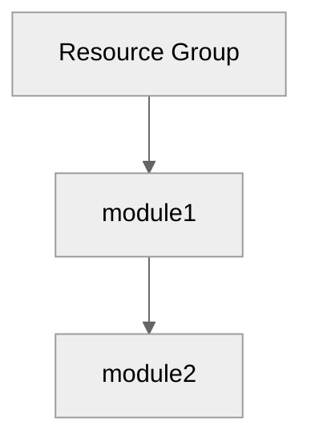

# Step 4: Implementation Plan - {project-name}


<details>
<summary><strong>📑 Table of Contents</strong></summary>

- [Overview](#overview)
- [Resource Inventory](#resource-inventory)
- [Module Structure](#module-structure)
- [Implementation Tasks](#implementation-tasks)
- [Deployment Phases](#deployment-phases)
- [Dependency Graph](#dependency-graph)
- [Naming Conventions](#naming-conventions)
- [Security Configuration](#security-configuration)
- [Estimated Implementation Time](#estimated-implementation-time)
- [Approval Gate](#approval-gate)
- [References](#references)

</details>

> Generated by bicep-plan agent | {date}

| ⬅️ Previous | 📑 Index | Next ➡️ |
| --- | --- | --- |
| [04-governance-constraints.md](04-governance-constraints.md) | [README](README.md) | [04-preflight-check.md](04-preflight-check.md) |

## Overview

Brief description of what will be implemented.

---

## Resource Inventory

| Resource   | Type                            | SKU | AVM Status            | Dependencies |
| ---------- | ------------------------------- | --- | --------------------- | ------------ |
| Resource 1 | Microsoft.Provider/resourceType |     | ✅ AVM                |              |
| Resource 2 | Microsoft.Provider/resourceType |     | ⚠️ Requires Approval  |              |
| Resource 3 | Microsoft.Provider/resourceType |     | ❌ No AVM (Justified) |              |

---

## Module Structure

```
infra/bicep/{project-name}/
├── main.bicep
├── main.bicepparam
├── modules/
│   ├── module1.bicep
│   ├── module2.bicep
│   └── module3.bicep
└── deploy.ps1
```

---

## Implementation Tasks

### Task 1: main.bicep (Orchestration)

**Purpose**: Main entry point

**Parameters**:

- List parameters

**Variables**:

- List variables (e.g., uniqueSuffix from uniqueString(resourceGroup().id))

**Modules Called**:

1. module1.bicep
2. module2.bicep

### Task 2: modules/module1.bicep

**Resources**:

- List resources

**Outputs**:

- List outputs

### Task 3: modules/module2.bicep

**Resources**:

- List resources

**Key Configuration**:

```bicep
Example configuration snippet
```

**Outputs**:

- List outputs

### Task N: deploy.ps1 (Deployment Script)

**Features**:

- Parameter validation
- Bicep lint/build verification
- What-If preview
- Deployment execution
- Output display

---

## Deployment Phases

> Deployment strategy: **{Phased|Single}** (chosen during planning)

### Phase 1: Foundation

| Order | Module | Resources | Validation |
| ----- | ------ | --------- | ---------- |
| 1 | ... | ... | ... |

**Approval Gate**: Verify foundation resources before proceeding.

### Phase 2: Security & Data

| Order | Module | Resources | Validation |
| ----- | ------ | --------- | ---------- |
| 2 | ... | ... | ... |

**Approval Gate**: Verify security controls before CDE resources.

### Phase N: ...

_(Repeat for each phase)_

### Phase Summary

| Phase | Resources | Est. Deploy Time | Approval Gate |
| ----- | --------- | ---------------- | ------------- |
| 1 | X | X min | ✅ |
| 2 | X | X min | ✅ |
| N | X | X min | ✅ |

---

## Dependency Graph



---

## Naming Conventions

| Resource       | Pattern                  | Example            |
| -------------- | ------------------------ | ------------------ |
| Resource Group | rg-{project}-{env}       | rg-project-dev     |
| Resource 1     | {prefix}-{project}-{env} | prefix-project-dev |

---

## Security Configuration

| Resource   | Security Setting | Value |
| ---------- | ---------------- | ----- |
| Resource 1 | Setting 1        |       |
| Resource 2 | Setting 2        |       |

---

## Estimated Implementation Time

| Task          | Estimated Duration |
| ------------- | ------------------ |
| Bicep modules | X minutes          |
| Testing       | X minutes          |
| Deployment    | X minutes          |
| **Total**     | **~X minutes**     |

---

## Approval Gate

> [!IMPORTANT]
> **📋 Implementation Plan Ready**
>
> - X Azure resources planned
> - X Bicep modules to create
> - Governance constraints addressed
> - CAF naming conventions applied
>
> Reply **"approve"** to proceed to bicep-code, or provide feedback.

---

## References

> [!NOTE]
> 📚 The following Microsoft Learn resources inform this implementation.

| Topic                  | Link                                                                                                                          |
| ---------------------- | ----------------------------------------------------------------------------------------------------------------------------- |
| Azure Verified Modules | [AVM Index](https://aka.ms/avm/index)                                                                                         |
| Bicep Best Practices   | [Documentation](https://learn.microsoft.com/azure/azure-resource-manager/bicep/best-practices)                                |
| CAF Naming Conventions | [Naming Rules](https://learn.microsoft.com/azure/cloud-adoption-framework/ready/azure-best-practices/resource-naming)         |
| Resource Abbreviations | [Abbreviations](https://learn.microsoft.com/azure/cloud-adoption-framework/ready/azure-best-practices/resource-abbreviations) |

---

_Plan generated by bicep-plan agent following Azure Well-Architected Framework guidelines._

---

| ⬅️ [04-governance-constraints.md](04-governance-constraints.md) | 🏠 [Project Index](README.md) | ➡️ [04-preflight-check.md](04-preflight-check.md) |
| --- | --- | --- |
