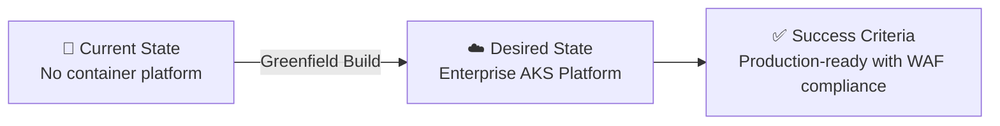

# Step 1: Requirements - aks-platform

<strong>📑 Table of Contents</strong>

- [Project Overview](#project-overview)
- [Functional Requirements](#functional-requirements)
- [Non-Functional Requirements (NFRs)](#non-functional-requirements-nfrs)
- [Compliance & Security Requirements](#compliance--security-requirements)
- [Budget](#budget)
- [Operational Requirements](#operational-requirements)
- [Regional Preferences](#regional-preferences)
- [Summary for Architecture Assessment](#summary-for-architecture-assessment)
- [References](#references)

> Generated by @requirements agent | 2026-02-15

| ⬅️ Previous | 📑 Index            | Next ➡️                                                        |
| ----------- | ------------------- | -------------------------------------------------------------- |
| —           | [README](README.md) | [02-architecture-assessment.md](02-architecture-assessment.md) |

## Project Overview

| Field                   | Value                                                                                                                       |
| ----------------------- | --------------------------------------------------------------------------------------------------------------------------- |
| **Project Name**        | aks-platform                                                                                                                |
| **Project Type**        | Container Platform (AKS + Application Gateway + Azure SQL)                                                                  |
| **Timeline**            | 2026-02-15 → 2026-05-15 (3 months)                                                                                          |
| **Primary Stakeholder** | Platform Engineering Team                                                                                                   |
| **Business Context**    | Enterprise-grade Kubernetes platform with WAF-protected ingress, managed SQL backend, and deterministic outbound networking |

### Business Context

| Field               | Value                                                                                                                                           |
| ------------------- | ----------------------------------------------------------------------------------------------------------------------------------------------- |
| Industry / Vertical | Technology / SaaS                                                                                                                               |
| Company Size        | Enterprise (500+)                                                                                                                               |
| Current State       | Greenfield                                                                                                                                      |
| Migration Source    | N/A (greenfield deployment)                                                                                                                     |
| Business Drivers    | Standardized container platform for microservices workloads with enterprise security, compliance, and operational excellence                    |
| Success Criteria    | Production-ready AKS cluster with AGIC ingress, SQL backend, and NAT Gateway operational within 3 months; passing WAF assessment on all pillars |

### State Transition

## Functional Requirements

### Core Capabilities

| #   | Capability                                    | Priority  | Acceptance Criteria                                                              |
| --- | --------------------------------------------- | --------- | -------------------------------------------------------------------------------- |
| 1   | AKS cluster with system and user node pools   | 🔴 Must   | Cluster is operational with separate system/user node pools, autoscaling enabled |
| 2   | Application Gateway Ingress Controller (AGIC) | 🔴 Must   | AGIC addon deployed, routing traffic to workloads via Application Gateway v2     |
| 3   | WAF policy on Application Gateway             | 🔴 Must   | OWASP 3.2 ruleset active in Prevention mode, custom rules configurable           |
| 4   | SSL/TLS termination at Application Gateway    | 🔴 Must   | TLS 1.2+ enforced, certificates managed via Key Vault integration                |
| 5   | Azure SQL Database backend                    | 🔴 Must   | General Purpose tier, zone-redundant, Azure AD-only authentication               |
| 6   | NAT Gateway for outbound traffic              | 🔴 Must   | Deterministic outbound public IP(s) for AKS egress, no load balancer SNAT        |
| 7   | Azure Container Registry (ACR)                | 🔴 Must   | Private ACR with AKS pull integration via managed identity                       |
| 8   | Azure Key Vault for secrets management        | 🔴 Must   | CSI secrets store driver enabled, managed identity access                        |
| 9   | Azure Monitor & Container Insights            | 🟡 Should | Full observability stack with log collection, metrics, and alerting              |
| 10  | Azure Policy for AKS                          | 🟡 Should | Pod security standards enforced via Azure Policy for Kubernetes                  |
| 11  | Private DNS zones                             | 🟡 Should | Private DNS resolution for SQL, ACR, and Key Vault private endpoints             |
| 12  | Horizontal Pod Autoscaler (HPA)               | 🟢 Could  | CPU/memory-based autoscaling for application workloads                           |

### User Types

| User Type              | Description                                        | Est. Count | Access Level                                           |
| ---------------------- | -------------------------------------------------- | ---------- | ------------------------------------------------------ |
| Platform Engineers     | Manage AKS cluster, networking, and infrastructure | 5-10       | Cluster Admin (Azure Kubernetes Service Cluster Admin) |
| DevOps Engineers       | Deploy and manage workloads, CI/CD pipelines       | 10-20      | Cluster User (Azure Kubernetes Service Cluster User)   |
| Application Developers | Deploy containerized applications                  | 20-50      | Namespace-scoped RBAC via Kubernetes                   |
| Security/Compliance    | Audit access, review policies, monitor threats     | 3-5        | Reader + Security Reader                               |

### Integrations

| System                        | Direction | Protocol                | Auth Method                   | SLA     |
| ----------------------------- | --------- | ----------------------- | ----------------------------- | ------- |
| Azure Container Registry      | Outbound  | HTTPS (Docker Registry) | Managed Identity (AcrPull)    | 99.9%   |
| Azure SQL Database            | Outbound  | TDS (TCP 1433)          | Managed Identity (Azure AD)   | 99.995% |
| Azure Key Vault               | Outbound  | HTTPS (REST)            | Managed Identity (CSI Driver) | 99.99%  |
| Azure Monitor / Log Analytics | Outbound  | HTTPS                   | Managed Identity              | 99.9%   |
| External APIs (via NAT GW)    | Outbound  | HTTPS                   | API Key / OAuth               | Varies  |
| Inbound traffic (via App GW)  | Inbound   | HTTPS (443)             | Certificate (TLS)             | 99.95%  |

### Data Types

| Category               | Sensitivity | Est. Volume   | Retention                        | Residency          |
| ---------------------- | ----------- | ------------- | -------------------------------- | ------------------ |
| Application data (SQL) | 🟡 Medium   | 50-200 GB     | 1 year minimum                   | EU (swedencentral) |
| Container images (ACR) | 🟢 Low      | 10-50 GB      | Indefinite                       | EU (swedencentral) |
| Application logs       | 🟢 Low      | 5-20 GB/month | 90 days                          | EU (swedencentral) |
| Secrets & certificates | 🔴 High     | < 1 MB        | Indefinite (soft-delete enabled) | EU (swedencentral) |
| Kubernetes audit logs  | 🟡 Medium   | 2-10 GB/month | 90 days                          | EU (swedencentral) |

### Architecture Pattern

| Field              | Value                                                                                                                                                                                                                                                               |
| ------------------ | ------------------------------------------------------------------------------------------------------------------------------------------------------------------------------------------------------------------------------------------------------------------- |
| Workload Pattern   | Container (AKS + ACR + KV + Monitor)                                                                                                                                                                                                                                |
| Recommended Option | Enterprise Tier: AKS + ACR + KV + Monitor + App Gateway + SQL                                                                                                                                                                                                       |
| Tier               | Enterprise                                                                                                                                                                                                                                                          |
| Justification      | Enterprise container platform requiring WAF-protected ingress, managed database backend, deterministic outbound IPs via NAT Gateway, and full compliance posture. Aligns with Container workload pattern at Enterprise tier from the Service Recommendation Matrix. |

## Non-Functional Requirements (NFRs)

| WAF Pillar     | Metric             | Target                                      | Current | Gap        |
| -------------- | ------------------ | ------------------------------------------- | ------- | ---------- |
| 🔄 Reliability | SLA                | 99.95% (AKS SLA with Uptime SLA enabled)    | N/A     | Greenfield |
| 🔄 Reliability | RTO                | 1 hour                                      | N/A     | Greenfield |
| 🔄 Reliability | RPO                | 15 minutes                                  | N/A     | Greenfield |
| ⚡ Performance | API Response (p95) | < 200 ms                                    | N/A     | Greenfield |
| ⚡ Performance | Concurrent Users   | 1,000-5,000                                 | N/A     | Greenfield |
| ⚡ Performance | Pod startup time   | < 30 seconds                                | N/A     | Greenfield |
| 🔒 Security    | Auth Method        | Azure AD + Kubernetes RBAC                  | —       | —          |
| 🔒 Security    | Encryption         | At-rest (AES-256) + In-transit (TLS 1.2)    | —       | —          |
| 🔒 Security    | Network Isolation  | Private endpoints + NSGs + Network Policies | —       | —          |
| 💰 Cost        | Monthly Budget     | ~$3,000-5,000                               | —       | —          |
| 🔧 Operations  | Uptime Monitoring  | Yes (Container Insights + Azure Monitor)    | —       | —          |
| 🔧 Operations  | Log Aggregation    | Yes (Log Analytics workspace)               | —       | —          |

### Scalability

| Dimension                      | Current | 6-Month Projection | 12-Month Projection |
| ------------------------------ | ------- | ------------------ | ------------------- |
| Users (concurrent)             | 1,000   | 2,500              | 5,000               |
| Data Volume (SQL)              | 50 GB   | 100 GB             | 200 GB              |
| Pods (total across namespaces) | 20-50   | 50-100             | 100-200             |
| Node count (user pool)         | 3       | 5                  | 8                   |

## Compliance & Security Requirements

### Regulatory Frameworks

<strong>PCI-DSS</strong> — Not Applicable

| Requirement             | Applicability | Notes                          |
| ----------------------- | ------------- | ------------------------------ |
| Cardholder data storage | No            | No payment card data processed |
| Network segmentation    | No            | N/A                            |
| Encryption requirements | No            | N/A                            |

<strong>SOC 2</strong> — Applicable

| Trust Principle | Applicability | Notes                                                |
| --------------- | ------------- | ---------------------------------------------------- |
| Security        | Yes           | Network isolation, RBAC, encryption enforced         |
| Availability    | Yes           | AKS Uptime SLA, zone-redundant SQL, multi-node pools |
| Confidentiality | Yes           | Private endpoints, Key Vault secrets, TLS everywhere |

<strong>HIPAA</strong> — Not Applicable

| Requirement   | Applicability | Notes                           |
| ------------- | ------------- | ------------------------------- |
| PHI handling  | No            | No protected health information |
| BAA required  | No            | N/A                             |
| Audit logging | No            | N/A                             |

<strong>GDPR</strong> — Applicable

| Requirement      | Applicability | Notes                                     |
| ---------------- | ------------- | ----------------------------------------- |
| EU data subjects | Yes           | Application may serve EU users            |
| Data residency   | Yes           | All data in swedencentral (EU)            |
| Right to erasure | Yes           | Application-level implementation required |

<strong>ISO 27001</strong> — Applicable

| Control Area        | Applicability | Notes                                                    |
| ------------------- | ------------- | -------------------------------------------------------- |
| Access control      | Yes           | Azure AD + Kubernetes RBAC + managed identities          |
| Asset management    | Yes           | Resource tagging, inventory via Azure Resource Graph     |
| Incident management | Yes           | Azure Monitor alerts, Log Analytics, diagnostic settings |

### Data Residency

| Requirement              | Value                                                          |
| ------------------------ | -------------------------------------------------------------- |
| Primary Region           | swedencentral                                                  |
| Data Sovereignty         | EU-only                                                        |
| Cross-region Replication | Not required (single-region deployment; DR via backup/restore) |

### Authentication & Authorization

| Requirement       | Value                                              |
| ----------------- | -------------------------------------------------- |
| Identity Provider | Entra ID (Azure Active Directory)                  |
| MFA Requirement   | Required for cluster admin access                  |
| RBAC Model        | Azure RBAC + Kubernetes RBAC (Azure AD-integrated) |

### Network Security

| Control                     | Required | Notes                                                                |
| --------------------------- | -------- | -------------------------------------------------------------------- |
| Private endpoints           | ✅       | SQL Database, ACR, Key Vault accessed via private endpoints          |
| VNet integration            | ✅       | AKS deployed with Azure CNI in dedicated VNet                        |
| Public endpoints acceptable | ❌       | Only Application Gateway has public IP; all backend services private |
| WAF required                | ✅       | Application Gateway WAF v2 with OWASP 3.2 ruleset                    |

### Recommended Security Controls

| Control               | Recommended | User Confirmed | Notes                                                   |
| --------------------- | ----------- | -------------- | ------------------------------------------------------- |
| Managed Identity      | Yes         | Yes            | Workload identity for pods; kubelet identity for ACR/KV |
| Private Endpoints     | Yes         | Yes            | SQL, ACR, Key Vault — no public network access          |
| WAF                   | Yes         | Yes            | Application Gateway WAF v2 in Prevention mode           |
| Key Vault for Secrets | Yes         | Yes            | CSI Secrets Store Driver; no secrets in Kubernetes      |
| Diagnostic Settings   | Yes         | Yes            | All resources send logs to Log Analytics workspace      |
| TLS 1.2 Minimum       | Yes         | Yes            | Enforced on Application Gateway, SQL, and all endpoints |
| Encryption at Rest    | Yes         | Yes            | Platform-managed keys (SSE) for SQL, ACR, storage       |
| Network Isolation     | Yes         | Yes            | Azure CNI, NSGs on all subnets, Calico network policies |

## Budget

> [!NOTE]
> The Azure Pricing MCP server generates detailed cost estimates during
> architecture assessment (Step 2). Provide an approximate budget here.

| Field              | Value                                                       |
| ------------------ | ----------------------------------------------------------- |
| 💰 Monthly Budget  | ~$3,000-5,000                                               |
| 📅 Annual Budget   | ~$36,000-60,000                                             |
| 🚦 Limit Type      | 🟡 Soft = can negotiate based on production requirements    |
| 📊 Cost Model Pref | Committed (1-year reserved instances for AKS nodes and SQL) |

### Cost Optimization Priorities

| Priority                         | Selected | Impact                                                     |
| -------------------------------- | -------- | ---------------------------------------------------------- |
| Minimize compute costs           | ☐        | Medium — use autoscaling and right-sized VMs               |
| Prefer consumption-based pricing | ☐        | Low — enterprise workloads benefit from reserved capacity  |
| Reserved instances acceptable    | ☑        | High — 1-year reservations for AKS node VMs and SQL vCores |
| Spot instances for non-critical  | ☑        | Medium — spot node pool for dev/test and batch workloads   |

### Estimated Cost Breakdown (Preliminary)

| Component                              | Est. Monthly Cost | Notes                                                       |
| -------------------------------------- | ----------------- | ----------------------------------------------------------- |
| AKS cluster (3-node user pool, D4s_v5) | ~$800-1,200       | System pool (2× D2s_v5) + user pool (3× D4s_v5)             |
| Application Gateway WAF v2             | ~$350-500         | Fixed cost + capacity units                                 |
| Azure SQL Database (General Purpose)   | ~$400-800         | 4-8 vCores, zone-redundant                                  |
| NAT Gateway                            | ~$35-50           | Fixed hourly + data processed                               |
| Azure Container Registry (Premium)     | ~$170             | Geo-replication not needed but Premium for private endpoint |
| Key Vault (Standard)                   | ~$5-10            | Per-operation pricing, minimal cost                         |
| Log Analytics workspace                | ~$100-300         | Based on ingestion volume (~10-30 GB/month)                 |
| Virtual Network / NSGs                 | ~$0               | No cost for VNet/subnets/NSGs                               |
| Public IPs (NAT GW + App GW)           | ~$10-20           | Standard SKU static IPs                                     |
| **Total Estimated**                    | **~$1,870-3,050** | Before reserved instance discounts                          |

## Operational Requirements

### Monitoring & Alerting

| Capability             | Required | Tool / Service                       | Notes                                                    |
| ---------------------- | -------- | ------------------------------------ | -------------------------------------------------------- |
| Application monitoring | ✅       | Application Insights                 | Instrumented via OpenTelemetry or auto-instrumentation   |
| Container monitoring   | ✅       | Container Insights (Azure Monitor)   | Node, pod, and container metrics; Prometheus integration |
| Log aggregation        | ✅       | Log Analytics workspace              | Centralized logging for all Azure resources and AKS      |
| Alert notifications    | ✅       | Azure Monitor Alerts → Email + Teams | P1 alerts within 5 minutes; P2 within 15 minutes         |
| Custom dashboards      | ✅       | Azure Monitor Workbooks              | Cluster health, workload performance, cost tracking      |
| Network monitoring     | ✅       | NSG Flow Logs + Network Watcher      | Traffic analysis and troubleshooting                     |

### Support & Maintenance

| Requirement         | Value                                                          |
| ------------------- | -------------------------------------------------------------- |
| Support Hours       | Business hours (Mon-Fri, 08:00-18:00 CET) with P1 24/7 on-call |
| On-call Requirement | Yes (for production incidents)                                 |
| Maintenance Windows | Sundays 02:00-06:00 CET for planned AKS upgrades               |
| Change Management   | Team approval via pull request on Bicep templates              |

### Backup & Disaster Recovery

| Component          | Backup Frequency         | Retention                                 | Recovery Method                           |
| ------------------ | ------------------------ | ----------------------------------------- | ----------------------------------------- |
| Azure SQL Database | Continuous (PITR)        | 35 days short-term; LTR weekly for 1 year | Point-in-time restore / geo-restore       |
| AKS cluster config | On change (GitOps)       | Indefinite (Git history)                  | Redeploy from Bicep + GitOps manifests    |
| Key Vault secrets  | Continuous (soft-delete) | 90 days (purge protection)                | Recover deleted secrets                   |
| Container images   | On push (ACR)            | Indefinite                                | Re-pull from ACR                          |
| Application state  | Application-dependent    | Application-dependent                     | Velero backup or application-level backup |

### AKS Cluster Configuration

| Setting                 | Value                  | Justification                                                    |
| ----------------------- | ---------------------- | ---------------------------------------------------------------- |
| Kubernetes version      | 1.29.x (latest stable) | Current stable release with long-term support                    |
| Network plugin          | Azure CNI              | Required for AGIC integration and advanced networking            |
| Network policy          | Calico                 | Enterprise network policy engine for pod-to-pod isolation        |
| DNS service             | CoreDNS (default)      | Standard Kubernetes DNS                                          |
| AKS SKU tier            | Standard (Uptime SLA)  | 99.95% SLA for production workloads                              |
| Private cluster         | No                     | AGIC requires API server accessibility; use authorized IP ranges |
| Authorized IP ranges    | Yes                    | Restrict API server access to known CIDR blocks                  |
| Azure AD integration    | Enabled                | Azure AD-backed RBAC for cluster authentication                  |
| Local accounts          | Disabled               | Enforce Azure AD-only authentication                             |
| Workload Identity       | Enabled                | Pod-level managed identity for Azure service access              |
| OIDC Issuer             | Enabled                | Required for Workload Identity federation                        |
| Defender for Containers | Enabled                | Runtime threat detection                                         |

### AKS Node Pools

| Pool   | Purpose                                    | VM Size         | Min/Max Nodes | Mode   | OS           | Taints                               |
| ------ | ------------------------------------------ | --------------- | ------------- | ------ | ------------ | ------------------------------------ |
| system | System workloads (CoreDNS, metrics-server) | Standard_D2s_v5 | 2 / 3         | System | Ubuntu 22.04 | `CriticalAddonsOnly=true:NoSchedule` |
| user   | Application workloads                      | Standard_D4s_v5 | 3 / 8         | User   | Ubuntu 22.04 | None                                 |

### Networking Design

| Component                   | CIDR / Config           | Purpose                                   |
| --------------------------- | ----------------------- | ----------------------------------------- |
| VNet                        | 10.0.0.0/16             | Primary virtual network                   |
| AKS subnet                  | 10.0.0.0/22 (1,024 IPs) | AKS nodes and pods (Azure CNI)            |
| Application Gateway subnet  | 10.0.4.0/24 (256 IPs)   | Application Gateway v2 dedicated subnet   |
| SQL Private Endpoint subnet | 10.0.5.0/24 (256 IPs)   | Private endpoints for SQL, ACR, Key Vault |
| NAT Gateway                 | Attached to AKS subnet  | Deterministic outbound IP for egress      |
| Service CIDR                | 10.1.0.0/16             | Kubernetes service IPs (non-overlapping)  |
| DNS Service IP              | 10.1.0.10               | Kubernetes DNS service IP                 |

### Application Gateway Configuration

| Setting       | Value                      | Notes                               |
| ------------- | -------------------------- | ----------------------------------- |
| SKU           | WAF_v2                     | Web Application Firewall v2         |
| Tier          | WAF_v2                     | Required for WAF policies           |
| Capacity      | Autoscale (2-10 instances) | Scales based on traffic             |
| WAF Mode      | Prevention                 | Blocks malicious requests           |
| WAF Ruleset   | OWASP 3.2                  | Latest managed ruleset              |
| SSL Policy    | AppGwSslPolicy20220101S    | TLS 1.2 minimum, modern ciphers     |
| Integration   | AGIC addon                 | AKS-managed ingress controller      |
| Health probes | HTTP/HTTPS                 | Automatic backend health monitoring |

### Azure SQL Configuration

| Setting                    | Value                         | Notes                           |
| -------------------------- | ----------------------------- | ------------------------------- |
| Service tier               | General Purpose               | Balanced compute and storage    |
| Compute model              | Provisioned (4 vCores)        | Predictable performance         |
| Hardware                   | Standard-series (Gen5)        | Latest generation               |
| Storage                    | 100 GB (auto-grow enabled)    | Scalable as needed              |
| Zone redundancy            | Enabled                       | High availability across zones  |
| Backup redundancy          | Zone-redundant backup storage | Aligns with HA strategy         |
| Azure AD-only auth         | Enabled                       | No SQL authentication allowed   |
| Public network access      | Disabled                      | Private endpoint only           |
| TLS version                | 1.2 minimum                   | Security baseline               |
| Auditing                   | Enabled                       | Logs to Log Analytics workspace |
| Advanced Threat Protection | Enabled                       | SQL vulnerability assessment    |

## Regional Preferences

| Preference         | Value              | Justification                                                       |
| ------------------ | ------------------ | ------------------------------------------------------------------- |
| Primary Region     | swedencentral      | EU GDPR-compliant; default region per azure-defaults                |
| Failover Region    | germanywestcentral | EU paired alternative for DR scenarios                              |
| Availability Zones | Required           | AKS node pools and SQL Database spread across zones for 99.95%+ SLA |

---

## Summary for Architecture Assessment

### Handoff Summary

| Aspect               | Key Points                                                                                                                                                                                                                     |
| -------------------- | ------------------------------------------------------------------------------------------------------------------------------------------------------------------------------------------------------------------------------ |
| Critical Constraints | (1) All backend services must use private endpoints — no public access to SQL/ACR/KV. (2) NAT Gateway required for deterministic outbound IPs. (3) WAF in Prevention mode is mandatory.                                        |
| Key Decisions        | Azure CNI networking for AGIC compatibility; General Purpose SQL tier for cost/performance balance; Premium ACR for private endpoint support; Standard AKS tier for Uptime SLA.                                                |
| Open Risks           | (1) AGIC addon limitations vs. standalone AGIC deployment — architect must evaluate. (2) Kubernetes version lifecycle — plan for upgrade cadence. (3) SQL vCore sizing may need adjustment based on actual workload profiling. |
| Recommended Pattern  | Container (Enterprise Tier): AKS + ACR + KV + Monitor + App Gateway WAF + SQL + NAT GW                                                                                                                                         |
| Budget Envelope      | ~$3,000-5,000/month                                                                                                                                                                                                            |

### Requirements Completeness

| Section                  | Status | Notes                                                             |
| ------------------------ | ------ | ----------------------------------------------------------------- |
| Project Overview         | ✅     | Complete with business context and state transition               |
| Functional Requirements  | ✅     | 12 capabilities identified with priorities                        |
| NFRs                     | ✅     | All WAF pillars covered with measurable targets                   |
| Compliance & Security    | ✅     | SOC 2, GDPR, ISO 27001 applicable; full security controls defined |
| Budget                   | ✅     | $3,000-5,000/month with preliminary breakdown                     |
| Operational Requirements | ✅     | Monitoring, backup, DR, and maintenance windows defined           |

---

## References

> [!NOTE]
> 📚 The following Microsoft Learn resources provide additional guidance.

| Topic                      | Link                                                                                                                            |
| -------------------------- | ------------------------------------------------------------------------------------------------------------------------------- |
| Well-Architected Framework | [Overview](https://learn.microsoft.com/azure/well-architected/)                                                                 |
| AKS Best Practices         | [AKS Baseline Architecture](https://learn.microsoft.com/azure/architecture/reference-architectures/containers/aks/baseline-aks) |
| AGIC Overview              | [Application Gateway Ingress Controller](https://learn.microsoft.com/azure/application-gateway/ingress-controller-overview)     |
| AKS Networking             | [Azure CNI Networking](https://learn.microsoft.com/azure/aks/configure-azure-cni)                                               |
| NAT Gateway with AKS       | [Managed NAT Gateway](https://learn.microsoft.com/azure/aks/nat-gateway)                                                        |
| Azure SQL Security         | [Azure SQL Security](https://learn.microsoft.com/azure/azure-sql/database/security-overview)                                    |
| Azure Regions              | [Products by Region](https://azure.microsoft.com/explore/global-infrastructure/products-by-region/)                             |
| Compliance Offerings       | [Azure Compliance](https://learn.microsoft.com/azure/compliance/)                                                               |
| AKS Uptime SLA             | [AKS Pricing Tiers](https://learn.microsoft.com/azure/aks/free-standard-pricing-tiers)                                          |
| Workload Identity          | [AKS Workload Identity](https://learn.microsoft.com/azure/aks/workload-identity-overview)                                       |

---

_Requirements captured using [plan-requirements.prompt.md](../../.github/prompts/plan-requirements.prompt.md) template_

---

| ⬅️ — | 🏠 [Project Index](README.md) | ➡️ [02-architecture-assessment.md](02-architecture-assessment.md) |
| ---- | ----------------------------- | ----------------------------------------------------------------- |
