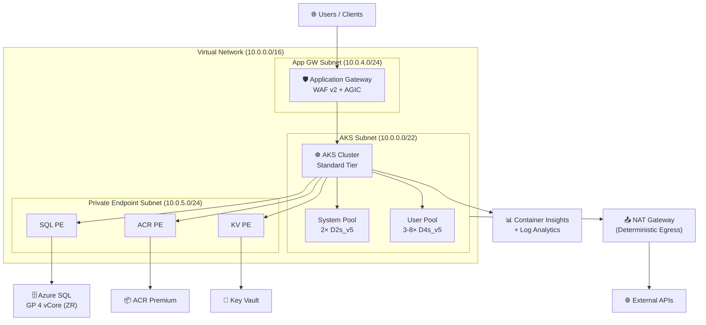
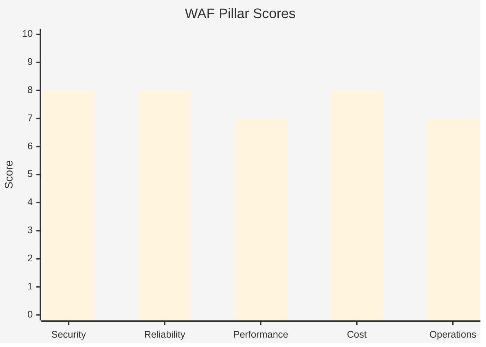

# Step 2: Architecture Assessment - aks-platform

<strong>📑 Table of Contents</strong>

- [Requirements Validation ✅](#requirements-validation-)
- [Executive Summary](#executive-summary)
- [WAF Pillar Assessment](#waf-pillar-assessment)
- [Resource SKU Recommendations](#resource-sku-recommendations)
- [Architecture Decision Summary](#architecture-decision-summary)
- [Implementation Handoff](#implementation-handoff)
- [Approval Gate](#approval-gate)
- [References](#references)

> Generated by architect agent | 2026-02-15

| ⬅️ Previous                              | 📑 Index            | Next ➡️                                            |
| ---------------------------------------- | ------------------- | -------------------------------------------------- |
| [01-requirements.md](01-requirements.md) | [README](README.md) | [03-des-cost-estimate.md](03-des-cost-estimate.md) |

## Requirements Validation ✅

| Requirement Area        | Status     | Validation Notes                                                                                                  |
| ----------------------- | ---------- | ----------------------------------------------------------------------------------------------------------------- |
| NFRs (SLA, RTO, RPO)    | ✅ Defined | SLA 99.95% (AKS Standard tier), RTO 1 hr, RPO 15 min — achievable with zone-redundant SQL and GitOps-based AKS DR |
| Compliance requirements | ✅ Defined | SOC 2, GDPR, ISO 27001 applicable; PCI-DSS and HIPAA explicitly excluded                                          |
| Budget (approximate)    | ✅ Defined | $3,000–5,000/month soft limit; preliminary breakdown provided and validated against pricing                       |
| Scale requirements      | ✅ Defined | 1,000–5,000 concurrent users, AKS user pool autoscale 3→8 nodes, SQL 4 vCores with room to grow                   |
| Security controls       | ✅ Defined | Private endpoints for SQL/ACR/KV, WAF Prevention mode, managed identity, Azure AD-only auth, TLS 1.2              |
| Data residency          | ✅ Defined | EU-only (swedencentral), failover to germanywestcentral                                                           |

---

## Executive Summary

This assessment evaluates an enterprise-grade AKS container platform with WAF-protected ingress
(Application Gateway with AGIC), Azure SQL Database backend, and NAT Gateway for deterministic
outbound traffic. The architecture follows the
[AKS baseline reference architecture](https://learn.microsoft.com/azure/architecture/reference-architectures/containers/aks/baseline-aks)
with additions for WAF ingress, SQL integration, and NAT Gateway egress.

The design prioritizes **Security** and **Reliability** as primary WAF pillars, with enterprise
compliance (SOC 2, GDPR, ISO 27001) driving private endpoint adoption and network isolation.
Cost optimization is achieved through right-sized SKUs and reserved instance eligibility while
staying within the $3,000–5,000/month budget envelope.

**Estimated monthly cost: ~$1,880–2,400** (pay-as-you-go), well within budget. Reserved instances
can reduce this further by ~$150–250/month.

### Recommended Architecture

---

## WAF Pillar Assessment

### Overall Scores

| Pillar                    | Score | Confidence | Summary                                                                       |
| ------------------------- | ----- | ---------- | ----------------------------------------------------------------------------- |
| 🔒 Security               | 8/10  | High       | Strong network isolation, managed identity, WAF Prevention, private endpoints |
| 🔄 Reliability            | 8/10  | High       | AKS Standard SLA, zone-redundant SQL, multi-node pools, PITR backups          |
| ⚡ Performance            | 7/10  | Medium     | D4s_v5 user nodes adequate; HPA planned; needs load testing validation        |
| 💰 Cost Optimization      | 8/10  | High       | ~$1,880–2,400/mo vs $3–5K budget; RI/SP eligible; spot nodes for dev/test     |
| 🔧 Operational Excellence | 7/10  | Medium     | IaC via Bicep, Container Insights, but GitOps & runbooks not yet defined      |

**Composite WAF Score**: 7.6/10
**Primary Pillar Optimized**: Security
**Trade-offs Accepted**: Slightly higher cost for Premium ACR (required for private endpoints); non-private AKS API server (required for AGIC addon — mitigated with authorized IP ranges)

### Service Maturity Assessment

| Service                      | GA Status | AVM Available | Lifecycle Risk |
| ---------------------------- | --------- | ------------- | -------------- |
| Azure Kubernetes Service     | GA        | ✅            | 🟢 Low         |
| Application Gateway WAF v2   | GA        | ✅            | 🟢 Low         |
| Azure SQL Database (Gen5)    | GA        | ✅            | 🟢 Low         |
| NAT Gateway                  | GA        | ✅            | 🟢 Low         |
| Azure Container Registry     | GA        | ✅            | 🟢 Low         |
| Azure Key Vault              | GA        | ✅            | 🟢 Low         |
| Log Analytics / App Insights | GA        | ✅            | 🟢 Low         |
| AKS Workload Identity        | GA        | N/A (config)  | 🟢 Low         |
| AGIC Addon                   | GA        | N/A (addon)   | 🟡 Medium      |

> AGIC addon rated 🟡 Medium because Microsoft recommends evaluating the standalone AGIC Helm
> chart for advanced scenarios. The addon approach is simpler but has fewer customization options.

---

### 🔒 Security Assessment (8/10)

**Strengths:**

- Private endpoints for all data-plane services (SQL, ACR, Key Vault) — zero public access to backends
- WAF v2 in Prevention mode with OWASP 3.2 ruleset blocking malicious traffic at the edge
- Managed identity throughout: Workload Identity for pods, kubelet identity for ACR pull and KV access
- Azure AD-only authentication for both AKS and SQL — local accounts disabled
- Network isolation via Azure CNI + Calico network policies + NSGs on all subnets
- TLS 1.2 enforced on all endpoints; Key Vault for certificate and secret management
- Defender for Containers enabled for runtime threat detection

**Gaps:**

- AKS API server is not private (required for AGIC addon compatibility) — mitigated by authorized IP ranges
- No Azure DDoS Protection Standard plan (relies on built-in Basic protection + WAF)
- No Microsoft Defender for SQL explicitly budgeted (though ATP is included in requirements)

**Recommendations:**

1. Configure AKS authorized IP ranges to restrict API server access to known corporate CIDRs and CI/CD runners
2. Enable diagnostic settings on all resources to send security logs to Log Analytics (AKS audit logs, NSG flow logs, SQL audit logs)
3. Evaluate Azure DDoS Protection Standard if public-facing traffic grows beyond initial projections
4. Implement Kubernetes Pod Security Standards via Azure Policy (Baseline profile minimum, Restricted for prod namespaces)

### 🔄 Reliability Assessment (8/10)

**Strengths:**

- AKS Standard tier with Uptime SLA → 99.95% API server availability
- Zone-redundant SQL Database General Purpose (automatic failover across AZs)
- Multi-node system pool (2 nodes min) with taint — dedicated to critical workloads
- User pool with autoscale (3→8 nodes) absorbs load spikes
- PITR backups for SQL (35-day short-term + weekly LTR for 1 year)
- Key Vault soft-delete (90 days) + purge protection for secret recovery
- GitOps-based cluster config recovery — infrastructure fully reproducible from Bicep

**Gaps:**

- Single-region deployment (swedencentral only) — no active-passive DR for AKS workloads
- NAT Gateway is a single point of failure for outbound traffic (though it has built-in HA within a zone)
- No Velero or equivalent backup for Kubernetes persistent state

**Recommendations:**

1. Document RTO/RPO recovery procedures: rebuild AKS from Bicep + GitOps in germanywestcentral
2. Implement Velero for stateful workload backups if persistent volumes are used
3. Configure AKS cluster auto-upgrade channel (`stable`) to maintain patch currency
4. Test SQL geo-restore to germanywestcentral annually as part of DR drill

### ⚡ Performance Assessment (7/10)

**Strengths:**

- D4s_v5 user nodes (4 vCPU, 16 GB) well-suited for typical microservices workloads
- Azure CNI provides native VNet IP assignment — no overlay network latency penalty
- Application Gateway autoscale (2→10 instances) handles traffic bursts
- SQL General Purpose 4 vCores provides adequate IOPS for 50–200 GB dataset
- HPA planned for CPU/memory-based pod autoscaling

**Gaps:**

- No Redis Cache layer for high-frequency read operations
- <200 ms p95 API target not validated — requires load testing against actual workloads
- SQL provisioned compute has fixed ceiling; may need right-sizing after workload profiling
- No CDN for static asset delivery (not required but could improve frontend performance)

**Recommendations:**

1. Conduct load testing with Azure Load Testing service before production launch
2. Profile SQL query performance under realistic load; consider scaling to 8 vCores if p95 > 200 ms
3. Evaluate Azure Cache for Redis (Basic C1 or Standard C0) if caching patterns emerge
4. Ensure HPA thresholds align with Application Gateway health probe intervals

### 💰 Cost Assessment (8/10)

| Service                         | SKU             |  Monthly Cost | Notes                                 |
| ------------------------------- | --------------- | ------------: | ------------------------------------- |
| AKS system pool (2× D2s_v5)     | Standard_D2s_v5 |       $148.92 | $0.102/hr × 2 × 730h                  |
| AKS user pool (3× D4s_v5)       | Standard_D4s_v5 |       $446.76 | $0.204/hr × 3 × 730h (min autoscale)  |
| AKS Standard tier               | Standard        |        $73.00 | $0.10/hr × 730h (Uptime SLA)          |
| App Gateway WAF v2              | WAF_v2          |       $289.80 | $0.26/hr fixed + ~$100 capacity units |
| SQL DB GP 4 vCore (zone-red.)   | GP Gen5 4 vCore |       $488.92 | $0.167439/vCore/hr × 4 × 730h         |
| SQL DB zone redundancy          | ZR addon        |       $122.23 | ~25% surcharge on compute             |
| SQL DB storage (100 GB)         | GP Storage      |        $11.50 | ~$0.115/GB/month                      |
| ACR Premium                     | Premium         |       $170.00 | $0.33333/day × 30 + storage overhead  |
| NAT Gateway                     | Standard        |        $36.50 | ~$0.045/hr + data processing          |
| Key Vault Standard              | Standard        |         $5.00 | Per-operation pricing                 |
| Log Analytics (~20 GB/mo)       | Per-GB          |        $59.80 | $2.99/GB ingestion                    |
| Public IPs (2×: NAT GW + AppGW) | Standard Static |         $7.30 | ~$0.005/hr × 2 × 730h                 |
| VNet / Subnets / NSGs           | —               |         $0.00 | No cost                               |
| **Total Estimated (PAYG)**      |                 | **$1,859.73** | **Within budget ($3–5K)**             |

**Cost Optimization Applied:**

- Linux-only nodes (no Windows licensing surcharge)
- AKS Standard tier (not Premium) for 99.95% SLA at lower management plane cost
- SQL General Purpose (not Business Critical) — sufficient for non-OLTP-intensive workloads
- Log Analytics ingestion capped at ~20 GB/mo; configure diagnostic settings selectively
- Spot node pool eligible for dev/test workloads (requirements mention this — saves ~40–60% on dev VMs)

### 🔧 Operational Excellence Assessment (7/10)

**Strengths:**

- Full Infrastructure as Code via Bicep with AVM modules
- Container Insights + Log Analytics for centralized observability
- Diagnostic settings planned for all resources
- Change management via pull request on Bicep templates
- Maintenance windows defined (Sundays 02:00–06:00 CET)

**Gaps:**

- GitOps tooling (Flux/ArgoCD) not yet specified for workload delivery
- No runbook or incident response playbook defined
- Alert rules and action groups not yet configured
- No chaos engineering or game day testing planned

**Recommendations:**

1. Implement Azure Monitor alert rules for: node NotReady, pod CrashLoopBackOff, SQL DTU > 80%, App GW 5xx rate
2. Configure Action Groups routing P1 alerts to Teams + PagerDuty/email within 5 minutes
3. Adopt GitOps (Flux v2 via AKS extension) for workload deployment — keeps cluster config separate from infra
4. Create operational runbooks for common scenarios: node pool scaling, AKS upgrade, SQL failover, certificate rotation

---

## Resource SKU Recommendations

| Service             | Recommended SKU        | Configuration                               | Monthly Est. | Justification                                            |
| ------------------- | ---------------------- | ------------------------------------------- | -----------: | -------------------------------------------------------- |
| AKS Cluster         | Standard tier          | K8s 1.29.x, Azure CNI, Calico, AGIC addon   |       $73.00 | 99.95% SLA; Premium ($438/mo) unnecessary at this stage  |
| AKS System Pool     | Standard_D2s_v5        | 2–3 nodes, Ubuntu 22.04, CriticalAddonsOnly |      $148.92 | Min viable for CoreDNS + metrics-server + kube-proxy     |
| AKS User Pool       | Standard_D4s_v5        | 3–8 nodes, Ubuntu 22.04, autoscale enabled  |      $446.76 | 4 vCPU / 16 GB balances cost and workload headroom       |
| Application Gateway | WAF_v2                 | Autoscale 2–10, Prevention mode, OWASP 3.2  |      $289.80 | WAF required; v2 supports autoscale and AGIC integration |
| Azure SQL Database  | GP Gen5 4 vCore        | Zone-redundant, Azure AD-only, 100 GB       |      $622.65 | Balanced cost/perf; can scale to 8 vCores if needed      |
| ACR                 | Premium                | Private endpoint, managed identity pull     |      $170.00 | Premium required for private endpoint + content trust    |
| NAT Gateway         | Standard               | 1 public IP, attached to AKS subnet         |       $36.50 | Deterministic egress IPs; no SNAT port exhaustion        |
| Key Vault           | Standard               | RBAC, soft-delete 90d, purge protection     |        $5.00 | FIPS 140-2 L2 sufficient; Premium (HSM) not required     |
| Log Analytics       | Per-GB (Pay-as-you-go) | 90-day retention, ~20 GB/mo ingestion       |       $59.80 | Pay-as-you-go optimal for < 100 GB/day                   |

<strong>AKS Node Pool</strong> — VM Size Comparison

| VM Size         | vCPU | RAM (GB) | Est. $/hr (Linux) | Monthly (730h) | Fits?            |
| --------------- | ---- | -------- | ----------------: | -------------: | ---------------- |
| Standard_D2s_v5 | 2    | 8        |            $0.102 |         $74.46 | ✅ System pool   |
| Standard_D4s_v5 | 4    | 16       |            $0.204 |        $148.92 | ✅ User pool     |
| Standard_D8s_v5 | 8    | 32       |            $0.408 |        $297.84 | ⚠️ Oversized now |
| Standard_D2s_v4 | 2    | 8        |            $0.111 |         $81.03 | ❌ Previous gen  |

**Selected**: D2s_v5 (system) + D4s_v5 (user) — current generation with best price/performance ratio. Upgrade to D8s_v5 only if pods require > 14 GB allocatable memory.

<strong>Azure SQL Database</strong> — Tier Comparison

| Tier                 | vCores | Max IOPS | Price/hr |   Monthly | Fits?            |
| -------------------- | ------ | -------- | -------: | --------: | ---------------- |
| GP Gen5 2 vCore      | 2      | ~3,200   |   $0.335 |   $244.55 | ❌ Insufficient  |
| GP Gen5 4 vCore      | 4      | ~6,400   |   $0.670 |   $489.10 | ✅ Right-sized   |
| GP Gen5 4 vCore (ZR) | 4      | ~6,400   |   $0.837 |   $611.01 | ✅ Recommended   |
| GP Gen5 8 vCore      | 8      | ~12,800  |   $1.340 |   $978.20 | ⚠️ Scale-up path |
| BC Gen5 4 vCore      | 4      | ~20,000  |   $2.344 | $1,711.12 | ❌ Over-budget   |

**Selected**: GP Gen5 4 vCore (zone-redundant) — meets performance needs with HA across availability zones. Scale to 8 vCores if profiling shows CPU pressure.

<strong>Application Gateway</strong> — SKU Comparison

| SKU         | WAF Support | Autoscale | Fixed $/hr | Monthly (fixed) | Fits?          |
| ----------- | ----------- | --------- | ---------: | --------------: | -------------- |
| Standard v2 | ❌          | ✅        |      $0.26 |         $189.80 | ❌ No WAF      |
| WAF v2      | ✅          | ✅        |      $0.26 |         $189.80 | ✅ Recommended |
| Basic v2    | ❌          | ❌        |      $0.02 |          $14.60 | ❌ No WAF/AGIC |

**Selected**: WAF v2 — mandatory per requirements (WAF Prevention mode, OWASP 3.2). Capacity units add ~$100/mo based on estimated throughput.

---

## Architecture Decision Summary

| Decision                  | Choice                               | Rationale                                                                                        |
| ------------------------- | ------------------------------------ | ------------------------------------------------------------------------------------------------ |
| AKS network plugin        | Azure CNI                            | Required for AGIC integration; provides native VNet IPs for pods                                 |
| AKS network policy        | Calico                               | Enterprise-grade pod-to-pod isolation; richer policy language than Azure network policies        |
| Ingress approach          | AGIC addon (not standalone Helm)     | Simpler lifecycle management; AKS-managed upgrades; sufficient for requirements                  |
| AKS API server visibility | Public with authorized IP ranges     | AGIC addon requires non-private API server; IP ranges restrict access to known CIDRs             |
| SQL compute model         | Provisioned (not Serverless)         | Predictable, always-on workload; Serverless auto-pause inappropriate for production              |
| SQL HA strategy           | Zone-redundant (not failover groups) | Single-region requirement; zone redundancy provides 99.995% SLA at lower cost than geo-failover  |
| ACR SKU                   | Premium (not Standard)               | Private endpoint support requires Premium tier; also enables content trust and geo-replication   |
| Outbound traffic          | NAT Gateway (not LB SNAT)            | Deterministic public IP(s); avoids AKS load balancer SNAT port exhaustion under high egress load |
| Secret management         | Key Vault + CSI Secrets Store Driver | Secrets projected as volumes/env vars; avoids storing secrets in Kubernetes etcd                 |
| Monitoring stack          | Container Insights + Log Analytics   | Native integration; Prometheus add-on available for custom metrics if needed later               |

---

## Implementation Handoff

### Ready for bicep-plan

The architecture is approved for implementation with the following key parameters:

| Parameter       | Value                                   |
| --------------- | --------------------------------------- |
| Region          | swedencentral                           |
| Failover Region | germanywestcentral                      |
| Environment     | dev / prod                              |
| Budget          | $3,000–5,000/month (estimated: ~$1,880) |
| Resource Count  | 10 primary resources + supporting       |

### Resources to Provision

| #   | Resource                     | SKU / Config                           | Key Config                                       |
| --- | ---------------------------- | -------------------------------------- | ------------------------------------------------ |
| 1   | Resource Group               | rg-aksplatform-{env}                   | swedencentral, required tags                     |
| 2   | Virtual Network              | vnet-aksplatform-{env} (10.0.0.0/16)   | 3 subnets: AKS, AppGW, PE                        |
| 3   | NSGs (3×)                    | nsg-aks/appgw/pe-{env}                 | Inbound/outbound rules per subnet                |
| 4   | NAT Gateway + Public IP      | natgw-aksplatform-{env}                | Attached to AKS subnet                           |
| 5   | AKS Cluster                  | Standard tier, K8s 1.29, AGIC addon    | System pool (2× D2s_v5) + User pool (3× D4s_v5)  |
| 6   | Application Gateway WAF v2   | agw-aksplatform-{env}                  | Autoscale 2–10, Prevention, OWASP 3.2            |
| 7   | Azure SQL Server + Database  | sql-aksplatform-{env} / GP 4 vCore ZR  | Azure AD-only, private endpoint, TLS 1.2         |
| 8   | Azure Container Registry     | acraksplatform{env}{suffix}            | Premium, private endpoint, managed identity pull |
| 9   | Azure Key Vault              | kv-aksplat-{env}-{suffix}              | RBAC, soft-delete, purge protection              |
| 10  | Log Analytics + App Insights | log-aksplatform-{env}                  | 90-day retention, Container Insights enabled     |
| 11  | Private DNS Zones (3×)       | privatelink.database/azurecr/vaultcore | Linked to VNet                                   |
| 12  | Private Endpoints (3×)       | pe-sql/acr/kv-{env}                    | In PE subnet (10.0.5.0/24)                       |

### Security Requirements for Implementation

| Requirement                      | Implementation                                                             |
| -------------------------------- | -------------------------------------------------------------------------- |
| Managed Identity for AKS         | System-assigned for kubelet; Workload Identity for pod-level access        |
| Private endpoints (SQL, ACR, KV) | Deploy in PE subnet; create private DNS zones; disable public access       |
| WAF Prevention mode              | WAF policy resource with OWASP 3.2 ruleset attached to Application Gateway |
| Azure AD-only SQL auth           | `azureADOnlyAuthentication: true` on SQL Server; configure AD admin        |
| TLS 1.2 minimum                  | Configure on App GW (SSL Policy), SQL Server, and Key Vault                |
| AKS authorized IP ranges         | Set on AKS cluster `apiServerAccessProfile.authorizedIpRanges`             |
| Calico network policies          | Enable via AKS `networkProfile.networkPolicy: 'calico'`                    |
| Defender for Containers          | Enable via AKS `securityProfile.defender.securityMonitoring.enabled: true` |

### Monitoring Requirements for Implementation

| Requirement             | Implementation                                                               |
| ----------------------- | ---------------------------------------------------------------------------- |
| Container Insights      | Enable via AKS `addonProfiles.omsagent` linked to Log Analytics workspace    |
| SQL diagnostics         | Diagnostic settings → Log Analytics (SQLInsights, Errors, QueryStoreRuntime) |
| App Gateway diagnostics | Diagnostic settings → Log Analytics (ApplicationGatewayAccessLog, WAF)       |
| Key Vault diagnostics   | Diagnostic settings → Log Analytics (AuditEvent)                             |
| NSG flow logs           | Enable NSG flow logs v2 → Log Analytics                                      |
| Alert rules             | Node NotReady, Pod CrashLoopBackOff, SQL DTU > 80%, AppGW 5xx > 5%           |
| Action groups           | Email + Teams channel for P1/P2 alerts                                       |

---

## Approval Gate

> [!IMPORTANT]
> **🏗️ Architecture Assessment Complete**
>
> | Pillar      | Score |
> | ----------- | ----- |
> | Security    | 8/10  |
> | Reliability | 8/10  |
> | Performance | 7/10  |
> | Cost        | 8/10  |
> | Operations  | 7/10  |
>
> **Composite WAF Score**: 7.6/10
>
> **Estimated Monthly Cost**: ~$1,880 (within budget of $3,000–5,000)
>
> **Confidence Level**: High
>
> - [ ] **Approved** — proceed to bicep-plan
> - Approver: \_\_\_
> - Date: \_\_\_
>
> Reply **"approve"** to proceed to bicep-plan, or provide feedback for revisions.

---

## References

> [!NOTE]
> 📚 The following Microsoft Learn resources informed this assessment.

| Topic                      | Link                                                                                                            |
| -------------------------- | --------------------------------------------------------------------------------------------------------------- |
| Well-Architected Framework | [Overview](https://learn.microsoft.com/azure/well-architected/)                                                 |
| AKS Baseline Architecture  | [Reference](https://learn.microsoft.com/azure/architecture/reference-architectures/containers/aks/baseline-aks) |
| AKS Best Practices         | [Guide](https://learn.microsoft.com/azure/aks/best-practices)                                                   |
| AGIC Overview              | [Docs](https://learn.microsoft.com/azure/application-gateway/ingress-controller-overview)                       |
| AKS Networking (Azure CNI) | [Configure](https://learn.microsoft.com/azure/aks/configure-azure-cni)                                          |
| NAT Gateway with AKS       | [Managed NAT](https://learn.microsoft.com/azure/aks/nat-gateway)                                                |
| Azure SQL Security         | [Overview](https://learn.microsoft.com/azure/azure-sql/database/security-overview)                              |
| AKS Workload Identity      | [Overview](https://learn.microsoft.com/azure/aks/workload-identity-overview)                                    |
| AKS Pricing Tiers          | [Free vs Standard](https://learn.microsoft.com/azure/aks/free-standard-pricing-tiers)                           |
| Security Checklist         | [WAF Security](https://learn.microsoft.com/azure/well-architected/security/checklist)                           |
| Reliability Checklist      | [WAF Reliability](https://learn.microsoft.com/azure/well-architected/reliability/checklist)                     |
| Cost Optimization          | [WAF Cost](https://learn.microsoft.com/azure/well-architected/cost-optimization/checklist)                      |
| Azure Pricing Calculator   | [Calculator](https://azure.microsoft.com/pricing/calculator/)                                                   |

---

_Assessment performed using Azure Well-Architected Framework. Pricing data from Azure Pricing MCP (2026-02-15)._

---

| ⬅️ [01-requirements.md](01-requirements.md) | 🏠 [Project Index](README.md) | ➡️ [03-des-cost-estimate.md](03-des-cost-estimate.md) |
| ------------------------------------------- | ----------------------------- | ----------------------------------------------------- |
