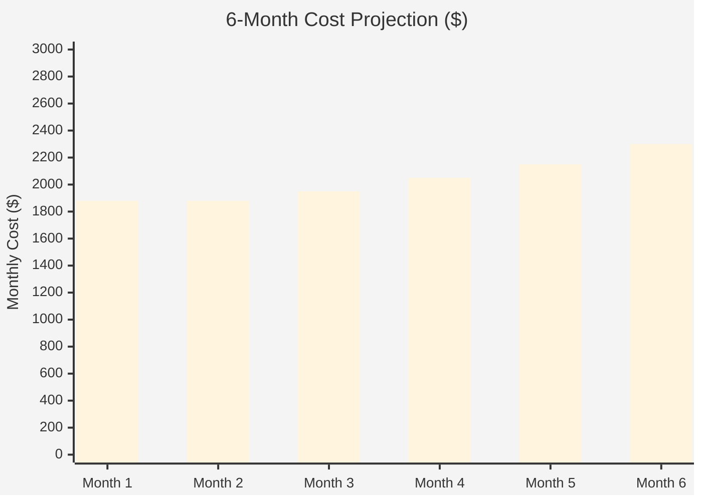

# Azure Cost Estimate: aks-platform


<details>
<summary><strong>📑 Table of Contents</strong></summary>

- [💰 Cost At-a-Glance](#-cost-at-a-glance)
- [✅ Decision Summary](#-decision-summary)
- [🔁 Requirements → Cost Mapping](#-requirements--cost-mapping)
- [📊 Top 5 Cost Drivers](#-top-5-cost-drivers)
- [Architecture Overview](#architecture-overview)
- [🧾 What We Are Not Paying For (Yet)](#-what-we-are-not-paying-for-yet)
- [⚠️ Cost Risk Indicators](#-cost-risk-indicators)
- [🎯 Quick Decision Matrix](#-quick-decision-matrix)
- [💰 Savings Opportunities](#-savings-opportunities)
- [Detailed Cost Breakdown](#detailed-cost-breakdown)
- [References](#references)

</details>

> Generated by architect agent | 2026-02-15

| ⬅️ Previous                                                    | 📑 Index            | Next ➡️                                                      |
| -------------------------------------------------------------- | ------------------- | ------------------------------------------------------------ |
| [02-architecture-assessment.md](02-architecture-assessment.md) | [README](README.md) | [04-governance-constraints.md](04-governance-constraints.md) |

**Generated**: 2026-02-15
**Region**: swedencentral
**Environment**: Production
**MCP Tools Used**: azure_price_search, azure_cost_estimate, azure_ri_pricing, azure_discover_skus
**Architecture Reference**: [02-architecture-assessment.md](02-architecture-assessment.md)

## 💰 Cost At-a-Glance

> **Monthly Total: ~$1,880** | Annual: ~$22,560
>
> ```
> Budget: $3,000–5,000/month (soft) | Utilization: 38–63% ($1,880 of $3,000–$5,000)
> ```
>
> | Status            | Indicator                                             |
> | ----------------- | ----------------------------------------------------- |
> | Cost Trend        | ➡️ Stable (fixed provisioned compute)                 |
> | Savings Available | 💰 ~$2,200/year with 1-year Reserved Instances        |
> | Compliance        | ✅ SOC 2 / GDPR / ISO 27001 aligned (no cost premium) |

## ✅ Decision Summary

- ✅ Approved: AKS Standard tier, WAF v2 ingress, GP 4 vCore SQL (ZR), Premium ACR, NAT Gateway, full observability stack
- ⏳ Deferred: Redis Cache, DDoS Standard, multi-region DR, Azure Front Door, premium monitoring (Sentinel)
- 🔁 Redesign Trigger: If concurrent users exceed 5,000 or p95 latency cannot meet < 200 ms with current SQL vCore count, scale SQL to 8 vCores (+~$490/mo) and evaluate Redis Cache (+~$55/mo)

**Confidence**: High | **Expected Variance**: ±15% (Log Analytics ingestion volume is the main variable; node autoscaling adds $149–745/mo at 3–8 nodes)

## 🔁 Requirements → Cost Mapping

| Requirement                      | Architecture Decision                      | Cost Impact               | Mandatory |
| -------------------------------- | ------------------------------------------ | ------------------------- | --------- |
| 99.95% SLA (AKS)                 | AKS Standard tier (Uptime SLA)             | +$73/month                | Yes       |
| WAF in Prevention mode           | Application Gateway WAF v2                 | +$290/month               | Yes       |
| Private endpoints (SQL, ACR, KV) | Premium ACR + PE subnet + Private DNS      | +$170/month (ACR)         | Yes       |
| Zone-redundant SQL               | GP 4 vCore ZR addon                        | +$122/month               | Yes       |
| Deterministic outbound IPs       | NAT Gateway on AKS subnet                  | +$37/month                | Yes       |
| SOC 2 / GDPR compliance          | Encryption at rest, audit logging, EU data | $0 incremental            | Yes       |
| Container observability          | Container Insights + Log Analytics         | +$60/month (~20 GB)       | Yes       |
| Autoscaling (3→8 user nodes)     | AKS cluster autoscaler                     | +$0–$745/month (variable) | No        |

## 📊 Top 5 Cost Drivers

| Rank | Resource                    | Monthly Cost | % of Total | Trend | Optimization                         |
| ---- | --------------------------- | -----------: | ---------: | ----- | ------------------------------------ |
| 1️⃣   | SQL DB GP 4 vCore (ZR)      |      $622.65 |      33.1% | ➡️    | 1-yr RI if workload stable           |
| 2️⃣   | AKS user pool (3× D4s_v5)   |      $446.76 |      23.8% | 📈    | 1-yr RI saves 41%; spot for dev/test |
| 3️⃣   | Application Gateway WAF v2  |      $289.80 |      15.4% | ➡️    | Fixed cost; optimize CU utilization  |
| 4️⃣   | ACR Premium                 |      $170.00 |       9.0% | ➡️    | Lifecycle policy to prune old images |
| 5️⃣   | AKS system pool (2× D2s_v5) |      $148.92 |       7.9% | ➡️    | 1-yr RI saves 41%                    |

> 💡 **Quick Win**: Enable ACR image retention policy to auto-delete untagged manifests older than 30 days — keeps storage costs flat as images accumulate.

<details>
<summary><strong>Cost Driver Details</strong></summary>

#### 1️⃣ Azure SQL Database

| Aspect            | Detail                                                        |
| ----------------- | ------------------------------------------------------------- |
| Current SKU       | GP Gen5 4 vCore (zone-redundant)                              |
| Monthly Cost      | $622.65                                                       |
| Cost Breakdown    | Compute: $488.92, ZR addon: $122.23, Storage (100 GB): $11.50 |
| Optimization      | 1-year reserved capacity                                      |
| Potential Savings | ~$200/month with 1-yr RI (~41% on compute)                    |

#### 2️⃣ AKS User Node Pool

| Aspect            | Detail                                                 |
| ----------------- | ------------------------------------------------------ |
| Current SKU       | 3× Standard_D4s_v5 (min autoscale)                     |
| Monthly Cost      | $446.76 (at 3 nodes) → $1,190 at 8 nodes               |
| Optimization      | 1-year RI for baseline 3 nodes; spot pool for dev/test |
| Potential Savings | ~$183/month with 1-yr RI on 3 nodes (41% savings)      |

#### 3️⃣ Application Gateway WAF v2

| Aspect            | Detail                                    |
| ----------------- | ----------------------------------------- |
| Current SKU       | WAF v2 (autoscale 2–10)                   |
| Monthly Cost      | ~$290 (fixed $190 + ~$100 capacity units) |
| Optimization      | Right-size min capacity; monitor CU usage |
| Potential Savings | Marginal — fixed cost dominates           |

</details>

## Architecture Overview

### Cost Distribution

| Category         | Monthly Cost (USD) | Share |
| ---------------- | -----------------: | ----: |
| 💻 Compute       |          $1,115.44 |   59% |
| 💾 Data Services |            $627.65 |   33% |
| 🌐 Networking    |            $133.60 |    7% |
| 🔧 Monitoring    |             $59.80 |    3% |

### Month-over-Month Projection



> Growth driven by: Log Analytics ingestion scaling with workload count, SQL storage auto-grow, and user node pool autoscaling as traffic increases.

### Key Design Decisions Affecting Cost

| Decision                   | Cost Impact    | Business Rationale                                          | Status   |
| -------------------------- | -------------- | ----------------------------------------------------------- | -------- |
| Premium ACR (not Standard) | +$100/month 📈 | Required for private endpoint support                       | Required |
| Zone-redundant SQL         | +$122/month 📈 | 99.995% SLA across AZs per reliability requirements         | Required |
| AKS Standard (not Free)    | +$73/month 📈  | 99.95% API server SLA for production                        | Required |
| Linux-only nodes           | -$284/month 📉 | No Windows licensing; AKS workloads are containerized Linux | Required |
| NAT Gateway (vs LB SNAT)   | +$37/month 📈  | Deterministic egress IPs; eliminates SNAT exhaustion risk   | Required |

## 🧾 What We Are Not Paying For (Yet)

- **Azure Cache for Redis** (~$55–250/mo): Add if caching patterns emerge from load testing
- **Azure DDoS Protection Standard** (~$2,944/mo): Current risk accepted with WAF + Basic DDoS
- **Multi-region DR** (~$1,500+/mo): Single-region with SQL geo-restore; full DR adds second AKS cluster
- **Azure Front Door** (~$350+/mo): Not needed — App Gateway handles single-region ingress
- **Azure Sentinel** (~$2.46/GB): Log Analytics sufficient for now; Sentinel adds SIEM/SOAR capabilities
- **Azure Bastion** (~$140/mo): SSH via `az aks command invoke`; add Bastion if persistent debug access needed
- **Azure Firewall** (~$900/mo): NAT Gateway provides egress; add Firewall if egress filtering required

### Assumptions & Uncertainty

- Log Analytics ingestion estimated at ~20 GB/mo based on typical AKS clusters with 3–5 user nodes; higher workload density increases log volume
- SQL storage set at 100 GB with auto-grow; growth rate depends on application data patterns
- Application Gateway capacity unit estimate (~$100/mo) based on moderate traffic; high-throughput workloads may increase CU consumption
- Node autoscaling costs ($149–$745/mo range) depend on actual pod scaling behavior

## ⚠️ Cost Risk Indicators

| Resource                   | Risk Level | Issue                                                          | Mitigation                                               |
| -------------------------- | ---------- | -------------------------------------------------------------- | -------------------------------------------------------- |
| AKS user pool autoscaling  | 🟡 Medium  | 3→8 nodes could add up to $745/mo at peak                      | Set pod resource limits; tune HPA thresholds carefully   |
| Log Analytics ingestion    | 🟡 Medium  | Container Insights can generate 50+ GB/mo with verbose logging | Configure diagnostic settings selectively; set daily cap |
| SQL storage auto-grow      | 🟢 Low     | 100 GB baseline; unclear growth rate                           | Monitor storage metrics; consider data retention policy  |
| App Gateway capacity units | 🟢 Low     | Variable cost based on connections and throughput              | Monitor CU metrics; right-size min autoscale instances   |

> **⚠️ Watch Item**: AKS user pool autoscaling is the largest cost variable. At steady state with 3 nodes: $447/mo. At full scale with 8 nodes: $1,190/mo — a $743/mo delta. Set autoscaler carefully and monitor.

## 🎯 Quick Decision Matrix

_"If you need X, expect to pay Y more"_

| Requirement               | Additional Cost | SKU Change                   | Verdict        | Notes                                              |
| ------------------------- | --------------- | ---------------------------- | -------------- | -------------------------------------------------- |
| Scale SQL to 8 vCores     | +$490/month     | GP Gen5 8 vCore (ZR)         | 🟡 Monitor     | Profile workload first; scale if p95 > 200 ms      |
| Add Redis Cache           | +$55–250/month  | Standard C0–C1               | 🟡 Monitor     | Add after load testing identifies caching needs    |
| Private AKS cluster       | +$0             | Config change                | 🔴 Investigate | Breaks AGIC addon; requires standalone Helm chart  |
| Azure DDoS Standard       | +$2,944/month   | DDoS Plan                    | 🔴 Investigate | Cost-prohibitive unless regulatory mandate         |
| Multi-region AKS DR       | +$1,500+/month  | Duplicate infra              | 🟡 Monitor     | Evaluate after 6 months based on availability data |
| Spot node pool (dev/test) | -$250/month     | Spot pricing (~60% discount) | 🟢 Go          | Create spot pool for non-production workloads      |

## 💰 Savings Opportunities

> ### Total Potential Savings: ~$5,120/year (1-yr RI on VMs + SQL)
>
> | Strategy                        | Commitment | Monthly Savings | Annual Savings | % Reduction |
> | ------------------------------- | ---------- | --------------: | -------------: | ----------: |
> | VM Reserved Instances (1-yr)    | 1-year     |         $183.54 |      $2,202.48 |        ~31% |
> | VM Reserved Instances (3-yr)    | 3-year     |         $281.39 |      $3,376.68 |        ~47% |
> | VM Savings Plan (1-yr)          | 1-year     |         $148.82 |      $1,785.84 |        ~25% |
> | SQL Reserved Capacity (1-yr)    | 1-year     |         $200.46 |      $2,405.52 |        ~41% |
> | Spot instances (dev/test pool)  | N/A        |        ~$250.00 |     ~$3,000.00 |       ~60%¹ |
> | Dev/Test pricing (non-prod sub) | N/A        |        ~$140.00 |     ~$1,680.00 |       ~24%² |
>
> ¹ Savings on dev/test node pool only (if using spot nodes instead of on-demand)
> ² Savings on dev subscription VM licensing (Linux only — already no Windows cost)

### RI Pricing Detail (from Azure Pricing MCP)

| VM SKU          | PAYG $/hr | 1-yr RI $/hr | 1-yr Savings | Break-even | 3-yr RI $/hr | 3-yr Savings |
| --------------- | --------: | -----------: | -----------: | ---------: | -----------: | -----------: |
| Standard_D2s_v5 |    $0.102 |       $0.060 |        41.0% | 7.1 months |       $0.038 |        63.0% |
| Standard_D4s_v5 |    $0.204 |       $0.120 |        41.0% | 7.1 months |       $0.075 |        63.0% |

**Recommended**: 1-year RIs for baseline AKS nodes (2× D2s_v5 system + 3× D4s_v5 user) — total annual savings of ~$2,200 with a 7.1-month break-even.

## Detailed Cost Breakdown

### Assumptions

- Hours: 730 hours/month (24/7 production workload)
- Network egress: < 100 GB/mo (moderate API traffic via NAT Gateway)
- Storage growth: ~5 GB/month SQL, container images < 50 GB total
- Log ingestion: ~20 GB/mo across AKS + resource diagnostics

### Line Items

| Category         | Service                    | SKU / Meter                   | Quantity / Units            |  Est. Monthly |
| ---------------- | -------------------------- | ----------------------------- | --------------------------- | ------------: |
| 💻 Compute       | AKS system pool            | Standard_D2s_v5 (Linux)       | 2 nodes × 730 hrs           |       $148.92 |
| 💻 Compute       | AKS user pool              | Standard_D4s_v5 (Linux)       | 3 nodes × 730 hrs           |       $446.76 |
| 💻 Compute       | AKS Standard tier          | Uptime SLA                    | 1 cluster × 730 hrs         |        $73.00 |
| 💻 Compute       | Application Gateway WAF v2 | Fixed cost                    | 1 instance × 730 hrs        |       $189.80 |
| 💻 Compute       | Application Gateway WAF v2 | Capacity units                | ~10 CU avg                  |      ~$100.00 |
| 💻 Compute       | Application Gateway WAF v2 | WAF policy                    | Included in fixed cost      |         $0.00 |
| 💾 Data Services | SQL DB compute             | GP Gen5 4 vCore               | 4 vCores × 730 hrs          |       $488.92 |
| 💾 Data Services | SQL DB zone redundancy     | ZR addon                      | ~25% of compute             |       $122.23 |
| 💾 Data Services | SQL DB storage             | GP Storage (LRS)              | 100 GB                      |        $11.50 |
| 💾 Data Services | Key Vault                  | Standard                      | ~1,000 operations/mo        |         $5.00 |
| 🌐 Networking    | NAT Gateway                | Standard (fixed + processing) | 1 instance × 730 hrs        |        $36.50 |
| 🌐 Networking    | Container Registry         | Premium (daily + storage)     | 30 days + 20 GB             |       $170.00 |
| 🌐 Networking    | Public IP addresses        | Standard Static               | 2 IPs × 730 hrs             |         $7.30 |
| 🌐 Networking    | Virtual Network / NSGs     | —                             | 1 VNet + 3 subnets + 3 NSGs |         $0.00 |
| 🌐 Networking    | Private Endpoints          | —                             | 3 endpoints                 |         $0.00 |
| 🌐 Networking    | Private DNS Zones          | —                             | 3 zones                     |         $0.00 |
| 🔧 Monitoring    | Log Analytics              | Per-GB ingestion              | ~20 GB/month                |        $59.80 |
| 🔧 Monitoring    | Application Insights       | Per-GB (first 5 GB free)      | ~3 GB/month                 |         $0.00 |
|                  |                            |                               | **Total (PAYG)**            | **$1,859.73** |

### Notes

- AKS node VMs eligible for 1-year or 3-year Reserved Instances (41–63% savings)
- SQL Database compute eligible for reserved capacity (similar RI discounts)
- ACR classified under Networking as it provides container image distribution — could alternatively be classified under Compute
- Log Analytics first 5 GB/mo is free; Container Insights generates the majority of ingestion volume
- Private Endpoints and Private DNS Zones have no additional cost beyond the resources they connect to
- Consider Dev/Test subscription pricing for non-production environments

---

## References

| Topic                    | Link                                                                                                                   |
| ------------------------ | ---------------------------------------------------------------------------------------------------------------------- |
| Azure Pricing Calculator | [Calculator](https://azure.microsoft.com/pricing/calculator/)                                                          |
| Cost Management          | [Overview](https://learn.microsoft.com/azure/cost-management-billing/costs/overview-cost-management)                   |
| Reserved Instances       | [Reservations](https://learn.microsoft.com/azure/cost-management-billing/reservations/save-compute-costs-reservations) |
| WAF Cost Optimization    | [Checklist](https://learn.microsoft.com/azure/well-architected/cost-optimization/checklist)                            |
| AKS Pricing              | [Pricing](https://azure.microsoft.com/pricing/details/kubernetes-service/)                                             |
| SQL Database Pricing     | [Pricing](https://azure.microsoft.com/pricing/details/azure-sql-database/single/)                                      |
| VM Pricing (Dsv5)        | [Pricing](https://azure.microsoft.com/pricing/details/virtual-machines/linux/)                                         |

---

| ⬅️ [02-architecture-assessment.md](02-architecture-assessment.md) | 🏠 [Project Index](README.md) | ➡️ [04-governance-constraints.md](04-governance-constraints.md) |
| ----------------------------------------------------------------- | ----------------------------- | --------------------------------------------------------------- |
