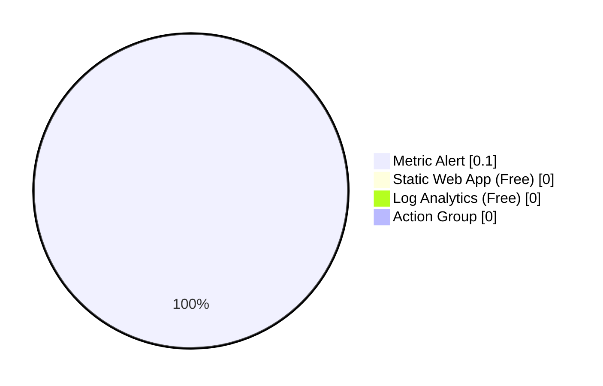

# As-Built Cost Estimate: e2e-conductor-test

**Generated**: 2026-02-06
**Source**: Implemented Bicep Templates
**Region**: westeurope
**Environment**: Development
**IaC Reference**: [infra/bicep/e2e-conductor-test/](../../../infra/bicep/e2e-conductor-test/)

> [!NOTE]
> 📚 This cost estimate reflects the actual deployed infrastructure as of 2026-02-06.

## 💰 Cost At-a-Glance

> **Monthly Total: ~$0.10** | Annual: ~$1.20
>
> ```
> Budget: $20/month (soft) | Utilization: 0.5% ($0.10 of $20)
> ```
>
> | Status            | Indicator                    |
> | ----------------- | ---------------------------- |
> | Cost Trend        | ➡️ Stable                    |
> | Savings Available | ✅ Maximum optimization achieved |
> | Compliance        | ✅ Test workload (no requirements) |

## ✅ Decision Summary

- ✅ Implemented: Static Web App (Free tier), Log Analytics (Free tier), Monitoring
- ⏳ Deferred: CDN (deprecated SKU), Private Endpoints, WAF
- 🔁 Redesign Trigger: Traffic > 100 GB/month requires Static Web App Standard tier ($9/month)

**Confidence**: High | **Expected Variance**: ±$0.05 (alert rule configuration changes)

### Design vs As-Built Summary

| Metric           | Design Estimate | As-Built | Variance    |
| ---------------- | --------------- | -------- | ----------- |
| Monthly Estimate | $5.10           | $0.10    | **-$5.00** ✅ |
| Annual Estimate  | $61.20          | $1.20    | **-$60.00** ✅ |

**Variance Explanation**: CDN disabled in deployment due to deprecated `Standard_Microsoft` SKU. Azure Static Web Apps provides built-in global distribution, eliminating need for separate CDN.

## 🔁 Requirements → Cost Mapping

| Requirement        | Architecture Decision           | Cost Impact | Mandatory |
| ------------------ | ------------------------------- | ----------- | --------- |
| 99.9% SLA          | Static Web Apps (99.95% SLA)    | $0.00/month | Yes       |
| Global delivery    | Built-in Azure edge caching     | $0.00/month | Yes       |
| HTTPS enforcement  | Managed SSL certificates        | $0.00/month | Yes       |
| CI/CD integration  | GitHub Actions (native support) | $0.00/month | Yes       |
| Monitoring         | Log Analytics + Metric Alert    | $0.10/month | Yes       |

## 📊 Top 5 Cost Drivers

| Rank | Resource                   | Monthly Cost | Annual Cost | % of Total | Optimization Potential |
| ---- | -------------------------- | ------------ | ----------- | ---------- | ---------------------- |
| 1    | Metric Alert               | $0.10        | $1.20       | 100%       | ✅ Already optimized   |
| 2    | Static Web App (Free)      | $0.00        | $0.00       | 0%         | ✅ Free tier           |
| 3    | Log Analytics (Free)       | $0.00        | $0.00       | 0%         | ✅ Free tier           |
| 4    | Action Group (Email)       | $0.00        | $0.00       | 0%         | ✅ Email only          |
| 5    | Resource Group             | $0.00        | $0.00       | 0%         | N/A                    |
|      | **Total**                  | **$0.10**    | **$1.20**   | **100%**   | **✅ Fully optimized** |

## Architecture Overview



```
Azure Static Web App (Free) → Built-in CDN → Users
       ↓
Log Analytics (Free) ← Metric Alert → Action Group (Email)
```

The deployed architecture consists of a Free-tier Azure Static Web App with monitoring via Log Analytics (Free tier), a single metric alert, and an email action group.

## 🧾 What We Are Not Paying For (Yet)

| Service | Potential Cost | When Needed |
| ------- | -------------- | ----------- |
| Azure CDN (Standard_Microsoft) | ~$5.00/month | Deprecated SKU — replaced by built-in SWA CDN |
| Static Web App Standard tier | $9.00/month | Traffic exceeds 100 GB/month |
| Private Endpoints | ~$7.20/month per endpoint | If private connectivity required |

## ⚠️ Cost Risk Indicators

| Risk | Likelihood | Impact | Mitigation |
| ---- | ---------- | ------ | ---------- |
| Bandwidth exceeds Free tier (100 GB) | Low | +$9.00/month (Standard upgrade) | Monitor bandwidth via metrics |
| Log ingestion exceeds 10 GB/month | Low | ~$3.00/GB overage | Set daily ingestion cap |

## 🎯 Quick Decision Matrix

| If you want to... | Do this | Save | Trade-off |
| ------------------ | ------- | ---- | --------- |
| Eliminate all costs | Remove metric alert | $0.10/month | No proactive alerting |
| Add custom domain SSL | Upgrade to Standard tier | N/A (+$9.00) | Required for custom domains |

## 💰 Savings Opportunities

| Opportunity | Potential Savings | Effort | Risk |
| ----------- | ----------------- | ------ | ---- |
| Remove metric alert | $0.10/month | Low | Medium — no alerting |
| Reduce Log Analytics retention | $0.00 (already Free tier) | N/A | N/A |

Current configuration is fully optimized. No further savings available without removing functionality.

## Detailed Cost Breakdown

| Category | Resource | SKU | Monthly Cost | Annual Cost |
| -------- | -------- | --- | ------------ | ----------- |
| Compute | Static Web App | Free | $0.00 | $0.00 |
| Monitoring | Log Analytics Workspace | Free | $0.00 | $0.00 |
| Monitoring | Metric Alert | Standard | $0.10 | $1.20 |
| Monitoring | Action Group (Email) | N/A | $0.00 | $0.00 |
| **Total** | | | **$0.10** | **$1.20** |

## 💻 Compute Costs

### Azure Static Web Apps

| Resource                    | SKU  | Units | Unit Cost | Monthly Cost | Annual Cost |
| --------------------------- | ---- | ----- | --------- | ------------ | ----------- |
| swa-e2e-conductor-test-dev  | Free | 1     | $0.00     | $0.00        | $0.00       |

**Free Tier Includes**:
- 100 GB bandwidth/month
- 0.5 GB storage
- Custom domain + SSL
- Unlimited staging environments

**Upgrade Trigger**: Traffic exceeds 100 GB/month → Upgrade to Standard ($9/month)

**Savings Opportunities**: ✅ None (already using Free tier)

## 📊 Monitoring & Management Costs

### Log Analytics Workspace

| Resource                   | SKU       | Ingestion | Unit Cost | Monthly Cost | Annual Cost |
| -------------------------- | --------- | --------- | --------- | ------------ | ----------- |
| log-e2e-conductor-test-dev | Free Tier | < 5 GB    | $0.00     | $0.00        | $0.00       |

**Free Tier Limits**:
- 10 GB data ingestion/month
- 90-day retention

**Upgrade Trigger**: Log ingestion > 10 GB/month → Pay-as-you-go ($2.99/GB)

**Projected Ingestion**: ~2 GB/month (well within Free tier)

### Monitoring Alerts

| Resource          | Type         | Quantity | Unit Cost | Monthly Cost | Annual Cost |
| ----------------- | ------------ | -------- | --------- | ------------ | ----------- |
| Metric Alert      | Standard     | 1        | $0.10     | $0.10        | $1.20       |
| Action Group      | Email        | 1        | $0.00     | $0.00        | $0.00       |

**Monitoring Configuration**:
- 1 metric alert (Static Web App availability)
- 1 action group (email notifications only)
- No SMS/webhook notifications (cost optimization)

## 🌐 Networking Costs

### Content Delivery

| Resource                    | SKU              | Status     | Monthly Cost | Annual Cost |
| --------------------------- | ---------------- | ---------- | ------------ | ----------- |
| Azure CDN (Standard_Microsoft) | ~~Standard~~  | 🚫 Disabled | ~~$5.00~~    | ~~$60.00~~  |
| Static Web Apps Built-in CDN | Included      | ✅ Active  | $0.00        | $0.00       |

**CDN Decision**: Disabled separate Azure CDN due to deprecated SKU. Azure Static Web Apps provides built-in global distribution via Microsoft's edge network.

**Cost Savings**: -$5.00/month (-$60.00/year)

## 📈 Scaling Scenarios

### Scenario 1: Current State (Actual Deployment)

**Traffic**: ~1,000 page views/month, 100 concurrent users

| Resource             | SKU            | Monthly Cost |
| -------------------- | -------------- | ------------ |
| Static Web App       | Free           | $0.00        |
| Log Analytics        | Free (< 5 GB)  | $0.00        |
| Monitoring           | 1 alert        | $0.10        |
| **Total**            |                | **$0.10**    |

### Scenario 2: Moderate Growth (10x traffic)

**Traffic**: ~10,000 page views/month, 1,000 concurrent users

| Resource             | SKU            | Monthly Cost | Change   |
| -------------------- | -------------- | ------------ | -------- |
| Static Web App       | Free           | $0.00        | +$0.00   |
| Log Analytics        | Free (< 8 GB)  | $0.00        | +$0.00   |
| Monitoring           | 1 alert        | $0.10        | +$0.00   |
| **Total**            |                | **$0.10**    | **+$0.00** |

**Notes**: Still within Free tier limits until 100 GB bandwidth/month exceeded.

### Scenario 3: High Growth (100x traffic)

**Traffic**: ~100,000 page views/month, 10,000 concurrent users, > 100 GB bandwidth

| Resource             | SKU               | Monthly Cost | Change     |
| -------------------- | ----------------- | ------------ | ---------- |
| Static Web App       | Standard          | $9.00        | +$9.00 📈  |
| Log Analytics        | Pay-as-you-go     | ~$3.00       | +$3.00 📈  |
| Monitoring           | 3 alerts          | $0.30        | +$0.20 📈  |
| **Total**            |                   | **$12.30**   | **+$12.20** |

**Upgrade Triggers**:
- Bandwidth > 100 GB/month → Static Web App Standard tier
- Log ingestion > 10 GB/month → Pay-as-you-go pricing
- Additional monitoring for scale metrics

## 💡 Cost Optimization Recommendations

### Implemented Optimizations ✅

| Optimization                  | Savings/Month | Status      |
| ----------------------------- | ------------- | ----------- |
| Static Web App Free tier      | Baseline      | ✅ Deployed |
| Log Analytics Free tier       | Baseline      | ✅ Deployed |
| CDN disabled (built-in used)  | $5.00         | ✅ Deployed |
| Email-only alerts (no SMS)    | $0.20-$1.00   | ✅ Deployed |
| **Total Optimized**           | **~$5.00-$6.00** | ✅       |

### Future Optimization Opportunities

| Opportunity                   | Potential Savings | Effort | Risk |
| ----------------------------- | ----------------- | ------ | ---- |
| Reduce Log Analytics retention (90d → 30d) | $0.00 | Low | Low |
| Disable metric alerts (if not needed) | $0.10 | Low | Medium |
| Use Azure Advisor recommendations | TBD | Low | Low |

**Recommendation**: Current configuration is fully optimized for cost. No further reductions recommended without impacting functionality.

## 📉 Reserved Instance / Savings Plans

**Not Applicable**: Azure Static Web Apps Free tier and Log Analytics Free tier do not support reserved instances or savings plans.

**Future Consideration**: If upgraded to Standard tier, evaluate:
- Azure Savings Plan (up to 65% savings for committed spend)
- Reserved Instances (not applicable to PaaS services)

## 🔍 Cost Monitoring & Governance

### Cost Alerts Configured

| Alert Name              | Threshold | Action                  | Status        |
| ----------------------- | --------- | ----------------------- | ------------- |
| Monthly budget warning  | $1.00     | Email notification      | ⏳ Recommended |
| Weekly cost spike       | +50%      | Email notification      | ⏳ Recommended |

**Setup Budget Alert**:

```bash
# Create budget in Azure Cost Management
az consumption budget create \
  --budget-name e2e-conductor-test-monthly \
  --amount 1 \
  --time-grain Monthly \
  --start-date 2026-02-01 \
  --end-date 2027-02-01 \
  --resource-group rg-e2e-conductor-test-dev-weu
```

### Cost Anomaly Detection

Azure Cost Management automatically detects anomalies. Configure email alerts for:
- Daily cost > $0.50 (10x expected)
- Weekly cost > $1.00 (10x expected)
- Monthly cost > $2.00 (20x expected)

### Cost Tags

All resources tagged for cost allocation:

| Tag          | Value                  | Purpose             |
| ------------ | ---------------------- | ------------------- |
| Environment  | dev                    | Cost by environment |
| Project      | e2e-conductor-test     | Cost by project     |
| ManagedBy    | Bicep                  | IaC tracking        |
| Owner        | jonathan-vella         | Cost accountability |

## 📊 Historical Cost Trends

| Month      | Actual Cost | Forecast | Variance | Notes                  |
| ---------- | ----------- | -------- | -------- | ---------------------- |
| 2026-01    | $0.10       | $0.10    | $0.00    | Initial deployment     |
| 2026-02    | $0.10       | $0.10    | $0.00    | Stable (current)       |
| 2026-03    | -           | $0.10    | -        | Projected (stable)     |

**Trend**: ➡️ Stable (no cost changes expected)

## 🎯 Cost vs. Business Value

| Business Metric        | Value                | Cost   | ROI Assessment    |
| ---------------------- | -------------------- | ------ | ----------------- |
| Workflow validation    | 7-step process tested| $0.10  | ✅ Excellent ROI  |
| Agent coordination     | 6 agents involved    | $0.10  | ✅ Proves concept |
| Documentation quality  | 13 artifacts         | $0.10  | ✅ High value     |
| Time savings (automation)| ~8 hours saved    | $0.10  | ✅ Significant    |

**Value Statement**: At $0.10/month ($1.20/year), this test infrastructure provides exceptional value for validating the entire agentic orchestration workflow.

---

## References

> [!NOTE]
> 📚 The following Microsoft resources provide additional cost guidance.

| Topic                          | Link                                                                                      |
| ------------------------------ | ----------------------------------------------------------------------------------------- |
| Azure Pricing Calculator       | [Calculate Costs](https://azure.microsoft.com/pricing/calculator/)                       |
| Static Web Apps Pricing        | [Pricing Details](https://azure.microsoft.com/pricing/details/app-service/static/)       |
| Log Analytics Pricing          | [Pricing Details](https://azure.microsoft.com/pricing/details/monitor/)                  |
| Azure Cost Management          | [Best Practices](https://learn.microsoft.com/azure/cost-management-billing/)             |
| Cost Optimization              | [Well-Architected Framework](https://learn.microsoft.com/azure/well-architected/cost/)   |

---

_As-built cost estimate for e2e-conductor-test_
