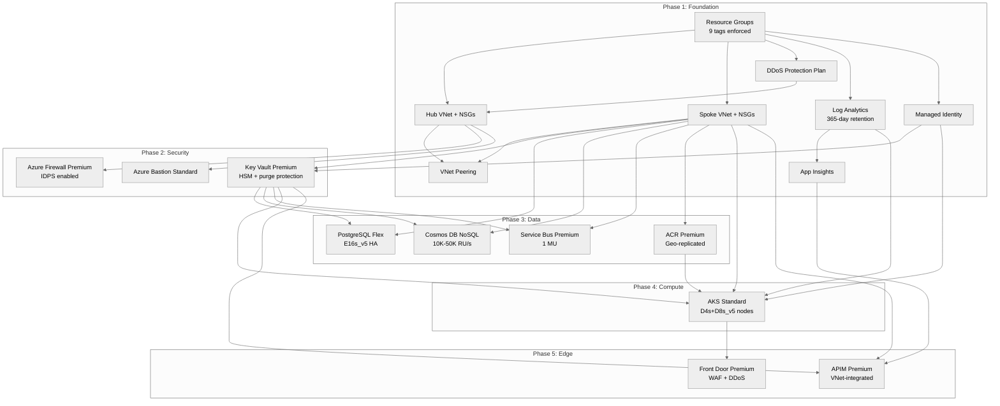

# Step 4: Implementation Plan - pci-dss-gw

> Generated by bicep-plan agent | 2025-07-15

> [!NOTE]
> PCI-DSS Level 1 payment gateway — 10,000 TPS sustained, 99.99% SLA target.
> Hub-spoke topology with CDE isolation. All 19 resources use AVM modules.

## Overview

Phased Bicep implementation for a PCI-DSS Level 1 compliant payment processing
platform on Azure. The architecture uses a hub-spoke network topology with dedicated
CDE (Cardholder Data Environment) isolation, dual-database strategy (PostgreSQL for
transactions, Cosmos DB for sessions/cache), and defense-in-depth security across
all layers.

**Deployment Strategy**: Phased (5 phases with approval gates)

**Governance**: 21 active policies (3 Deny blockers resolved). 9 mandatory lowercase
tags enforced by `JV-Enforce Resource Group Tags v3` (Deny effect). HSM purge
protection required by MCAPSGov. Classic ARM resources blocked.

---

## Resource Inventory

| # | Resource | Type | SKU | AVM Module | Version | Dependencies |
|---|----------|------|-----|------------|---------|--------------|
| 1 | Hub VNet | `Microsoft.Network/virtualNetworks` | — | `avm/res/network/virtual-network` | 0.7.2 | Resource Group |
| 2 | Spoke VNet | `Microsoft.Network/virtualNetworks` | — | `avm/res/network/virtual-network` | 0.7.2 | Resource Group |
| 3 | Hub NSGs (×3) | `Microsoft.Network/networkSecurityGroups` | — | `avm/res/network/network-security-group` | 0.5.2 | Hub VNet |
| 4 | Spoke NSGs (×4) | `Microsoft.Network/networkSecurityGroups` | — | `avm/res/network/network-security-group` | 0.5.2 | Spoke VNet |
| 5 | DDoS Protection | `Microsoft.Network/ddosProtectionPlans` | Network Protection | `avm/res/network/ddos-protection-plan` | 0.3.2 | Resource Group |
| 6 | Log Analytics | `Microsoft.OperationalInsights/workspaces` | PerGB2018 | `avm/res/operational-insights/workspace` | 0.15.0 | Resource Group |
| 7 | App Insights | `Microsoft.Insights/components` | — | `avm/res/insights/component` | 0.7.1 | Log Analytics |
| 8 | User Managed Identity | `Microsoft.ManagedIdentity/userAssignedIdentities` | — | `avm/res/managed-identity/user-assigned-identity` | 0.5.0 | Resource Group |
| 9 | Key Vault (HSM) | `Microsoft.KeyVault/vaults` | Premium | `avm/res/key-vault/vault` | 0.13.3 | VNets, Managed Identity |
| 10 | Azure Firewall | `Microsoft.Network/azureFirewalls` | Premium | `avm/res/network/azure-firewall` | 0.9.2 | Hub VNet, Public IP |
| 11 | Firewall Public IP | `Microsoft.Network/publicIPAddresses` | Standard | `avm/res/network/public-ip-address` | 0.12.0 | Resource Group |
| 12 | Azure Bastion | `Microsoft.Network/bastionHosts` | Standard | `avm/res/network/bastion-host` | 0.8.2 | Hub VNet, Public IP |
| 13 | Bastion Public IP | `Microsoft.Network/publicIPAddresses` | Standard | `avm/res/network/public-ip-address` | 0.12.0 | Resource Group |
| 14 | PostgreSQL Flex | `Microsoft.DBforPostgreSQL/flexibleServers` | E16s_v5 (HA) | `avm/res/db-for-postgre-sql/flexible-server` | 0.15.1 | Spoke VNet, Key Vault |
| 15 | Cosmos DB | `Microsoft.DocumentDB/databaseAccounts` | NoSQL (autoscale) | `avm/res/document-db/database-account` | 0.18.0 | Spoke VNet, Key Vault |
| 16 | Service Bus | `Microsoft.ServiceBus/namespaces` | Premium (1 MU) | `avm/res/service-bus/namespace` | 0.16.1 | Spoke VNet, Key Vault |
| 17 | Container Registry | `Microsoft.ContainerRegistry/registries` | Premium | `avm/res/container-registry/registry` | 0.10.0 | Spoke VNet |
| 18 | AKS | `Microsoft.ContainerService/managedClusters` | Standard | `avm/res/container-service/managed-cluster` | 0.12.0 | Spoke VNet, ACR, Key Vault, Log Analytics |
| 19 | Front Door + WAF | `Microsoft.Cdn/profiles` | Premium | `avm/res/cdn/profile` | 0.17.1 | AKS, Firewall |
| 20 | API Management | `Microsoft.ApiManagement/service` | Premium (1 unit) | `avm/res/api-management/service` | 0.14.0 | Spoke VNet, Key Vault, App Insights |

**AVM Coverage**: 20/20 resources (100%) — all use Azure Verified Modules.

---

## Module Structure

```
infra/bicep/pci-dss-gw/
├── main.bicep                    # Orchestration — phased deployment
├── main.bicepparam               # Parameter values
├── modules/
│   ├── resource-groups.bicep     # Hub + Spoke resource groups (9 tags)
│   ├── networking-hub.bicep      # Hub VNet, NSGs, DDoS plan
│   ├── networking-spoke.bicep    # Spoke VNet, NSGs, peering
│   ├── monitoring.bicep          # Log Analytics, App Insights
│   ├── identity.bicep            # User-assigned managed identity
│   ├── key-vault.bicep           # Key Vault Premium (HSM, purge-protected)
│   ├── firewall.bicep            # Azure Firewall Premium + public IP
│   ├── bastion.bicep             # Azure Bastion Standard + public IP
│   ├── postgresql.bicep          # PostgreSQL Flex E16s_v5 (zone-redundant HA)
│   ├── cosmos-db.bicep           # Cosmos DB NoSQL (autoscale 10K-50K RU/s)
│   ├── service-bus.bicep         # Service Bus Premium (1 MU)
│   ├── container-registry.bicep  # ACR Premium (geo-replication)
│   ├── aks.bicep                 # AKS Standard + KEDA + Workload Identity
│   ├── front-door.bicep          # Front Door Premium + WAF policy
│   └── api-management.bicep      # APIM Premium (VNet-integrated)
└── deploy.ps1                    # Phase-aware deployment script
```

---

## Implementation Tasks

### Task 1: main.bicep (Orchestration)

**Purpose**: Main entry point with phased deployment support

**Parameters**:

- `environment` (string, allowed: `dev`, `staging`, `prod`)
- `location` (string, default: `swedencentral`)
- `failoverLocation` (string, default: `germanywestcentral`)
- `owner` (string) — team or individual
- `costCenter` (string) — cost center code
- `technicalContact` (string) — technical contact email
- `deployPhase` (int, 0-5, default: 0) — 0 = all phases

**Variables**:

- `uniqueSuffix = uniqueString(resourceGroup().id)` — generated once, passed everywhere
- `requiredRgTags` — 9 mandatory lowercase tags (Deny-enforced)
- `allTags = union(requiredRgTags, { ManagedBy: 'Bicep', Project: 'pci-dss-gw' })`

**Tag Block** (governance-compliant):

```bicep
var requiredRgTags = {
  environment: environment
  owner: owner
  costcenter: costCenter
  application: 'pci-dss-gw'
  workload: 'payment-gateway'
  sla: '99.99'
  'backup-policy': 'daily'
  'maint-window': 'Sun:02:00-06:00'
  'technical-contact': technicalContact
}
```

**Modules Called** (conditional on `deployPhase`):

1. `modules/networking-hub.bicep` (Phase 1)
2. `modules/networking-spoke.bicep` (Phase 1)
3. `modules/monitoring.bicep` (Phase 1)
4. `modules/identity.bicep` (Phase 1)
5. `modules/key-vault.bicep` (Phase 2)
6. `modules/firewall.bicep` (Phase 2)
7. `modules/bastion.bicep` (Phase 2)
8. `modules/postgresql.bicep` (Phase 3)
9. `modules/cosmos-db.bicep` (Phase 3)
10. `modules/service-bus.bicep` (Phase 3)
11. `modules/container-registry.bicep` (Phase 3)
12. `modules/aks.bicep` (Phase 4)
13. `modules/front-door.bicep` (Phase 5)
14. `modules/api-management.bicep` (Phase 5)

### Task 2: modules/networking-hub.bicep

**Purpose**: Hub VNet with firewall, bastion, and gateway subnets

**Resources** (via AVM):

- Hub VNet (`vnet-hub-pci-dss-gw-{env}`, `10.0.0.0/16`)
  - `AzureFirewallSubnet` (`10.0.1.0/24`)
  - `AzureBastionSubnet` (`10.0.2.0/26`)
  - `GatewaySubnet` (`10.0.3.0/27`)
- NSG for Bastion subnet (required inbound/outbound rules)
- DDoS Protection Plan (`ddos-pci-dss-gw-{env}`)

**Key Configuration**:

```bicep
// DDoS plan associated with hub VNet
ddosProtectionPlan: { id: ddosPlan.outputs.resourceId }
```

**Outputs**: `hubVnetId`, `hubVnetName`, `firewallSubnetId`, `bastionSubnetId`

### Task 3: modules/networking-spoke.bicep

**Purpose**: Spoke VNet for CDE workloads with private endpoint subnets

**Resources** (via AVM):

- Spoke VNet (`vnet-spoke-pci-dss-gw-{env}`, `10.1.0.0/16`)
  - `snet-aks-system` (`10.1.0.0/22`) — AKS system node pool
  - `snet-aks-cde` (`10.1.4.0/22`) — AKS CDE user node pool
  - `snet-data` (`10.1.8.0/24`) — PostgreSQL, Cosmos DB private endpoints
  - `snet-apim` (`10.1.9.0/24`) — APIM VNet integration
  - `snet-pe` (`10.1.10.0/24`) — General private endpoints
- NSGs for each subnet (deny all inbound by default, allowlist)
- VNet peering: hub ↔ spoke (bidirectional)

**Key Configuration**:

```bicep
// APIM subnet delegation
delegation: 'Microsoft.Web/serverFarms' // For APIM VNet integration
// All data subnets: privateEndpointNetworkPolicies: 'Enabled'
```

**Outputs**: `spokeVnetId`, `aksSystemSubnetId`, `aksCdeSubnetId`,
`dataSubnetId`, `apimSubnetId`, `peSubnetId`

### Task 4: modules/monitoring.bicep

**Purpose**: Centralized observability for PCI audit requirements

**Resources** (via AVM):

- Log Analytics Workspace (`log-pci-dss-gw-{env}`)
  - Retention: 365 days (PCI-DSS § 10.7)
  - SKU: PerGB2018
- Application Insights (`appi-pci-dss-gw-{env}`)
  - Connected to Log Analytics workspace

**Outputs**: `logAnalyticsWorkspaceId`, `appInsightsId`,
`appInsightsConnectionString`, `appInsightsInstrumentationKey`

### Task 5: modules/identity.bicep

**Purpose**: User-assigned managed identity for service-to-service auth

**Resources** (via AVM):

- User Assigned Managed Identity (`id-pci-dss-gw-{env}`)

**Outputs**: `identityId`, `identityPrincipalId`, `identityClientId`

### Task 6: modules/key-vault.bicep

**Purpose**: HSM-backed key storage for PCI cryptographic requirements

**Resources** (via AVM):

- Key Vault Premium (`kv-thetest-{env}-{suffix}`)
  - `enableRbacAuthorization: true`
  - `enablePurgeProtection: true` (MCAPSGov Deny enforced)
  - `enableSoftDelete: true`
  - `softDeleteRetentionInDays: 90`
  - `publicNetworkAccess: 'Disabled'`
  - Private endpoint in `snet-pe`
  - Diagnostic settings → Log Analytics

**Key Configuration**:

```bicep
sku: 'premium'  // HSM-backed for PCI-DSS Req 3
enablePurgeProtection: true  // MCAPSGov Deny — MANDATORY
networkAcls: { defaultAction: 'Deny', bypass: 'AzureServices' }
```

**Outputs**: `keyVaultId`, `keyVaultName`, `keyVaultUri`

### Task 7: modules/firewall.bicep

**Purpose**: Network IDPS and east-west traffic inspection for PCI Req 1

**Resources** (via AVM):

- Public IP (`pip-fw-pci-dss-gw-{env}`, Standard, Static, Zone 1,2,3)
- Azure Firewall Premium (`fw-pci-dss-gw-{env}`)
  - IDPS enabled (Alert & Deny mode)
  - TLS inspection enabled
  - Firewall Policy with rule collection groups
  - Zone-redundant (zones 1, 2, 3)
  - Diagnostic settings → Log Analytics

**Outputs**: `firewallPrivateIp`, `firewallId`

### Task 8: modules/bastion.bicep

**Purpose**: Secure administrative access without public IPs on VMs

**Resources** (via AVM):

- Public IP (`pip-bas-pci-dss-gw-{env}`, Standard, Static)
- Bastion Host Standard (`bas-pci-dss-gw-{env}`)
  - Native client support enabled
  - File copy enabled
  - IP connect enabled

**Outputs**: `bastionId`

### Task 9: modules/postgresql.bicep

**Purpose**: Primary transactional database for payment processing

**Resources** (via AVM):

- PostgreSQL Flexible Server (`psql-pci-dss-gw-{env}`)
  - SKU: `MemoryOptimized`, `E16s_v5` (16 vCores, 128 GB RAM)
  - HA: Zone-redundant
  - Storage: 512 GB, auto-grow enabled
  - Backup: 35-day retention, geo-redundant
  - Authentication: Azure AD + password (PostgreSQL requires password)
  - Private endpoint in `snet-data`
  - PgBouncer: enabled (built-in connection pooling)
  - Diagnostic settings → Log Analytics

**Key Configuration**:

```bicep
highAvailability: { mode: 'ZoneRedundant' }
backup: { backupRetentionDays: 35, geoRedundantBackup: 'Enabled' }
```

**Outputs**: `postgresqlFqdn`, `postgresqlId`

### Task 10: modules/cosmos-db.bicep

**Purpose**: Session state and cache store with sub-10ms reads

**Resources** (via AVM):

- Cosmos DB Account (`cosmos-pci-dss-gw-{env}`)
  - API: NoSQL
  - Consistency: Session
  - Autoscale: 10,000 — 50,000 RU/s
  - Backup: Continuous (PITR)
  - Public network access: Disabled
  - Private endpoint in `snet-data`
  - Diagnostic settings → Log Analytics

**Key Configuration**:

```bicep
consistencyPolicy: { defaultConsistencyLevel: 'Session' }
databaseAccountOfferType: 'Standard'
enableAutomaticFailover: true
```

**Outputs**: `cosmosDbEndpoint`, `cosmosDbId`

### Task 11: modules/service-bus.bicep

**Purpose**: Reliable message queuing for async payment processing

**Resources** (via AVM):

- Service Bus Namespace Premium (`sb-pci-dss-gw-{env}`)
  - 1 Messaging Unit
  - Zone-redundant
  - Private endpoint in `snet-pe`
  - Queues: `payment-transactions`, `payment-notifications`
  - Dead-letter queue enabled per queue
  - Diagnostic settings → Log Analytics

**Outputs**: `serviceBusId`, `serviceBusEndpoint`

### Task 12: modules/container-registry.bicep

**Purpose**: Private container image storage with vulnerability scanning

**Resources** (via AVM):

- Container Registry Premium (`crthetest{env}{suffix}`)
  - Zone-redundant
  - Content trust enabled
  - Geo-replication to `germanywestcentral`
  - Public network access: Disabled
  - Private endpoint in `snet-pe`
  - Diagnostic settings → Log Analytics

**Outputs**: `acrId`, `acrLoginServer`

### Task 13: modules/aks.bicep

**Purpose**: Kubernetes cluster for CDE payment workloads

**Resources** (via AVM):

- AKS Managed Cluster Standard (`aks-pci-dss-gw-{env}`)
  - System node pool: `Standard_D4s_v5` × 3 (zones 1,2,3)
  - CDE user node pool: `Standard_D8s_v5` × 3-20 (KEDA autoscaler)
  - Network plugin: Azure CNI Overlay
  - Network policy: Calico
  - Workload Identity enabled
  - OIDC Issuer enabled
  - KEDA add-on enabled
  - Defender profile enabled
  - Azure Policy add-on enabled
  - Diagnostic settings → Log Analytics
  - ACR integration (attach)

**Key Configuration**:

```bicep
sku: { name: 'Standard', tier: 'Standard' }
agentPoolProfiles: [
  { name: 'system', vmSize: 'Standard_D4s_v5', count: 3 }
  { name: 'cde', vmSize: 'Standard_D8s_v5', minCount: 3, maxCount: 20 }
]
networkProfile: { networkPlugin: 'azure', networkPolicy: 'calico' }
```

> [!WARNING]
> MCAPSGov Deny limits AKS to 10 agent pools (2 planned — compliant).
> Verify VMSS node count limit does not conflict with autoscaler max (20).

**Outputs**: `aksClusterName`, `aksOidcIssuerUrl`, `kubeletIdentityObjectId`

### Task 14: modules/front-door.bicep

**Purpose**: Global edge security with WAF and DDoS protection

**Resources** (via AVM):

- Front Door Premium (`fd-pci-dss-gw-{env}`)
  - WAF policy: OWASP 3.2 ruleset, bot protection
  - Origin group: AKS ingress (private link)
  - Custom domains (if applicable)
  - Diagnostic settings → Log Analytics

**Outputs**: `frontDoorId`, `frontDoorEndpoint`

### Task 15: modules/api-management.bicep

**Purpose**: API gateway inside CDE with OAuth, rate limiting

**Resources** (via AVM):

- APIM Premium (`apim-pci-dss-gw-{env}`)
  - 1 unit
  - VNet integration mode: Internal
  - Subnet: `snet-apim`
  - Application Insights logger
  - Named values for Key Vault secrets
  - Diagnostic settings → Log Analytics

> [!NOTE]
> APIM Premium deployment takes 30-45 minutes. Plan accordingly for Phase 5.

**Outputs**: `apimGatewayUrl`, `apimId`

### Task 16: deploy.ps1 (Phase-Aware Deployment Script)

**Features**:

- Parameter: `-Phase` (0-5, default 0 = all phases)
- Parameter validation (environment, location)
- Bicep lint and build verification before deployment
- What-If preview with user confirmation per phase
- Phase-sequential execution with approval gates
- Deployment output capture and display
- Error handling with rollback guidance
- Timing per phase

**Phase Mapping**:

```powershell
$phases = @{
    1 = 'Foundation (VNets, NSGs, DDoS, Monitoring, Identity)'
    2 = 'Security (Key Vault, Firewall, Bastion)'
    3 = 'Data (PostgreSQL, Cosmos DB, Service Bus, ACR)'
    4 = 'Compute (AKS)'
    5 = 'Edge/Integration (Front Door, APIM)'
}
```

---

## Deployment Phases

> Deployment strategy: **Phased** (chosen during planning)

### Phase 1: Foundation

| Order | Module | Resources | Validation |
|-------|--------|-----------|------------|
| 1.1 | networking-hub.bicep | Hub VNet, 3 NSGs, DDoS Plan | VNet created, subnets exist, DDoS associated |
| 1.2 | networking-spoke.bicep | Spoke VNet, 4 NSGs, VNet peering | Peering connected, subnets exist |
| 1.3 | monitoring.bicep | Log Analytics, App Insights | Workspace accessible, retention = 365 days |
| 1.4 | identity.bicep | User Managed Identity | Identity created, principalId available |

**Estimated Deploy Time**: 5-8 minutes

**Approval Gate**: Verify network topology — hub-spoke peering active, DDoS plan
associated, Log Analytics ingesting, managed identity created. Run:

```bash
az network vnet peering list -g rg-pci-dss-gw-{env} --vnet-name vnet-hub-pci-dss-gw-{env}
az monitor log-analytics workspace show -g rg-pci-dss-gw-{env} -n log-pci-dss-gw-{env}
```

### Phase 2: Security

| Order | Module | Resources | Validation |
|-------|--------|-----------|------------|
| 2.1 | key-vault.bicep | Key Vault Premium + private endpoint | `enablePurgeProtection: true`, RBAC enabled |
| 2.2 | firewall.bicep | Firewall Premium + public IP | IDPS Alert & Deny, zones 1-2-3 |
| 2.3 | bastion.bicep | Bastion Standard + public IP | Native client enabled |

**Estimated Deploy Time**: 8-12 minutes

**Approval Gate**: Verify security controls — Key Vault purge protection (MCAPSGov
blocker), Firewall IDPS mode, private endpoint connectivity. Run:

```bash
az keyvault show -n kv-thetest-{env}-{suffix} --query "properties.enablePurgeProtection"
az network firewall show -g rg-pci-dss-gw-{env} -n fw-pci-dss-gw-{env} --query "sku.tier"
```

### Phase 3: Data

| Order | Module | Resources | Validation |
|-------|--------|-----------|------------|
| 3.1 | postgresql.bicep | PostgreSQL Flex E16s_v5 + private endpoint | Zone-redundant HA, 35-day backup |
| 3.2 | cosmos-db.bicep | Cosmos DB NoSQL + private endpoint | Session consistency, autoscale active |
| 3.3 | service-bus.bicep | Service Bus Premium + private endpoint | 2 queues created, DLQ enabled |
| 3.4 | container-registry.bicep | ACR Premium + private endpoint | Geo-replication to germanywestcentral |

**Estimated Deploy Time**: 15-20 minutes

**Approval Gate**: Verify data tier — PostgreSQL HA status, Cosmos DB consistency,
Service Bus queues, ACR geo-replication. Run:

```bash
az postgres flexible-server show -g rg-pci-dss-gw-{env} -n psql-pci-dss-gw-{env} \
  --query "highAvailability"
az cosmosdb show -g rg-pci-dss-gw-{env} -n cosmos-pci-dss-gw-{env} \
  --query "consistencyPolicy"
```

### Phase 4: Compute

| Order | Module | Resources | Validation |
|-------|--------|-----------|------------|
| 4.1 | aks.bicep | AKS Standard + system pool + CDE pool | Workload Identity, KEDA, Defender |

**Estimated Deploy Time**: 10-15 minutes

**Approval Gate**: Verify AKS cluster — node pools running, KEDA enabled, ACR
attached, workload identity configured. Run:

```bash
az aks show -g rg-pci-dss-gw-{env} -n aks-pci-dss-gw-{env} \
  --query "{pools:agentPoolProfiles[].{name:name,count:count,vmSize:vmSize}}"
az aks addon show -g rg-pci-dss-gw-{env} -n aks-pci-dss-gw-{env} -a keda
```

### Phase 5: Edge & Integration

| Order | Module | Resources | Validation |
|-------|--------|-----------|------------|
| 5.1 | front-door.bicep | Front Door Premium + WAF policy | OWASP 3.2, bot protection enabled |
| 5.2 | api-management.bicep | APIM Premium (VNet-integrated) | Internal mode, subnet bound |

**Estimated Deploy Time**: 35-50 minutes (APIM is slow)

**Approval Gate**: Verify edge tier — Front Door endpoint responding, WAF policy
active, APIM gateway reachable internally. Run:

```bash
az afd profile show -g rg-pci-dss-gw-{env} --profile-name fd-pci-dss-gw-{env}
az apim show -g rg-pci-dss-gw-{env} -n apim-pci-dss-gw-{env} \
  --query "virtualNetworkType"
```

### Phase Summary

| Phase | Resources | Est. Deploy Time | Approval Gate |
|-------|-----------|------------------|---------------|
| 1 — Foundation | 11 (VNets, NSGs, DDoS, Log Analytics, Identity) | 5-8 min | ✅ Network topology verified |
| 2 — Security | 5 (Key Vault, Firewall, Bastion + PIPs) | 8-12 min | ✅ Security controls verified |
| 3 — Data | 4 (PostgreSQL, Cosmos DB, Service Bus, ACR) | 15-20 min | ✅ Data tier verified |
| 4 — Compute | 1 (AKS with 2 node pools) | 10-15 min | ✅ Cluster operational |
| 5 — Edge | 2 (Front Door, APIM) | 35-50 min | ✅ Edge endpoints verified |
| **Total** | **23 resource deployments** | **~73-105 min** | **5 approval gates** |

---

## Dependency Graph



---

## Naming Conventions

| Resource | Pattern | Example |
|----------|---------|---------|
| Resource Group | `rg-{project}-{env}` | `rg-pci-dss-gw-prod` |
| Hub VNet | `vnet-hub-{project}-{env}` | `vnet-hub-pci-dss-gw-prod` |
| Spoke VNet | `vnet-spoke-{project}-{env}` | `vnet-spoke-pci-dss-gw-prod` |
| Subnet | `snet-{purpose}-{env}` | `snet-aks-cde-prod` |
| NSG | `nsg-{purpose}-{env}` | `nsg-aks-cde-prod` |
| DDoS Plan | `ddos-{project}-{env}` | `ddos-pci-dss-gw-prod` |
| Log Analytics | `log-{project}-{env}` | `log-pci-dss-gw-prod` |
| App Insights | `appi-{project}-{env}` | `appi-pci-dss-gw-prod` |
| Managed Identity | `id-{project}-{env}` | `id-pci-dss-gw-prod` |
| Key Vault | `kv-{short}-{env}-{suffix}` | `kv-thetest-prod-a1b2` |
| Azure Firewall | `fw-{project}-{env}` | `fw-pci-dss-gw-prod` |
| Bastion | `bas-{project}-{env}` | `bas-pci-dss-gw-prod` |
| Public IP | `pip-{purpose}-{project}-{env}` | `pip-fw-pci-dss-gw-prod` |
| PostgreSQL | `psql-{project}-{env}` | `psql-pci-dss-gw-prod` |
| Cosmos DB | `cosmos-{project}-{env}` | `cosmos-pci-dss-gw-prod` |
| Service Bus | `sb-{project}-{env}` | `sb-pci-dss-gw-prod` |
| Container Registry | `cr{short}{env}{suffix}` | `crthetestproda1b2` |
| AKS | `aks-{project}-{env}` | `aks-pci-dss-gw-prod` |
| Front Door | `fd-{project}-{env}` | `fd-pci-dss-gw-prod` |
| APIM | `apim-{project}-{env}` | `apim-pci-dss-gw-prod` |

---

## Security Configuration

| Resource | Setting | Value | Source |
|----------|---------|-------|--------|
| Key Vault | `enablePurgeProtection` | `true` | MCAPSGov Deny |
| Key Vault | `enableRbacAuthorization` | `true` | PCI Req 8 |
| Key Vault | `sku` | `premium` (HSM) | PCI Req 3 |
| Key Vault | `publicNetworkAccess` | `Disabled` | PCI Req 1 |
| PostgreSQL | `authConfig` | Azure AD + password | PCI Req 8 |
| PostgreSQL | `highAvailability.mode` | `ZoneRedundant` | PCI Req 6 |
| Cosmos DB | `publicNetworkAccess` | `Disabled` | PCI Req 1 |
| Cosmos DB | `consistencyPolicy` | `Session` | ADR-005 |
| Azure Firewall | `tier` | `Premium` (IDPS) | PCI Req 1 |
| Azure Firewall | IDPS mode | `Alert and Deny` | PCI Req 11 |
| AKS | `networkPolicy` | `calico` | PCI Req 1 |
| AKS | `workloadIdentity` | `true` | PCI Req 8 |
| AKS | Defender profile | Enabled | PCI Req 11 |
| AKS | Azure Policy add-on | Enabled | PCI Req 6 |
| Front Door | WAF ruleset | OWASP 3.2 | PCI Req 6 |
| Front Door | Bot protection | Enabled | PCI Req 6 |
| APIM | VNet type | `Internal` | PCI Req 1 |
| Service Bus | `publicNetworkAccess` | `Disabled` | PCI Req 1 |
| ACR | Content trust | Enabled | PCI Req 6 |
| Log Analytics | Retention | 365 days | PCI § 10.7 |
| All services | TLS | 1.2 minimum | PCI Req 4 |
| All services | Auth | Managed Identity | PCI Req 8 |

---

## Estimated Implementation Time

| Task | Estimated Duration |
|------|-------------------|
| main.bicep + parameters | 45 min |
| networking-hub.bicep | 30 min |
| networking-spoke.bicep | 30 min |
| monitoring.bicep | 15 min |
| identity.bicep | 10 min |
| key-vault.bicep | 20 min |
| firewall.bicep | 30 min |
| bastion.bicep | 15 min |
| postgresql.bicep | 30 min |
| cosmos-db.bicep | 25 min |
| service-bus.bicep | 20 min |
| container-registry.bicep | 20 min |
| aks.bicep | 45 min |
| front-door.bicep | 30 min |
| api-management.bicep | 25 min |
| deploy.ps1 | 30 min |
| Testing & validation | 60 min |
| **Total** | **~7.5 hours** |

---

## Approval Gate

> [!IMPORTANT]
> **Implementation Plan Ready**
>
> - **20 Azure resources** planned across 15 Bicep modules
> - **20/20 use AVM modules** (100% coverage)
> - **3 governance blockers** resolved (9 tags, HSM purge, AKS pool limit)
> - **5 deployment phases** with approval gates between each
> - **CAF naming conventions** applied to all resources
> - **Estimated deployment**: ~73-105 minutes (all phases)
> - **Estimated implementation**: ~7.5 hours
>
> Reply **"approve"** to proceed to bicep-code, or provide feedback.

---

## References

> [!NOTE]
> The following Microsoft Learn resources inform this implementation.

| Topic | Link |
|-------|------|
| Azure Verified Modules | [AVM Index](https://aka.ms/avm/index) |
| Bicep Best Practices | [Documentation](https://learn.microsoft.com/azure/azure-resource-manager/bicep/best-practices) |
| CAF Naming Conventions | [Naming Rules](https://learn.microsoft.com/azure/cloud-adoption-framework/ready/azure-best-practices/resource-naming) |
| Resource Abbreviations | [Abbreviations](https://learn.microsoft.com/azure/cloud-adoption-framework/ready/azure-best-practices/resource-abbreviations) |
| AKS PCI-DSS Baseline | [AKS Regulated Cluster](https://learn.microsoft.com/azure/aks/operator-best-practices-cluster-security) |
| PostgreSQL Flex HA | [HA Concepts](https://learn.microsoft.com/azure/postgresql/flexible-server/concepts-high-availability) |
| Cosmos DB Consistency | [Consistency Levels](https://learn.microsoft.com/azure/cosmos-db/consistency-levels) |
| Azure Firewall Premium | [IDPS Features](https://learn.microsoft.com/azure/firewall/premium-features) |
| PCI-DSS on Azure | [Compliance](https://learn.microsoft.com/azure/compliance/offerings/offering-pci-dss) |
| Hub-Spoke Topology | [Reference Architecture](https://learn.microsoft.com/azure/architecture/networking/architecture/hub-spoke) |

---

_Plan generated by bicep-plan agent following Azure Well-Architected Framework guidelines._
