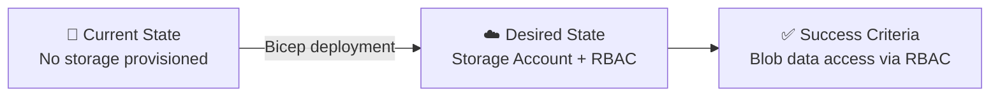

# 📋 Step 1: Requirements - storage-rbac

<strong>📑 Requirements Overview</strong>

- [🎯 Project Overview](#-project-overview)
- [🚀 Functional Requirements](#-functional-requirements)
- [⚡ Non-Functional Requirements (NFRs)](#-non-functional-requirements-nfrs)
- [🔒 Compliance & Security Requirements](#-compliance--security-requirements)
- [💰 Budget](#-budget)
- [🔧 Operational Requirements](#-operational-requirements)
- [🌍 Regional Preferences](#-regional-preferences)
- [📊 Complexity Classification](#-complexity-classification)
- [📋 Summary for Architecture Assessment](#-summary-for-architecture-assessment)
- [References](#references)

> Generated by @requirements agent | 2026-03-06

| ⬅️ Previous | 📑 Index            | Next ➡️                                                        |
| ----------- | ------------------- | -------------------------------------------------------------- |
| —           | [README](README.md) | [02-architecture-assessment.md](02-architecture-assessment.md) |

## 🎯 Project Overview

| Field                   | Value                                                                   |
| ----------------------- | ----------------------------------------------------------------------- |
| **Project Name**        | storage-rbac                                                            |
| **Project Type**        | Storage & RBAC                                                          |
| **Timeline**            | 2026-03-06 → 2026-03-13                                                 |
| **Primary Stakeholder** | Jack Stalley (jack.stalley@kailice.uk)                                  |
| **Business Context**    | Deploy a storage account with RBAC role assignment for blob data access |

### Business Context

| Field               | Value                                                          |
| ------------------- | -------------------------------------------------------------- |
| Industry / Vertical | Technology                                                     |
| Company Size        | Mid-Market                                                     |
| Current State       | Greenfield                                                     |
| Migration Source    | N/A (greenfield)                                               |
| Business Drivers    | Provision blob storage with least-privilege RBAC access        |
| Success Criteria    | Storage account deployed with correct role assignment in place |

### State Transition

## 🚀 Functional Requirements

### Core Capabilities

| #   | Capability                                    | Priority | Acceptance Criteria                                                                        |
| --- | --------------------------------------------- | -------- | ------------------------------------------------------------------------------------------ |
| 1   | Azure Storage Account (Standard LRS)          | 🔴 Must  | Storage account deployed in swedencentral with HTTPS-only, TLS 1.2, no public blob access  |
| 2   | Storage Blob Data Contributor role assignment | 🔴 Must  | Role assigned to jack.stalley@kailice.uk (Object ID: 6f2e00ae-231f-4fe8-8e2e-73a45f15e021) |

### User Types

| User Type      | Description                             | Est. Count | Access Level                  |
| -------------- | --------------------------------------- | ---------- | ----------------------------- |
| Blob Data User | User with blob read/write/delete access | 1          | Storage Blob Data Contributor |

### Integrations

| System | Direction | Protocol | Auth Method | SLA |
| ------ | --------- | -------- | ----------- | --- |
| N/A    | —         | —        | —           | —   |

> No external integrations required for this project.

### Data Types

| Category  | Sensitivity | Est. Volume | Retention     | Residency     |
| --------- | ----------- | ----------- | ------------- | ------------- |
| Blob data | 🟢 Low      | < 1 GB      | Not specified | swedencentral |

### Architecture Pattern

| Field              | Value                                             |
| ------------------ | ------------------------------------------------- |
| Workload Pattern   | Simple Storage                                    |
| Recommended Option | Single storage account with RBAC                  |
| Tier               | Cost-Optimized                                    |
| Justification      | Only 2 resources needed; no compute or networking |

## ⚡ Non-Functional Requirements (NFRs)

| WAF Pillar     | Metric         | Target                                  | Current | Gap |
| -------------- | -------------- | --------------------------------------- | ------- | --- |
| 🔄 Reliability | SLA            | 99.9%                                   | N/A     | N/A |
| 🔄 Reliability | RTO            | 24h                                     | N/A     | N/A |
| 🔄 Reliability | RPO            | 12h                                     | N/A     | N/A |
| 🔒 Security    | Auth Method    | Azure RBAC                              | —       | —   |
| 🔒 Security    | Encryption     | At-rest + In-transit (platform default) | —       | —   |
| 💰 Cost        | Monthly Budget | < $50                                   | —       | —   |

### Scalability

| Dimension        | Current | 6-Month Projection | 12-Month Projection |
| ---------------- | ------- | ------------------ | ------------------- |
| Users            | 1       | 1                  | 1-5                 |
| Data Volume      | < 1 GB  | < 10 GB            | < 50 GB             |
| Transactions/day | < 100   | < 500              | < 1,000             |

## 🔒 Compliance & Security Requirements

### Regulatory Frameworks

<strong>PCI-DSS</strong> — Not Applicable

No cardholder data is stored or processed.

<strong>SOC 2</strong> — Not Applicable

Not required for this simple storage project.

<strong>HIPAA</strong> — Not Applicable

No PHI data is handled.

<strong>GDPR</strong> — Not Applicable

No EU personal data subjects identified. Region is EU-compliant by default (swedencentral).

<strong>ISO 27001</strong> — Not Applicable

Not required for this simple storage project.

### Data Residency

| Requirement              | Value           |
| ------------------------ | --------------- |
| Primary Region           | swedencentral   |
| Data Sovereignty         | EU (by default) |
| Cross-region Replication | Not required    |

### Authentication & Authorization

| Requirement       | Value                                      |
| ----------------- | ------------------------------------------ |
| Identity Provider | Entra ID                                   |
| MFA Requirement   | Not required (inherited from tenant)       |
| RBAC Model        | Azure RBAC (Storage Blob Data Contributor) |

### Network Security

| Control                     | Required | Notes                                       |
| --------------------------- | -------- | ------------------------------------------- |
| Private endpoints           | ❌       | Not required for dev environment            |
| VNet integration            | ❌       | Not required for dev environment            |
| Public endpoints acceptable | ✅       | Acceptable for dev; restrict in higher envs |
| WAF required                | ❌       | No web-facing endpoint                      |

### Recommended Security Controls

| Control               | Recommended | User Confirmed | Notes                                     |
| --------------------- | ----------- | -------------- | ----------------------------------------- |
| Managed Identity      | No          | N/A            | RBAC via Entra ID user principal          |
| Private Endpoints     | No          | N/A            | Dev environment, not required             |
| WAF                   | No          | N/A            | No web endpoints                          |
| Key Vault for Secrets | No          | N/A            | No secrets to manage                      |
| Diagnostic Settings   | No          | N/A            | Optional for dev                          |
| TLS 1.2 Minimum       | Yes         | Yes            | Enforced on storage account               |
| Encryption at Rest    | Yes         | Yes            | Platform default (Microsoft-managed keys) |
| Network Isolation     | No          | N/A            | Dev environment, public access OK         |

## 💰 Budget

> [!NOTE]
> The Azure Pricing MCP server generates detailed cost estimates during
> architecture assessment (Step 2). Provide an approximate budget here.

| Field              | Value       |
| ------------------ | ----------- |
| 💰 Monthly Budget  | < $50       |
| 📅 Annual Budget   | < $600      |
| 🚦 Limit Type      | 🟡 Soft     |
| 📊 Cost Model Pref | Consumption |

### Cost Optimization Priorities

| Priority                         | Selected | Impact |
| -------------------------------- | -------- | ------ |
| Minimize compute costs           | ☐        | N/A    |
| Prefer consumption-based pricing | ☑        | High   |
| Reserved instances acceptable    | ☐        | N/A    |
| Spot instances for non-critical  | ☐        | N/A    |

## 🔧 Operational Requirements

### Monitoring & Alerting

| Capability             | Required | Tool / Service | Notes                |
| ---------------------- | -------- | -------------- | -------------------- |
| Application monitoring | ❌       | N/A            | No application layer |
| Log aggregation        | ❌       | N/A            | Optional for dev     |
| Alert notifications    | ❌       | N/A            | Not required for dev |
| Custom dashboards      | ❌       | N/A            | Not required for dev |

### Support & Maintenance

| Requirement         | Value        |
| ------------------- | ------------ |
| Support Hours       | Best-effort  |
| On-call Requirement | No           |
| Maintenance Windows | N/A          |
| Change Management   | Self-service |

### Backup & Disaster Recovery

| Component       | Backup Frequency | Retention | Recovery Method |
| --------------- | ---------------- | --------- | --------------- |
| Storage Account | N/A (LRS)        | N/A       | Re-deploy       |

## 🌍 Regional Preferences

| Preference         | Value         | Justification               |
| ------------------ | ------------- | --------------------------- |
| Primary Region     | swedencentral | Default — EU GDPR-compliant |
| Failover Region    | N/A           | Not required for dev        |
| Availability Zones | Not needed    | Simple dev workload         |

---

## 📊 Complexity Classification

| Field      | Value                                                                                                                 |
| ---------- | --------------------------------------------------------------------------------------------------------------------- |
| Complexity | `simple`                                                                                                              |
| Criteria   | simple: ≤3 resources, no custom policies, single env                                                                  |
| Rationale  | 2 resources (storage account + role assignment), single dev environment, no compliance frameworks, no custom policies |

---

## 📋 Summary for Architecture Assessment

### Handoff Summary

| Aspect               | Key Points                                                                          |
| -------------------- | ----------------------------------------------------------------------------------- |
| Critical Constraints | Budget < $50/month; dev environment only; no private endpoints required             |
| Key Decisions        | Standard LRS storage; Azure RBAC with Storage Blob Data Contributor role; Bicep IaC |
| Open Risks           | None — simple 2-resource deployment                                                 |
| Recommended Pattern  | Simple Storage with RBAC                                                            |
| Budget Envelope      | < $50/month                                                                         |

### IaC Tool

| Field    | Value |
| -------- | ----- |
| iac_tool | Bicep |

### Target Identity

| Field     | Value                                |
| --------- | ------------------------------------ |
| UPN       | jack.stalley@kailice.uk              |
| Object ID | 6f2e00ae-231f-4fe8-8e2e-73a45f15e021 |
| Role      | Storage Blob Data Contributor        |
| Scope     | Storage Account                      |

### Target Subscription

| Field           | Value                                |
| --------------- | ------------------------------------ |
| Subscription    | Visual Studio Enterprise             |
| Subscription ID | 1d997f13-84f0-4047-b288-ffefd5137b68 |
| Tenant ID       | 03a8a9f4-9541-4226-92ab-8218cda03e14 |

### Requirements Completeness

| Section                  | Status | Notes                               |
| ------------------------ | ------ | ----------------------------------- |
| Project Overview         | ✅     | Complete                            |
| Functional Requirements  | ✅     | 2 resources fully specified         |
| NFRs                     | ✅     | Relaxed targets appropriate for dev |
| Compliance & Security    | ✅     | No compliance frameworks required   |
| Budget                   | ✅     | < $50/month                         |
| Operational Requirements | ✅     | Minimal — dev environment           |

---

## References

> [!NOTE]
> 📚 The following Microsoft Learn resources provide additional guidance.

| Topic                         | Link                                                                                                                                |
| ----------------------------- | ----------------------------------------------------------------------------------------------------------------------------------- |
| Storage Account overview      | [Overview](https://learn.microsoft.com/azure/storage/common/storage-account-overview)                                               |
| Azure RBAC built-in roles     | [Built-in roles](https://learn.microsoft.com/azure/role-based-access-control/built-in-roles)                                        |
| Storage Blob Data Contributor | [Role definition](https://learn.microsoft.com/azure/role-based-access-control/built-in-roles/storage#storage-blob-data-contributor) |
| Well-Architected Framework    | [Overview](https://learn.microsoft.com/azure/well-architected/)                                                                     |

---

_Requirements captured using [plan-requirements.prompt.md](../../.github/prompts/plan-requirements.prompt.md) template_

---

| ⬅️ — | 🏠 [Project Index](README.md) | ➡️ [02-architecture-assessment.md](02-architecture-assessment.md) |
| ---- | ----------------------------- | ----------------------------------------------------------------- |

