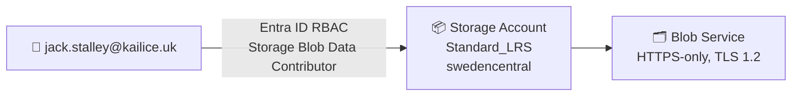

# 🏛️ Step 2: Architecture Assessment - storage-rbac

<strong>📑 Assessment Contents</strong>

- [✅ Requirements Validation](#-requirements-validation)
- [💎 Executive Summary](#-executive-summary)
- [🏛️ WAF Pillar Assessment](#-waf-pillar-assessment)
- [📦 Resource SKU Recommendations](#-resource-sku-recommendations)
- [🎯 Architecture Decision Summary](#-architecture-decision-summary)
- [🚀 Implementation Handoff](#-implementation-handoff)
- [🔒 Approval Gate](#-approval-gate)
- [References](#references)

> Generated by architect agent | 2026-03-06

| ⬅️ Previous                              | 📑 Index            | Next ➡️                                            |
| ---------------------------------------- | ------------------- | -------------------------------------------------- |
| [01-requirements.md](01-requirements.md) | [README](README.md) | [03-des-cost-estimate.md](03-des-cost-estimate.md) |

## ✅ Requirements Validation

| Requirement Area        | Status     | Validation Notes                                                  |
| ----------------------- | ---------- | ----------------------------------------------------------------- |
| NFRs (SLA, RTO, RPO)    | ✅ Defined | SLA 99.9%, RTO 24h, RPO 12h — appropriate for dev LRS storage     |
| Compliance requirements | ✅ Defined | No regulatory frameworks applicable; EU data residency via region |
| Budget (approximate)    | ✅ Defined | < $50/month — well within range for single Standard_LRS account   |
| Scale requirements      | ✅ Defined | < 1 GB initial, < 50 GB at 12 months, < 1,000 txn/day             |
| Security controls       | ✅ Defined | TLS 1.2, HTTPS-only, no public blob access, Azure RBAC, no keys   |
| Data residency          | ✅ Defined | swedencentral (EU GDPR-compliant)                                 |

---

## 💎 Executive Summary

A minimal Azure Storage Account deployment with RBAC-based data-plane access. Two resources total: one storage account (Standard_LRS) and one role assignment granting Storage Blob Data Contributor to a named Entra ID user. No compute, networking, or monitoring required for this dev workload.

The architecture optimizes for **cost** and **security** — consumption-based storage with zero shared-key access. Standard_LRS is appropriate given the dev environment, relaxed RTO/RPO, and sub-50 GB data volume.

### Recommended Architecture

---

## 🏛️ WAF Pillar Assessment

### Overall Scores

| Pillar                    | Score | Confidence | Summary                                              |
| ------------------------- | ----- | ---------- | ---------------------------------------------------- |
| 🔒 Security               | 8/10  | High       | Strong baseline: RBAC, no keys, TLS 1.2, HTTPS-only  |
| 🔄 Reliability            | 5/10  | High       | LRS only — acceptable for dev, not prod              |
| ⚡ Performance            | 7/10  | High       | Standard tier adequate for < 1,000 txn/day           |
| 💰 Cost Optimization      | 9/10  | High       | Minimal resources, consumption-based, well under $50 |
| 🔧 Operational Excellence | 6/10  | Medium     | No monitoring or diagnostics; acceptable for dev     |

**Primary Pillar Optimized**: Cost Optimization
**Trade-offs Accepted**: Reduced reliability (LRS vs GRS) and no monitoring in exchange for minimal cost

---

### 🔒 Security Assessment (8/10)

**Strengths:**

- Shared key access disabled — all access via Entra ID RBAC only
- TLS 1.2 minimum enforced on all storage endpoints
- HTTPS-only traffic; HTTP connections rejected
- Public blob access disabled — no anonymous container/blob reads
- Least-privilege role (Storage Blob Data Contributor scoped to account)

**Gaps:**

- No private endpoint (public network access enabled) — acceptable for dev
- No diagnostic logs forwarded to Log Analytics — no audit trail
- No resource lock to prevent accidental deletion

**Recommendations:**

1. Add a `CanNotDelete` resource lock for the storage account to prevent accidental removal
2. For promotion to staging/prod, add private endpoint and disable public network access
3. Consider enabling storage analytics logging if audit requirements emerge

### 🔄 Reliability Assessment (5/10)

**Strengths:**

- Standard_LRS provides 11 nines durability within a single datacenter
- Azure Storage SLA of 99.9% for LRS read/write operations
- Stateless RBAC assignment — no runtime dependency to fail

**Gaps:**

- LRS stores 3 copies in a single datacenter only — datacenter failure = data loss
- No backup strategy defined (re-deploy from IaC is the recovery method)
- No availability zones (not applicable to LRS)

**Recommendations:**

1. Acceptable for dev — document that prod workloads require ZRS or GRS
2. If data becomes valuable, consider enabling soft-delete and blob versioning
3. For prod promotion, upgrade to ZRS (zone-redundant) at minimum

### ⚡ Performance Assessment (7/10)

**Strengths:**

- Standard tier supports up to 20,000 IOPS and 60 Gbps ingress — far exceeds requirements
- Hot access tier is default and optimal for < 1,000 txn/day workload
- No compute bottleneck — direct SDK/REST access to storage

**Gaps:**

- No CDN or caching layer (not needed at this scale)
- Standard tier has higher latency than Premium for sub-millisecond workloads

**Recommendations:**

1. No changes needed — Standard tier is well-suited for projected workload
2. Monitor transaction patterns; if burst patterns emerge, evaluate Premium BlockBlobStorage

### 💰 Cost Assessment (9/10)

| Service               | SKU          | Monthly Cost | Notes                                       |
| --------------------- | ------------ | ------------ | ------------------------------------------- |
| Storage Account (LRS) | Standard_LRS | ~$0.50       | Hot tier, ~1 GB data, < 1,000 txn/month     |
| Role Assignment       | N/A          | $0.00        | Free Azure control-plane resource           |
| **Total Estimated**   |              | **~$0.50**   | Well within $50/month budget (99% headroom) |

> Pricing basis: Azure Storage Blob Hot LRS in swedencentral — $0.018/GB/month for data at rest,
> $0.0044 per 10,000 write transactions, $0.0035 per 10,000 read transactions.
> At < 1 GB data and < 1,000 transactions, total cost is negligible.

**Cost Optimization Applied:**

- Standard_LRS selected (cheapest redundancy tier) — appropriate for dev
- No monitoring resources provisioned — saves Log Analytics ingestion costs
- Consumption-based model — pay only for stored data and operations
- Role assignment is a free Azure resource

### 🔧 Operational Excellence Assessment (6/10)

**Strengths:**

- Infrastructure as Code via Bicep with AVM module — reproducible deployments
- Simple 2-resource deployment — low operational overhead
- CAF-compliant naming conventions applied
- Required tags (Environment, ManagedBy, Project, Owner) enforced

**Gaps:**

- No diagnostic settings or Log Analytics integration
- No alerting on storage metrics (availability, latency, capacity)
- No deployment pipeline (manual Bicep deployment assumed)

**Recommendations:**

1. Add diagnostic settings if promoted beyond dev (storage metrics → Log Analytics)
2. Consider a basic GitHub Actions pipeline for deployment automation
3. Implement resource lock to prevent accidental deletion

---

## 📦 Resource SKU Recommendations

| Service         | Recommended SKU | Configuration                                                       | Monthly Est. | Justification                                  |
| --------------- | --------------- | ------------------------------------------------------------------- | ------------ | ---------------------------------------------- |
| Storage Account | Standard_LRS    | Hot tier, HTTPS-only, TLS 1.2, no public blob, no shared key access | ~$0.50       | Cheapest tier; dev workload, no HA requirement |
| Role Assignment | N/A             | Storage Blob Data Contributor → Object ID `6f2e00ae-...e021`        | $0.00        | Free control-plane resource                    |

<strong>Storage Account</strong> — Redundancy Tier Comparison

| Tier          | Copies | Zones | Regions | Price/GB/mo | Fits? |
| ------------- | ------ | ----- | ------- | ----------- | ----- |
| Standard_LRS  | 3      | 1     | 1       | $0.018      | ✅    |
| Standard_ZRS  | 3      | 3     | 1       | $0.023      | ⚠️    |
| Standard_GRS  | 6      | 1     | 2       | $0.036      | ❌    |
| Standard_GZRS | 6      | 3     | 2       | $0.041      | ❌    |

**Selected**: Standard_LRS — lowest cost, sufficient for dev with relaxed RTO/RPO (24h/12h).

---

## 🎯 Architecture Decision Summary

| Decision             | Choice                        | Rationale                                                           |
| -------------------- | ----------------------------- | ------------------------------------------------------------------- |
| Storage redundancy   | Standard_LRS                  | Dev environment, < $50 budget, RTO 24h acceptable for re-deploy     |
| Access control model | Azure RBAC (no shared keys)   | Security best practice; eliminates key rotation burden              |
| RBAC role            | Storage Blob Data Contributor | Grants read/write/delete on blob data; least privilege for use case |
| IaC approach         | Bicep with AVM module         | AVM-first policy; verified module for storage account               |
| Monitoring           | None (dev)                    | Cost optimization; add diagnostics if promoted to staging/prod      |
| Network isolation    | Public access allowed         | Dev environment; private endpoint required for prod promotion       |
| Access tier          | Hot                           | Default; optimal for active data with < 1,000 txn/day               |

---

## 🚀 Implementation Handoff

### Ready for bicep-plan

The architecture is approved for implementation with the following key parameters:

| Parameter      | Value                         |
| -------------- | ----------------------------- |
| Region         | swedencentral                 |
| Environment    | dev                           |
| Budget         | $50/month (estimated: ~$0.50) |
| Resource Count | 2                             |

### Resources to Provision

| #   | Resource        | SKU          | Key Config                                                    |
| --- | --------------- | ------------ | ------------------------------------------------------------- |
| 1   | Storage Account | Standard_LRS | Hot tier, HTTPS-only, TLS 1.2, no public blob, no shared keys |
| 2   | Role Assignment | N/A          | Storage Blob Data Contributor → `6f2e00ae-...e021`            |

### Security Requirements for Implementation

| Requirement               | Implementation                                 |
| ------------------------- | ---------------------------------------------- |
| HTTPS-only                | `supportsHttpsTrafficOnly: true`               |
| TLS 1.2 minimum           | `minimumTlsVersion: 'TLS1_2'`                  |
| No public blob access     | `allowBlobPublicAccess: false`                 |
| Disable shared key access | `allowSharedKeyAccess: false`                  |
| RBAC data-plane auth      | Role assignment: Storage Blob Data Contributor |

### Monitoring Requirements for Implementation

| Requirement         | Implementation                                      |
| ------------------- | --------------------------------------------------- |
| Diagnostic settings | Not required for dev (recommended for staging/prod) |
| Storage analytics   | Not required for dev                                |

---

## 🔒 Approval Gate

> [!IMPORTANT]
> **🏗️ Architecture Assessment Complete**
>
> | Pillar      | Score |
> | ----------- | ----- |
> | Security    | 8/10  |
> | Reliability | 5/10  |
> | Performance | 7/10  |
> | Cost        | 9/10  |
> | Operations  | 6/10  |
>
> **Estimated Monthly Cost**: ~$0.50 (well within $50/month budget)
>
> **Confidence Level**: High
>
> - [ ] **Approved** — proceed to bicep-plan
> - Approver:
> - Date:
>
> Reply **"approve"** to proceed to bicep-plan, or provide feedback for revisions.

---

## References

> [!NOTE]
> 📚 The following Microsoft Learn resources informed this assessment.

| Topic                      | Link                                                                                                  |
| -------------------------- | ----------------------------------------------------------------------------------------------------- |
| Well-Architected Framework | [Overview](https://learn.microsoft.com/azure/well-architected/)                                       |
| Storage Account Overview   | [Docs](https://learn.microsoft.com/azure/storage/common/storage-account-overview)                     |
| Storage Redundancy         | [Docs](https://learn.microsoft.com/azure/storage/common/storage-redundancy)                           |
| Azure RBAC Built-in Roles  | [Docs](https://learn.microsoft.com/azure/role-based-access-control/built-in-roles)                    |
| Storage Security Baseline  | [Docs](https://learn.microsoft.com/azure/storage/common/storage-security-guide)                       |
| AVM Storage Account Module | [Registry](https://github.com/Azure/bicep-registry-modules/tree/main/avm/res/storage/storage-account) |
| Storage Blob Pricing       | [Pricing](https://azure.microsoft.com/pricing/details/storage/blobs/)                                 |

---

_Assessment performed using Azure Well-Architected Framework. Simple fast-path review (1-pass comprehensive). 2026-03-06._

---

| ⬅️ [01-requirements.md](01-requirements.md) | 🏠 [Project Index](README.md) | ➡️ [03-des-cost-estimate.md](03-des-cost-estimate.md) |
| ------------------------------------------- | ----------------------------- | ----------------------------------------------------- |

