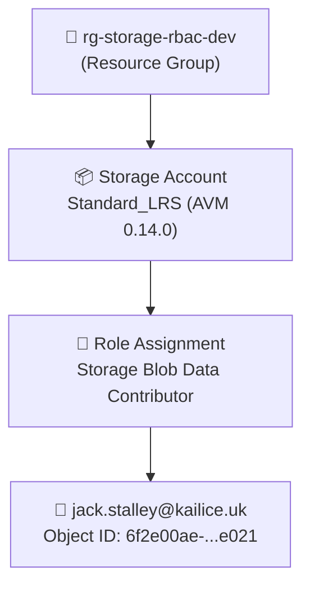
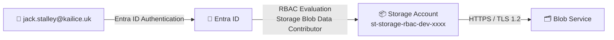

# 📐 Step 4: Implementation Plan - storage-rbac


<details open>
<summary><strong>📑 Implementation Plan Overview</strong></summary>

- [📋 Overview](#-overview)
- [📦 Resource Inventory](#-resource-inventory)
- [🗂️ Module Structure](#-module-structure)
- [🔨 Implementation Tasks](#-implementation-tasks)
- [🚀 Deployment Phases](#-deployment-phases)
- [🔗 Dependency Graph](#-dependency-graph)
- [🔄 Runtime Flow Diagram](#-runtime-flow-diagram)
- [🏷️ Naming Conventions](#-naming-conventions)
- [🔐 Security Configuration](#-security-configuration)
- [⏱️ Estimated Implementation Time](#-estimated-implementation-time)
- [🔒 Approval Gate](#-approval-gate)
- [References](#references)

</details>

> Generated by bicep-plan agent | 2026-03-06

| ⬅️ Previous                                                    | 📑 Index            | Next ➡️                                                          |
| -------------------------------------------------------------- | ------------------- | ---------------------------------------------------------------- |
| [02-architecture-assessment.md](02-architecture-assessment.md) | [README](README.md) | [05-implementation-reference.md](05-implementation-reference.md) |

> [!NOTE]
> Simple fast-path project: 2 resources (Storage Account + Role Assignment). Governance discovery skipped (no custom policies). Single deployment phase.

## 📋 Overview

A single Azure Storage Account (Standard_LRS) with an RBAC role assignment granting Storage Blob Data Contributor to a named Entra ID user. The architecture prioritizes **cost optimization** and **security** — RBAC-only access with zero shared-key exposure.

**Primary Region**: swedencentral
**Environment**: dev
**Deployment Target**: Resource Group `rg-storage-rbac-dev`
**Subscription**: Visual Studio Enterprise (`1d997f13-84f0-4047-b288-ffefd5137b68`)

### Governance Alignment

> [!TIP]
> Simple fast-path: Governance discovery skipped per user request. No custom Azure Policies apply to this subscription for the target resource types. Standard security baseline enforced via AVM module defaults.

---

## 📦 Resource Inventory

| Resource        | Type                                    | SKU/Tier     | AVM Module                                                    | Region        | Dependencies    |
| --------------- | --------------------------------------- | ------------ | ------------------------------------------------------------- | ------------- | --------------- |
| Storage Account | Microsoft.Storage/storageAccounts       | Standard_LRS | `br/public:avm/res/storage/storage-account:0.14.0`            | swedencentral | (foundation)    |
| Role Assignment | Microsoft.Authorization/roleAssignments | N/A          | Inline (`Microsoft.Authorization/roleAssignments@2022-04-01`) | swedencentral | Storage Account |

✅ **1/2 resources via AVM module** — Role assignment uses native Bicep resource (no AVM module needed for simple scoped role assignments)

---

## 🗂️ Module Structure

```text
infra/bicep/storage-rbac/
├── main.bicep            # Orchestration - resource group scope, deploys storage + RBAC
├── main.bicepparam       # Parameters file with environment values
└── deploy.ps1            # Deployment script with what-if analysis
```

> [!NOTE]
> No `modules/` subfolder needed. With only 2 resources and a single AVM module, all resources are deployed inline in `main.bicep` for simplicity.

---

## 🔨 Implementation Tasks

### Task 1: main.bicep (Orchestration + All Resources)

**Purpose**: Deploy storage account via AVM and role assignment inline

**Target Scope**: `resourceGroup`

**Parameters**:

| Parameter       | Type   | Default                    | Description                             |
| --------------- | ------ | -------------------------- | --------------------------------------- |
| `projectName`   | string | `'storage-rbac'`           | Project identifier for naming           |
| `environment`   | string | `'dev'`                    | Environment (dev/staging/prod)          |
| `location`      | string | `resourceGroup().location` | Primary Azure region                    |
| `owner`         | string | `'Jack Stalley'`           | Owner for tagging                       |
| `principalId`   | string | —                          | Entra ID Object ID of the user for RBAC |
| `principalType` | string | `'User'`                   | Principal type for role assignment      |

**Variables**:

| Variable                     | Formula                                                                                | Purpose                                    |
| ---------------------------- | -------------------------------------------------------------------------------------- | ------------------------------------------ |
| `uniqueSuffix`               | `uniqueString(resourceGroup().id)`                                                     | 13-char unique identifier                  |
| `storageAccountName`         | `'st${take(replace(projectName, '-', ''), 10)}${environment}${take(uniqueSuffix, 4)}'` | CAF-compliant, globally unique (≤24 chars) |
| `storageBlobDataContributor` | `'ba92f5b4-2d11-453d-a403-e96b0029c9fe'`                                               | Built-in role definition ID                |

**Required Tags**:

```bicep
var requiredTags = {
  Environment: environment
  ManagedBy: 'Bicep'
  Project: projectName
  Owner: owner
}
```

**AVM Storage Account** — `br/public:avm/res/storage/storage-account:0.14.0`:

```bicep
module storageAccount 'br/public:avm/res/storage/storage-account:0.14.0' = {
  name: 'deploy-st-${projectName}'
  params: {
    name: storageAccountName
    location: location
    kind: 'StorageV2'
    skuName: 'Standard_LRS'
    accessTier: 'Hot'
    allowBlobPublicAccess: false
    allowSharedKeyAccess: false
    supportsHttpsTrafficOnly: true
    minimumTlsVersion: 'TLS1_2'
    publicNetworkAccess: 'Enabled'
    tags: requiredTags
  }
}
```

**Role Assignment** — inline resource:

```bicep
resource roleAssignment 'Microsoft.Authorization/roleAssignments@2022-04-01' = {
  name: guid(storageAccount.outputs.resourceId, principalId, storageBlobDataContributor)
  scope: storageAccount
  properties: {
    roleDefinitionId: subscriptionResourceId('Microsoft.Authorization/roleDefinitions', storageBlobDataContributor)
    principalId: principalId
    principalType: principalType
  }
}
```

**Outputs**:

| Output               | Type   | Value                            |
| -------------------- | ------ | -------------------------------- |
| `storageAccountName` | string | Name of deployed storage account |
| `storageAccountId`   | string | Resource ID of storage account   |
| `roleAssignmentId`   | string | Resource ID of role assignment   |
| `blobEndpoint`       | string | Primary blob service endpoint    |

---

### Task 2: main.bicepparam

**Purpose**: Parameter file with environment-specific values

```bicepparam
using './main.bicep'

param projectName = 'storage-rbac'
param environment = 'dev'
param location = 'swedencentral'
param owner = 'Jack Stalley'
param principalId = '6f2e00ae-231f-4fe8-8e2e-73a45f15e021'
param principalType = 'User'
```

---

### Task 3: deploy.ps1

**Purpose**: PowerShell deployment script with what-if validation

**Key Steps**:

1. Set variables (resource group name, location, template path)
2. Create resource group if it doesn't exist (`az group create`)
3. Run `az deployment group what-if` for pre-deployment validation
4. Prompt for confirmation
5. Run `az deployment group create` with parameter file
6. Output deployment results

---

## 🚀 Deployment Phases

> Single deployment phase — 2 resources in one `az deployment group create` operation.

| Phase | Name       | Resources              | Duration | Gate    |
| ----- | ---------- | ---------------------- | -------- | ------- |
| 1     | All-in-One | Storage Account + RBAC | ~2 min   | what-if |

**Deployment Command**:

```bash
# Create resource group
az group create --name rg-storage-rbac-dev --location swedencentral --tags Environment=dev ManagedBy=Bicep Project=storage-rbac Owner="Jack Stalley"

# What-if validation
az deployment group what-if \
  --resource-group rg-storage-rbac-dev \
  --template-file infra/bicep/storage-rbac/main.bicep \
  --parameters infra/bicep/storage-rbac/main.bicepparam

# Deploy
az deployment group create \
  --resource-group rg-storage-rbac-dev \
  --template-file infra/bicep/storage-rbac/main.bicep \
  --parameters infra/bicep/storage-rbac/main.bicepparam \
  --name storage-rbac-deploy-$(date +%Y%m%d%H%M%S)
```

---

## 🔗 Dependency Graph



**Diagram Source**: [04-dependency-diagram.py](./04-dependency-diagram.py) | **Output**: [04-dependency-diagram.png](./04-dependency-diagram.png)

---

## 🔄 Runtime Flow Diagram



**Diagram Source**: [04-runtime-diagram.py](./04-runtime-diagram.py) | **Output**: [04-runtime-diagram.png](./04-runtime-diagram.png)

---

## 🏷️ Naming Conventions

| Resource        | Naming Pattern                            | Example Value          | Max Length |
| --------------- | ----------------------------------------- | ---------------------- | ---------- |
| Resource Group  | `rg-{project}-{env}`                      | `rg-storage-rbac-dev`  | 90         |
| Storage Account | `st{short}{env}{suffix}`                  | `ststoragerbacdev7f3a` | 24         |
| Role Assignment | `guid(storageId, principalId, roleDefId)` | (deterministic GUID)   | N/A        |

> [!IMPORTANT]
> Storage account names must be globally unique, 3–24 characters, lowercase alphanumeric only. The `uniqueString()` suffix ensures uniqueness across deployments.

---

## 🔐 Security Configuration

| Setting               | Value                         | Enforced By         |
| --------------------- | ----------------------------- | ------------------- |
| HTTPS-only            | `true`                        | AVM + Bicep param   |
| Minimum TLS version   | `TLS1_2`                      | AVM + Bicep param   |
| Public blob access    | `false`                       | AVM + Bicep param   |
| Shared key access     | `false` (disabled)            | AVM + Bicep param   |
| Public network access | `Enabled` (dev only)          | Bicep param         |
| Authentication method | Entra ID RBAC only            | Shared key disabled |
| Role assignment scope | Storage account               | Bicep resource      |
| Role definition       | Storage Blob Data Contributor | Built-in role       |
| Principal type        | User                          | Bicep param         |

### Identity Resolution (Completed)

| Field     | Value                                  |
| --------- | -------------------------------------- |
| UPN       | jack.stalley@kailice.uk                |
| Object ID | `6f2e00ae-231f-4fe8-8e2e-73a45f15e021` |
| Discovery | `az ad user show` (Azure CLI)          |
| Principal | User (not Service Principal or Group)  |

---

## ⏱️ Estimated Implementation Time

| Task                    | Effort          |
| ----------------------- | --------------- |
| Write `main.bicep`      | ~15 minutes     |
| Write `main.bicepparam` | ~5 minutes      |
| Write `deploy.ps1`      | ~10 minutes     |
| Bicep lint + build      | ~2 minutes      |
| What-if validation      | ~2 minutes      |
| Deployment              | ~2 minutes      |
| **Total**               | **~36 minutes** |

---

## 🔒 Approval Gate

> [!IMPORTANT]
> **📐 Implementation Plan Complete**
>
> | Metric           | Value                        |
> | ---------------- | ---------------------------- |
> | Resources        | 2                            |
> | AVM Modules      | 1 (Storage Account)          |
> | Custom Resources | 1 (Role Assignment — inline) |
> | Governance       | Skipped (simple fast-path)   |
> | Deployment       | Single phase (~2 min)        |
> | Est. Build Time  | ~36 minutes                  |
>
> **Adversarial Review**: Skipped (1-pass at code stage per fast-path)
>
> Reply **"approve"** to proceed to bicep-code, or provide feedback for revisions.

---

## References

> [!NOTE]
> 📚 The following Microsoft Learn resources informed this plan.

| Topic                         | Link                                                                                                                     |
| ----------------------------- | ------------------------------------------------------------------------------------------------------------------------ |
| AVM Storage Account Module    | [Registry](https://github.com/Azure/bicep-registry-modules/tree/main/avm/res/storage/storage-account)                    |
| Storage Account Overview      | [Docs](https://learn.microsoft.com/azure/storage/common/storage-account-overview)                                        |
| Storage Blob Data Contributor | [Docs](https://learn.microsoft.com/azure/role-based-access-control/built-in-roles/storage#storage-blob-data-contributor) |
| Role Assignments Bicep        | [Docs](https://learn.microsoft.com/azure/templates/microsoft.authorization/roleassignments)                              |
| CAF Naming Conventions        | [Docs](https://learn.microsoft.com/azure/cloud-adoption-framework/ready/azure-best-practices/resource-naming)            |
| uniqueString Function         | [Docs](https://learn.microsoft.com/azure/azure-resource-manager/bicep/bicep-functions-string#uniquestring)               |
| Bicep Parameter Files         | [Docs](https://learn.microsoft.com/azure/azure-resource-manager/bicep/parameter-files)                                   |

---

<div align="center">

| ⬅️ [02-architecture-assessment.md](02-architecture-assessment.md) | 🏠 [Project Index](README.md) | ➡️ [05-implementation-reference.md](05-implementation-reference.md) |
| ----------------------------------------------------------------- | ----------------------------- | ------------------------------------------------------------------- |

</div>
