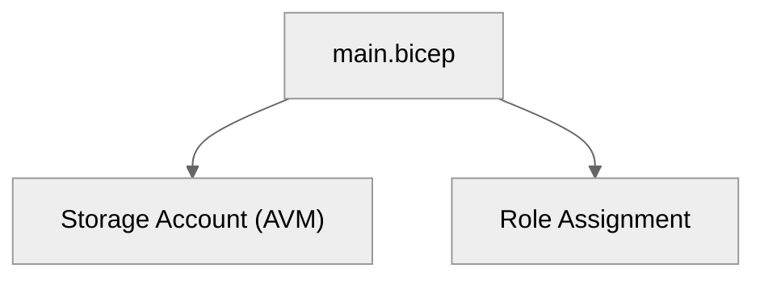

# 🔧 Step 5: Implementation Reference - storage-rbac


<details open>
<summary><strong>📑 Implementation Reference</strong></summary>

- [📁 IaC Templates Location](#-iac-templates-location)
- [🗂️ File Structure](#-file-structure)
- [✅ Validation Status](#-validation-status)
- [🏗️ Resources Created](#-resources-created)
- [🚀 Deployment Instructions](#-deployment-instructions)
- [📝 Key Implementation Notes](#-key-implementation-notes)
- [References](#references)

</details>

> Generated by bicep-code agent | 2026-03-06

| ⬅️ Previous                                            | 📑 Index            | Next ➡️                                              |
| ------------------------------------------------------ | ------------------- | ---------------------------------------------------- |
| [04-implementation-plan.md](04-implementation-plan.md) | [README](README.md) | [06-deployment-summary.md](06-deployment-summary.md) |

## 📁 IaC Templates Location

📁 **Code Location**: [`infra/bicep/storage-rbac/`](../../infra/bicep/storage-rbac/)

| Property              | Value                                              |
| --------------------- | -------------------------------------------------- |
| **Project**           | storage-rbac                                       |
| **IaC Tool**          | Bicep                                              |
| **AVM Coverage**      | 1/1 AVM-eligible resources                         |
| **Total Resources**   | 2 (Storage Account + Role Assignment)              |
| **Deployment Phases** | 1 (single `az deployment group create`)            |
| **Region**            | swedencentral                                      |
| **Environment**       | dev                                                |
| **Target RG**         | rg-storage-rbac-dev                                |
| **Subscription**      | Visual Studio Enterprise (1d997f13...ffefd5137b68) |

---

## 🗂️ File Structure

```text
infra/bicep/storage-rbac/
|- main.bicep
|- main.bicepparam
|- deploy.ps1
```

| File              | Path                                       | Purpose                               |
| ----------------- | ------------------------------------------ | ------------------------------------- |
| `main.bicep`      | `infra/bicep/storage-rbac/main.bicep`      | AVM storage account + role assignment |
| `main.bicepparam` | `infra/bicep/storage-rbac/main.bicepparam` | Environment parameter values          |
| `deploy.ps1`      | `infra/bicep/storage-rbac/deploy.ps1`      | PowerShell deployment with what-if    |

### AVM Module Usage

| Resource        | AVM Module                                           | Version  | Inline? |
| --------------- | ---------------------------------------------------- | -------- | ------- |
| Storage Account | `br/public:avm/res/storage/storage-account`          | `0.14.0` | No      |
| Role Assignment | `Microsoft.Authorization/roleAssignments@2022-04-01` | N/A      | Yes     |

---

## ✅ Validation Status

| Check         | Result  | Details                         |
| ------------- | ------- | ------------------------------- |
| `bicep lint`  | ✅ PASS | No warnings or errors           |
| `bicep build` | ✅ PASS | ARM template generated (309 KB) |

---

## 🏗️ Resources Created

| Resource                        | Type                                                  | Naming Pattern |
| ------------------------------- | ----------------------------------------------------- | -------------- |
| Storage Account                 | `Microsoft.Storage/storageAccounts`                   | `st{short}{env}{suffix}` |
| Storage Blob Data Contributor   | `Microsoft.Authorization/roleAssignments@2022-04-01` | Role GUID-based |



---

## 📌 Detailed Implementation Findings

### Naming Conventions Applied

| Property              | Value                                              |
| --------------------- | -------------------------------------------------- |
| **Project**           | storage-rbac                                       |
| **IaC Tool**          | Bicep                                              |
| **AVM Coverage**      | 1/1 AVM-eligible resources                         |
| **Total Resources**   | 2 (Storage Account + Role Assignment)              |
| **Deployment Phases** | 1 (single `az deployment group create`)            |
| **Region**            | swedencentral                                      |
| **Environment**       | dev                                                |
| **Target RG**         | rg-storage-rbac-dev                                |
| **Subscription**      | Visual Studio Enterprise (1d997f13...ffefd5137b68) |

---

### Security Baseline

| Resource        | Pattern                  | Example Output           | CAF Compliant |
| --------------- | ------------------------ | ------------------------ | ------------- |
| Resource Group  | `rg-{project}-{env}`     | rg-storage-rbac-dev      | ✅            |
| Storage Account | `st{short}{env}{suffix}` | ststoragerbacdev\*\*\*\* | ✅ (≤24)      |

> `****` = first 4 characters of `uniqueString(resourceGroup().id)`

---

### Tags Applied

| Control                    | Status | Implementation                                    |
| -------------------------- | ------ | ------------------------------------------------- |
| TLS 1.2 minimum            | ✅     | `minimumTlsVersion: 'TLS1_2'`                     |
| HTTPS-only                 | ✅     | `supportsHttpsTrafficOnly: true`                  |
| No public blob access      | ✅     | `allowBlobPublicAccess: false`                    |
| Shared key access disabled | ✅     | `allowSharedKeyAccess: false`                     |
| RBAC-only data access      | ✅     | Storage Blob Data Contributor via role assignment |
| Managed Identity           | N/A    | User principal (dev environment)                  |

---

### Adversarial Review (1-pass comprehensive - simple fast-path)

| Tag           | Value          | Source               |
| ------------- | -------------- | -------------------- |
| `Environment` | `dev`          | Baseline requirement |
| `ManagedBy`   | `Bicep`        | Baseline requirement |
| `Project`     | `storage-rbac` | Baseline requirement |
| `Owner`       | `Jack Stalley` | Baseline requirement |

| Lens          | Finding                                                       | Severity | Status    |
| ------------- | ------------------------------------------------------------- | -------- | --------- |
| Security      | Shared key disabled, TLS 1.2, HTTPS-only, no public blob      | ✅ Pass  | Compliant |
| Cost          | Standard_LRS, no unnecessary resources, ~$0.50/mo             | ✅ Pass  | Optimal   |
| Reliability   | LRS acceptable for dev; documented in architecture assessment | ✅ Pass  | Accepted  |
| Naming/Tags   | CAF naming, 4 required tags applied                           | ✅ Pass  | Compliant |
| AVM Usage     | Storage account via AVM v0.14.0; role assignment inline       | ✅ Pass  | Compliant |
| Identity      | Real principal ID from `az ad user show`, no placeholders     | ✅ Pass  | Verified  |
| Unique Suffix | Generated once in main.bicep via `uniqueString(rg.id)`        | ✅ Pass  | Compliant |

---

## 🚀 Deployment Instructions

### Prerequisites

- Azure CLI installed with Bicep extension
- Authenticated via `az login`
- Subscription set: `az account set --subscription 1d997f13-84f0-4047-b288-ffefd5137b68`

### Deploy

```powershell
cd infra/bicep/storage-rbac

# With what-if preview (recommended)
./deploy.ps1

# Skip what-if (direct deploy)
./deploy.ps1 -SkipWhatIf
```

### Manual Deployment (alternative)

```bash
az group create --name rg-storage-rbac-dev --location swedencentral

az deployment group create \
  --resource-group rg-storage-rbac-dev \
  --template-file infra/bicep/storage-rbac/main.bicep \
  --parameters infra/bicep/storage-rbac/main.bicepparam
```

---

## 📝 Key Implementation Notes

- Required baseline controls are implemented: TLS 1.2 minimum, HTTPS-only, no public blob access, shared key disabled.
- Resource naming follows CAF patterns and required tags (`Environment`, `ManagedBy`, `Project`, `Owner`) are applied.
- AVM is used for the storage account (`br/public:avm/res/storage/storage-account:0.14.0`) with inline RBAC assignment.

---

## References

- [AVM Storage Account Module](https://github.com/Azure/bicep-registry-modules/tree/main/avm/res/storage/storage-account)
- [Storage Blob Data Contributor Role](https://learn.microsoft.com/en-us/azure/role-based-access-control/built-in-roles/storage#storage-blob-data-contributor)
- [Azure CAF Naming](https://learn.microsoft.com/en-us/azure/cloud-adoption-framework/ready/azure-best-practices/resource-naming)
