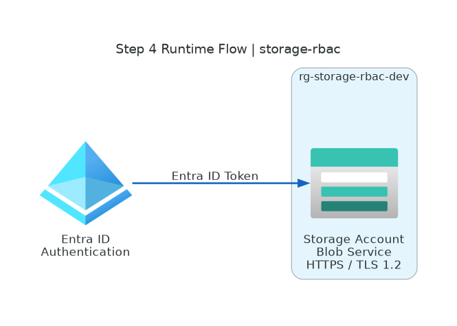

# 📐 Azure Design Document: storage-rbac

<strong>📑 Design Contents</strong>

- [📝 1. Introduction](#-1-introduction)
- [🏛️ 2. Azure Architecture Overview](#-2-azure-architecture-overview)
- [🌐 3. Networking](#-3-networking)
- [💾 4. Storage](#-4-storage)
- [💻 5. Compute](#-5-compute)
- [👤 6. Identity & Access](#-6-identity--access)
- [🔐 7. Security & Compliance](#-7-security--compliance)
- [🔄 8. Backup & Disaster Recovery](#-8-backup--disaster-recovery)
- [📊 9. Management & Monitoring](#-9-management--monitoring)
- [📎 10. Appendix](#-10-appendix)
- [References](#references)

> Generated by 08-As-Built agent | 2026-03-06

| ⬅️ Previous                                            | 📑 Index            | Next ➡️                                              |
| ------------------------------------------------------ | ------------------- | ---------------------------------------------------- |
| [07-documentation-index.md](07-documentation-index.md) | [README](README.md) | [07-operations-runbook.md](07-operations-runbook.md) |

**Version**: 1.0
**Date**: 2026-03-06
**Author**: Generated by Workload Documentation Generator
**Status**: Complete

---

## 📝 1. Introduction

### 1.1 Document Purpose

This design document captures the as-built implementation for `storage-rbac` in Azure.
It documents the deployed topology, security settings, and operating assumptions for the
development environment.

**Intended Audience:**

- Solution architects
- Platform operations
- Security reviewers
- Developers consuming blob storage

### 1.2 Project Overview

`storage-rbac` deploys a single Storage Account and grants one Entra ID user data-plane
blob permissions using Azure RBAC. The deployment uses Bicep and the AVM Storage Account
module.

**Business Objectives:**

- Provide low-cost blob storage in `swedencentral`
- Enforce RBAC-based data access (no shared-key dependency)
- Keep the footprint minimal for a simple development workload

### 1.3 Design Objectives

| Objective    | Target                              | Implementation                                            |
| ------------ | ----------------------------------- | --------------------------------------------------------- |
| Availability | Development-grade resiliency        | Standard_LRS storage in one region                        |
| Performance  | Support low traffic blob operations | StorageV2 account, Hot tier                               |
| Security     | RBAC-first and TLS baseline         | HTTPS-only, TLS 1.2, no public blob access, no shared key |
| Scalability  | Grow from small dev usage           | Azure Storage scale limits far exceed current demand      |

### 1.4 Constraints & Assumptions

**Constraints:**

- Fast-path scope: only storage plus one role assignment
- Monthly budget target under $50

**Assumptions:**

- `jack.stalley@kailice.uk` remains the intended blob data user
- No private networking is required for this dev environment

### 1.5 Stakeholders

| Role              | Team        | Responsibility                         |
| ----------------- | ----------- | -------------------------------------- |
| Project Owner     | Engineering | Approves storage and access model      |
| Blob Data User    | Engineering | Uses blob data plane operations        |
| Platform Operator | Platform    | Maintains IaC, deployment, and support |

---

## 🏛️ 2. Azure Architecture Overview

### 2.1 Architecture Diagram

Source: [04-runtime-diagram.py](./04-runtime-diagram.py)

### 2.2 Resource Summary

| Category   | Count |
| ---------- | ----- |
| Compute    | 0     |
| Networking | 0     |
| Data       | 1     |
| Security   | 1     |

---

## 🌐 3. Networking

`storage-rbac` does not deploy dedicated virtual networking resources.

- `publicNetworkAccess`: `Enabled`
- `networkRuleSet.defaultAction`: `Deny`
- No VNet rules
- No private endpoints

This is acceptable for the current dev scope and should be revisited for staging/production.

---

## 💾 4. Storage

| Property           | Value                                                |
| ------------------ | ---------------------------------------------------- |
| Name               | `ststoragerbadevk565`                                |
| Type               | `Microsoft.Storage/storageAccounts`                  |
| Kind               | `StorageV2`                                          |
| SKU                | `Standard_LRS`                                       |
| Access Tier        | `Hot`                                                |
| Region             | `swedencentral`                                      |
| Blob Endpoint      | `https://ststoragerbadevk565.blob.core.windows.net/` |
| Provisioning State | `Succeeded`                                          |

---

## 💻 5. Compute

No compute resources are deployed in this workload.

---

## 👤 6. Identity & Access

| Setting          | Value                                  |
| ---------------- | -------------------------------------- |
| Principal Name   | `jack.stalley@kailice.uk`              |
| Principal ID     | `6f2e00ae-231f-4fe8-8e2e-73a45f15e021` |
| Principal Type   | `User`                                 |
| Role             | `Storage Blob Data Contributor`        |
| Role Definition  | `ba92f5b4-2d11-453d-a403-e96b0029c9fe` |
| Assignment Scope | Storage Account `ststoragerbadevk565`  |
| Assignment ID    | `1b42b0f0-d31e-5e7a-bee2-013e5b272dcb` |

---

## 🔐 7. Security & Compliance

<strong>🔒 Security Controls</strong>

| Control            | Implementation                   | Evidence                  |
| ------------------ | -------------------------------- | ------------------------- |
| TLS 1.2+           | `minimumTlsVersion: TLS1_2`      | `az storage account show` |
| HTTPS-only         | `enableHttpsTrafficOnly: true`   | `az storage account show` |
| Shared key access  | `allowSharedKeyAccess: false`    | `az storage account show` |
| Public blob access | `allowBlobPublicAccess: false`   | `az storage account show` |
| RBAC access        | Blob Data Contributor assignment | `az role assignment list` |

<strong>📋 Compliance Mapping</strong>

| Framework         | Control ID | Status |
| ----------------- | ---------- | ------ |
| Internal Baseline | TLS1.2     | ✅     |
| Internal Baseline | HTTPSOnly  | ✅     |
| Internal Baseline | RBACOnly   | ✅     |

No additional regulatory framework controls were required for this simple dev deployment.

---

## 🔄 8. Backup & Disaster Recovery

Fast-path note: this project intentionally omits a dedicated `07-backup-dr-plan.md` artifact.
Current recovery method is redeploy from IaC, with LRS redundancy as configured.

---

## 📊 9. Management & Monitoring

- Monitoring stack is intentionally minimal for this dev deployment.
- Health is verified through deployment outputs and Azure control-plane status.
- Consider adding diagnostic settings and alerting before promotion to production.

---

## 📎 10. Appendix

📋 Detailed Resource Configuration

- Resource Group: `rg-storage-rbac-dev`
- Subscription: `1d997f13-84f0-4047-b288-ffefd5137b68`
- Bicep Module: `br/public:avm/res/storage/storage-account:0.14.0`
- Tags: `Environment=dev`, `ManagedBy=Bicep`, `Project=storage-rbac`, `Owner=Jack Stalley`

📚 Reference Architecture Links

| Architecture             | Link                                                                                                |
| ------------------------ | --------------------------------------------------------------------------------------------------- |
| Storage Account Overview | [Learn](https://learn.microsoft.com/azure/storage/common/storage-account-overview)                  |
| AVM Storage Account      | [GitHub](https://github.com/Azure/bicep-registry-modules/tree/main/avm/res/storage/storage-account) |

---

## References

> [!NOTE]
> 📚 The following Microsoft Learn resources provide additional guidance.

| Topic                      | Link                                                                                               |
| -------------------------- | -------------------------------------------------------------------------------------------------- |
| Well-Architected Framework | [Overview](https://learn.microsoft.com/azure/well-architected/)                                    |
| Azure Architecture Center  | [Architectures](https://learn.microsoft.com/azure/architecture/)                                   |
| Security Best Practices    | [Security Baseline](https://learn.microsoft.com/security/benchmark/azure/overview)                 |
| Networking Best Practices  | [Network Security](https://learn.microsoft.com/azure/security/fundamentals/network-best-practices) |
| Backup Best Practices      | [Azure Backup](https://learn.microsoft.com/azure/backup/backup-best-practices)                     |
| Monitoring Overview        | [Azure Monitor](https://learn.microsoft.com/azure/azure-monitor/overview)                          |

---

_Design document generated from infrastructure artifacts and deployed Azure state._

---

| ⬅️ [07-documentation-index.md](07-documentation-index.md) | 🏠 [Project Index](README.md) | ➡️ [07-operations-runbook.md](07-operations-runbook.md) |
| --------------------------------------------------------- | ----------------------------- | ------------------------------------------------------- |

