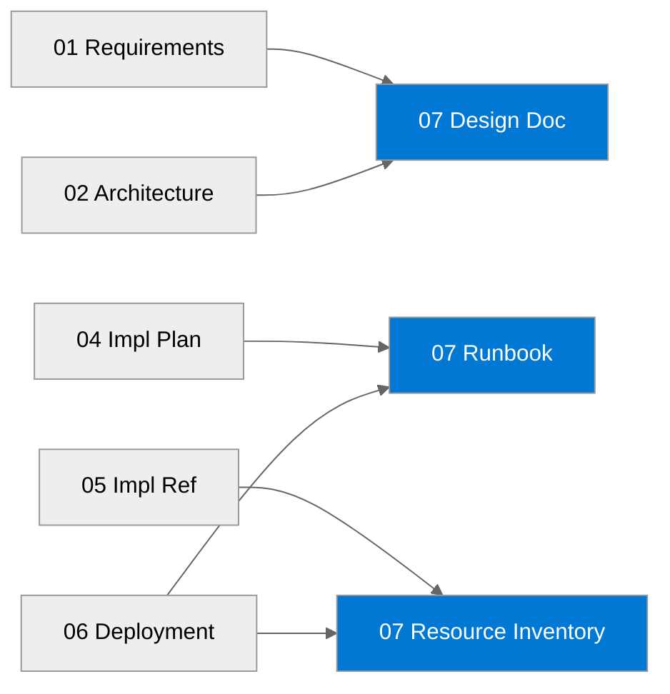

# 📚 storage-rbac - Workload Documentation

<strong>📑 Documentation Contents</strong>

- [📦 1. Document Package Contents](#-1-document-package-contents)
- [📚 2. Source Artifacts](#-2-source-artifacts)
- [📋 3. Project Summary](#-3-project-summary)
- [🔗 4. Related Resources](#-4-related-resources)
- [⚡ 5. Quick Links](#-5-quick-links)

> Generated by 08-As-Built agent | 2026-03-06

| ⬅️ Previous                                          | 📑 Index            | Next ➡️                                        |
| ---------------------------------------------------- | ------------------- | ---------------------------------------------- |
| [06-deployment-summary.md](06-deployment-summary.md) | [README](README.md) | [07-design-document.md](07-design-document.md) |

**Generated**: 2026-03-06
**Version**: 1.0
**Status**: Complete

---

## 📦 1. Document Package Contents

| Document                                         | Description                              | Status                                                        |
| ------------------------------------------------ | ---------------------------------------- | ------------------------------------------------------------- |
| [Design Document](./07-design-document.md)       | As-built architecture and configuration  |  |
| [Operations Runbook](./07-operations-runbook.md) | Day-2 operations and incident handling   |  |
| [Resource Inventory](./07-resource-inventory.md) | Deployed resources and key properties    |  |
| [Compliance Matrix](./07-compliance-matrix.md)   | Fast-path project: intentionally omitted |         |
| [Backup & DR Plan](./07-backup-dr-plan.md)       | Fast-path project: intentionally omitted |         |

---

## 📚 2. Source Artifacts

These documents were generated from the following workflow outputs:

| Artifact                 | Source File                           | Generated  |
| ------------------------ | ------------------------------------- | ---------- |
| Requirements             | `01-requirements.md`                  | 2026-03-06 |
| Architecture Assessment  | `02-architecture-assessment.md`       | 2026-03-06 |
| Implementation Plan      | `04-implementation-plan.md`           | 2026-03-06 |
| Implementation Reference | `05-implementation-reference.md`      | 2026-03-06 |
| Deployment Summary       | `06-deployment-summary.md`            | 2026-03-06 |
| IaC Source               | `infra/bicep/storage-rbac/main.bicep` | 2026-03-06 |

---

## 📋 3. Project Summary

| Attribute          | Value                           |
| ------------------ | ------------------------------- |
| **Project Name**   | `storage-rbac`                  |
| **Environment**    | `dev`                           |
| **Primary Region** | `swedencentral`                 |
| **Compliance**     | Internal baseline controls only |
| **Monthly Cost**   | Refer to architecture estimate  |

---

## 🔗 4. Related Resources

- **Infrastructure Code**: [`infra/bicep/storage-rbac/`](../../infra/bicep/storage-rbac/)
- **Agent Outputs**: [`agent-output/storage-rbac/`](./)
- **Deployment Summary**: [`06-deployment-summary.md`](./06-deployment-summary.md)

---

## ⚡ 5. Quick Links

- 📂 **Code**: [Deployment Script](../../infra/bicep/storage-rbac/deploy.ps1) | [Main Bicep Template](../../infra/bicep/storage-rbac/main.bicep)
- 📄 **Docs**: [Design Document](./07-design-document.md) | [Runbook](./07-operations-runbook.md) | [Inventory](./07-resource-inventory.md)
- 🔗 **External**: [Azure Well-Architected Framework](https://learn.microsoft.com/azure/well-architected/) | [AVM Index](https://aka.ms/avm/index)

---

_Documentation index generated by Workload Documentation Generator._

---

| ⬅️ [06-deployment-summary.md](06-deployment-summary.md) | 🏠 [Project Index](README.md) | ➡️ [07-design-document.md](07-design-document.md) |
| ------------------------------------------------------- | ----------------------------- | ------------------------------------------------- |

