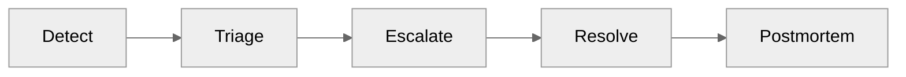
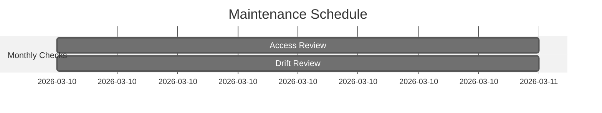
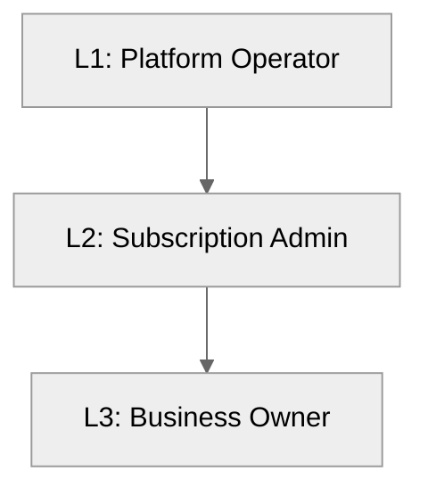

# 📖 Operations Runbook: storage-rbac


<details open>
<summary><strong>📑 Runbook Contents</strong></summary>

- [⚡ Quick Reference](#-quick-reference)
- [📋 1. Daily Operations](#-1-daily-operations)
- [🚨 2. Incident Response](#-2-incident-response)
- [🔧 3. Common Procedures](#-3-common-procedures)
- [🕐 4. Maintenance Windows](#-4-maintenance-windows)
- [📞 5. Contacts & Escalation](#-5-contacts--escalation)
- [📝 6. Change Log](#-6-change-log)
- [References](#references)

</details>

> Generated by 08-As-Built agent | 2026-03-06

| ⬅️ Previous                                    | 📑 Index            | Next ➡️                                              |
| ---------------------------------------------- | ------------------- | ---------------------------------------------------- |
| [07-design-document.md](07-design-document.md) | [README](README.md) | [07-resource-inventory.md](07-resource-inventory.md) |

**Version**: 1.0
**Date**: 2026-03-06
**Environment**: dev
**Region**: swedencentral

---

## ⚡ Quick Reference

| Item                | Value                                   |
| ------------------- | --------------------------------------- |
| **Primary Region**  | `swedencentral`                         |
| **Resource Group**  | `rg-storage-rbac-dev`                   |
| **Support Contact** | Project owner (Jack Stalley)            |
| **Escalation Path** | Platform Operator -> Subscription Admin |

### Critical Resources

| Resource        | Name                  | Resource Group        | Severity |
| --------------- | --------------------- | --------------------- | -------- |
| Storage Account | `ststoragerbadevk565` | `rg-storage-rbac-dev` | 🟠 P2    |
| Role Assignment | `1b42b0f0-d31e-...`   | `rg-storage-rbac-dev` | 🟢 P3    |

---

## 📋 1. Daily Operations

### 1.1 Health Checks

**Morning Health Check:**

1. ✅ Verify storage account provisioning state is `Succeeded`
2. ✅ Verify blob endpoint resolves and serves HTTPS
3. ✅ Verify expected RBAC assignment exists for `jack.stalley@kailice.uk`

**KQL Query - System Health Overview:**

<details>
<summary><strong>📊 Health Check KQL</strong></summary>

```kusto
// AzureActivity checks for storage-rbac resource operations
AzureActivity
| where ResourceGroup == "rg-storage-rbac-dev"
| where ResourceProviderValue has "MICROSOFT.STORAGE"
| project TimeGenerated, ActivityStatusValue, OperationNameValue, Caller
| top 50 by TimeGenerated desc
```

</details>

### 1.2 Log Review

**Priority Logs to Review:**

| Log Source      | Query Focus                            | Action Threshold |
| --------------- | -------------------------------------- | ---------------- |
| Azure Activity  | Failed storage or RBAC operations      | Any failure      |
| Storage Metrics | Availability and failed request spikes | Sustained errors |

---

## 🚨 2. Incident Response

### 2.1 Severity Definitions

| Severity | Definition                                      | Response Time  |
| -------- | ----------------------------------------------- | -------------- |
| 🔴 P1    | Production-impacting outage (not expected here) | 15 minutes     |
| 🟠 P2    | Blob access blocked for intended user           | 1 hour         |
| 🟢 P3    | Non-blocking config drift or documentation gap  | 1 business day |

### Incident Response Flow



### 2.2 Runbooks by Alert

| Alert                           | Runbook            | Owner             |
| ------------------------------- | ------------------ | ----------------- |
| Storage account unavailable     | Section 3.1 checks | Platform Operator |
| RBAC permission denied for user | Section 3.2 checks | Platform Operator |

---

## 🔧 3. Common Procedures

### 3.1 Restart Services

<details>
<summary>🔧 Verify Storage Service Health (no restart action)</summary>

```bash
az storage account show \
  --name ststoragerbadevk565 \
  --resource-group rg-storage-rbac-dev \
  --query "{state:provisioningState,https:enableHttpsTrafficOnly,tls:minimumTlsVersion}" \
  --output table
```

</details>

### 3.2 Scale Resources

<details>
<summary>📈 Validate and update SKU if required</summary>

```bash
az storage account show \
  --name ststoragerbadevk565 \
  --resource-group rg-storage-rbac-dev \
  --query "sku.name" \
  --output tsv

# Scale pattern (example only; use with change approval)
# az storage account update \
#   --name ststoragerbadevk565 \
#   --resource-group rg-storage-rbac-dev \
#   --sku Standard_ZRS
```

</details>

---

## 🕐 4. Maintenance Windows

| Task                              | Schedule             | Duration |
| --------------------------------- | -------------------- | -------- |
| Access review for role assignment | Monthly (first week) | 30 min   |
| Bicep drift and baseline review   | Monthly              | 30 min   |



> [!TIP]
> 💡 Execute changes through Bicep source and redeploy to keep IaC as the single source of truth.

---

## 📞 5. Contacts & Escalation

| Role               | Contact                   | Phone | On-Call Rotation |
| ------------------ | ------------------------- | ----- | ---------------- |
| Blob Data User     | `jack.stalley@kailice.uk` | N/A   | N/A              |
| Platform Operator  | Project maintainer        | N/A   | Best effort      |
| Subscription Admin | Azure subscription owner  | N/A   | Best effort      |

### Escalation Path



---

## 📝 6. Change Log

| Date       | Change                                      | Author            |
| ---------- | ------------------------------------------- | ----------------- |
| 2026-03-06 | Initial as-built runbook for `storage-rbac` | 08-As-Built agent |

---

## References

> [!NOTE]
> 📚 The following Microsoft Learn resources provide operational guidance.

| Topic                 | Link                                                                                             |
| --------------------- | ------------------------------------------------------------------------------------------------ |
| Azure Monitor Alerts  | [Alerting Best Practices](https://learn.microsoft.com/azure/azure-monitor/best-practices-alerts) |
| Log Analytics Queries | [KQL Reference](https://learn.microsoft.com/azure/azure-monitor/logs/get-started-queries)        |
| Incident Management   | [Azure Status](https://status.azure.com/)                                                        |
| Service Health        | [Azure Service Health](https://learn.microsoft.com/azure/service-health/overview)                |

---

_Operations runbook generated from infrastructure artifacts and deployed Azure state._

---

<div align="center">

| ⬅️ [07-design-document.md](07-design-document.md) | 🏠 [Project Index](README.md) | ➡️ [07-resource-inventory.md](07-resource-inventory.md) |
| ------------------------------------------------- | ----------------------------- | ------------------------------------------------------- |

</div>
