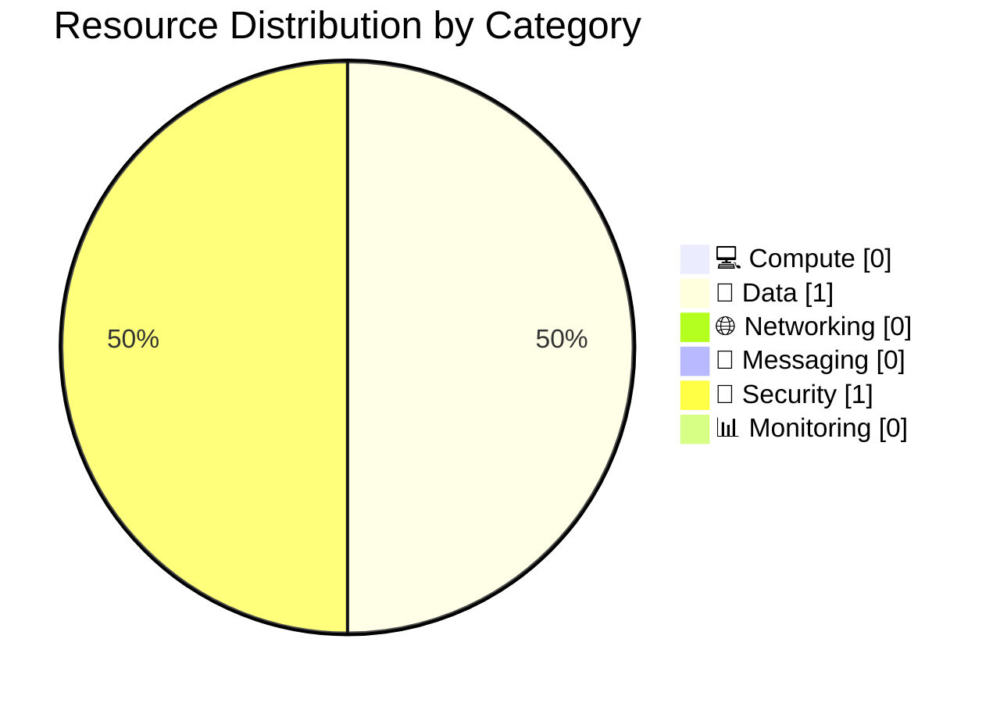

# 📦 Resource Inventory: storage-rbac

<strong>📑 Inventory Contents</strong>

- [📊 Summary](#-summary)
- [📦 Resource Listing](#-resource-listing)
- [References](#references)

> Generated by 08-As-Built agent | 2026-03-06

| ⬅️ Previous                                          | 📑 Index            | Next ➡️                                                |
| ---------------------------------------------------- | ------------------- | ------------------------------------------------------ |
| [07-operations-runbook.md](07-operations-runbook.md) | [README](README.md) | [07-documentation-index.md](07-documentation-index.md) |

**Generated**: 2026-03-06
**Source**: Infrastructure as Code (Bicep) + deployed Azure state
**Environment**: dev
**Region**: swedencentral

---

## 📊 Summary

| Category            | Count |
| ------------------- | ----- |
| **Total Resources** | 2     |
| 💻 Compute          | 0     |
| 💾 Data Services    | 1     |
| 🌐 Networking       | 0     |
| 📨 Messaging        | 0     |
| 🔐 Security         | 1     |
| 📊 Monitoring       | 0     |

---

## 📦 Resource Listing

### 💻 Compute Resources

No compute resources deployed.

### 💾 Data Services

| Name                  | Type                                | SKU            | Configuration                           | Location        | Monthly Cost                          |
| --------------------- | ----------------------------------- | -------------- | --------------------------------------- | --------------- | ------------------------------------- |
| `ststoragerbadevk565` | `Microsoft.Storage/storageAccounts` | `Standard_LRS` | `StorageV2`, `Hot`, HTTPS-only, TLS 1.2 | `swedencentral` | N/A (not calculated in this artifact) |

### 🌐 Networking Resources

No dedicated networking resources deployed.

### 📨 Messaging Resources

No messaging resources deployed.

### 🔐 Security Resources

| Name                     | Type                                      | Configuration                                                 | Location        |
| ------------------------ | ----------------------------------------- | ------------------------------------------------------------- | --------------- |
| `1b42b0f0-d31e-5e7a-...` | `Microsoft.Authorization/roleAssignments` | `Storage Blob Data Contributor` for `jack.stalley@kailice.uk` | `swedencentral` |

### 📊 Monitoring Resources

No dedicated monitoring resources deployed.

---

## References

| Topic                | Link                                                                                                                   |
| -------------------- | ---------------------------------------------------------------------------------------------------------------------- |
| Azure Resource Types | [Resource Providers](https://learn.microsoft.com/azure/azure-resource-manager/management/resource-providers-and-types) |
| Naming Conventions   | [CAF Naming](https://learn.microsoft.com/azure/cloud-adoption-framework/ready/azure-best-practices/resource-naming)    |
| Pricing Calculator   | [Azure Pricing](https://azure.microsoft.com/pricing/calculator/)                                                       |

---

_Resource inventory generated from Bicep templates and deployed Azure resources._

---

| ⬅️ [07-operations-runbook.md](07-operations-runbook.md) | 🏠 [Project Index](README.md) | ➡️ [07-documentation-index.md](07-documentation-index.md) |
| ------------------------------------------------------- | ----------------------------- | --------------------------------------------------------- |

