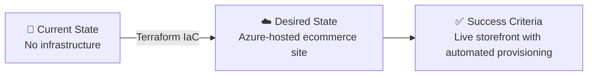

# 📋 Step 1: Requirements - terraform-e2e

<strong>📑 Requirements Overview</strong>

- [🎯 Project Overview](#-project-overview)
- [🚀 Functional Requirements](#-functional-requirements)
- [⚡ Non-Functional Requirements (NFRs)](#-non-functional-requirements-nfrs)
- [🔒 Compliance & Security Requirements](#-compliance--security-requirements)
- [💰 Budget](#-budget)
- [🔧 Operational Requirements](#-operational-requirements)
- [🌍 Regional Preferences](#-regional-preferences)
- [📋 Summary for Architecture Assessment](#-summary-for-architecture-assessment)
- [References](#references)

> Generated by @requirements agent | 2026-02-26

| ⬅️ Previous | 📑 Index            | Next ➡️                                                        |
| ----------- | ------------------- | -------------------------------------------------------------- |
| —           | [README](README.md) | [02-architecture-assessment.md](02-architecture-assessment.md) |

## 🎯 Project Overview

| Field                   | Value                                      |
| ----------------------- | ------------------------------------------ |
| **Project Name**        | terraform-e2e                              |
| **Project Type**        | Full-Stack (Static frontend + API backend) |
| **Timeline**            | 2026-02-26 → TBD                           |
| **Primary Stakeholder** | team-terraform                             |
| **Business Context**    | Small ecommerce storefront on Azure        |
| **iac_tool**            | Terraform                                  |

### Business Context

| Field               | Value                                                           |
| ------------------- | --------------------------------------------------------------- |
| Industry / Vertical | Retail / E-commerce                                             |
| Company Size        | Startup (1–50 employees)                                        |
| Current State       | Greenfield                                                      |
| Migration Source    | N/A — greenfield deployment                                     |
| Business Drivers    | Launch online storefront with minimal infrastructure overhead   |
| Success Criteria    | Functional ecommerce site deployed to Azure with IaC automation |

### State Transition

## 🚀 Functional Requirements

### Core Capabilities

| #   | Capability                 | Priority  | Acceptance Criteria                               |
| --- | -------------------------- | --------- | ------------------------------------------------- |
| 1   | Static frontend hosting    | 🔴 Must   | SWA serves storefront pages with < 2s load time   |
| 2   | Backend REST API           | 🔴 Must   | App Service hosts product/order API endpoints     |
| 3   | Relational data store      | 🔴 Must   | Azure SQL stores products, orders, customers      |
| 4   | Customer authentication    | 🔴 Must   | Entra External ID handles sign-up/sign-in flows   |
| 5   | Product catalog browsing   | 🔴 Must   | Customers can browse and search products          |
| 6   | Shopping cart and checkout | 🟡 Should | Customers can add items and complete orders       |
| 7   | Order management dashboard | 🟡 Should | Admin users can view and manage orders            |
| 8   | Email notifications        | 🟢 Could  | Order confirmation emails via SendGrid or similar |

### User Types

| User Type         | Description                 | Est. Count | Access Level |
| ----------------- | --------------------------- | ---------- | ------------ |
| Customer          | End-user shopping on site   | < 100      | Reader       |
| Store Admin       | Manages products and orders | 1–5        | Admin        |
| Platform Engineer | Manages infrastructure      | 1–2        | Contributor  |

### Integrations

| System            | Direction | Protocol | Auth Method      | SLA    |
| ----------------- | --------- | -------- | ---------------- | ------ |
| Entra External ID | Inbound   | OIDC     | OAuth 2.0        | 99.9%  |
| Azure SQL         | Outbound  | TDS      | Managed Identity | 99.99% |

### Data Types

| Category        | Sensitivity | Est. Volume | Retention  | Residency     |
| --------------- | ----------- | ----------- | ---------- | ------------- |
| Product catalog | 🟢 Low      | < 1 GB      | Indefinite | swedencentral |
| Customer data   | 🟡 Medium   | < 500 MB    | 3 years    | swedencentral |
| Order data      | 🟡 Medium   | < 1 GB      | 7 years    | swedencentral |
| Auth tokens     | 🔴 High     | Transient   | Session    | swedencentral |

### Architecture Pattern

| Field              | Value                                                         |
| ------------------ | ------------------------------------------------------------- |
| Workload Pattern   | N-Tier (Static frontend → API backend → SQL database)         |
| Recommended Option | Static Web App + App Service + Azure SQL                      |
| Tier               | Cost-Optimized                                                |
| Justification      | Small user base and startup budget suit cost-optimized N-tier |

## ⚡ Non-Functional Requirements (NFRs)

| WAF Pillar     | Metric              | Target                                                 | Current | Gap |
| -------------- | ------------------- | ------------------------------------------------------ | ------- | --- |
| 🔄 Reliability | SLA                 | 99.5%                                                  | N/A     | N/A |
| 🔄 Reliability | RTO                 | 24 hours                                               | N/A     | N/A |
| 🔄 Reliability | RPO                 | 12 hours                                               | N/A     | N/A |
| ⚡ Performance | Page Load           | < 2000 ms (p95, measured via App Insights)             | N/A     | N/A |
| ⚡ Performance | API Response (p95)  | < 500 ms (p95, measured via App Insights)              | N/A     | N/A |
| ⚡ Performance | Concurrent Users    | < 100 (initial), scale-out at 80%                      | N/A     | N/A |
| 🔒 Security    | Auth Method         | Entra External ID (OIDC)                               | —       | —   |
| 🔒 Security    | Encryption          | TLS 1.2 in-transit; AES-256 at-rest (all data classes) | —       | —   |
| 🔒 Security    | Admin MFA           | Required for Store Admin + Platform Engineer           | —       | —   |
| 💰 Cost        | Monthly Budget      | $500–$2,000                                            | —       | —   |
| 🔧 Operations  | Alert MTTA          | < 30 min (business hours)                              | —       | —   |
| 🔧 Operations  | Monitoring Coverage | 100% of deployed resources                             | —       | —   |

> [!NOTE]
> RTO/RPO relaxed to 24h/12h to match single-region dev-only posture.
> If production environments are added, reassess with Standard targets (RTO 4h, RPO 1h).

### Scalability

| Dimension        | Current | 6-Month Projection | 12-Month Projection |
| ---------------- | ------- | ------------------ | ------------------- |
| Users            | < 100   | 100–500            | 500–1,000           |
| Data Volume      | < 2 GB  | 5 GB               | 10 GB               |
| Transactions/day | < 50    | 100–500            | 500–1,000           |

### Scale-Out Phase Boundaries

| Trigger                          | Action                                                  |
| -------------------------------- | ------------------------------------------------------- |
| Concurrent users > 80            | Evaluate App Service scale-out or upgrade SKU           |
| Azure SQL DTU > 80% sustained    | Upgrade SQL tier or switch to vCore model               |
| Monthly cost approaches $2,000   | Review cost optimization, consider reserved instances   |
| Production environment requested | Re-architect for Standard RTO/RPO (4h/1h), add failover |

> Architecture should accommodate current-state targets but use SKUs and patterns that
> support horizontal scale-out without redesign (e.g., App Service Plan scaling, SQL elastic pools).

## 🔒 Compliance & Security Requirements

### Regulatory Frameworks

<strong>PCI-DSS</strong> — Not Applicable

No cardholder data is stored directly; payment processing would be delegated to a third-party provider (e.g., Stripe, PayPal).

<strong>SOC 2</strong> — Not Applicable

Not required at this stage for a startup ecommerce site.

<strong>HIPAA</strong> — Not Applicable

No protected health information is handled.

<strong>GDPR</strong> — Applicable

The storefront processes EU personal data (customer names, emails, order history) in swedencentral.
GDPR applies regardless of company size.

| Requirement                | Applicability | Notes                                                   |
| -------------------------- | ------------- | ------------------------------------------------------- |
| EU data subjects           | Yes           | Customers in EU purchasing via the storefront           |
| Data residency             | Yes           | All data in swedencentral (EU)                          |
| Right to erasure           | Yes           | API endpoint or admin workflow to delete customer data  |
| Right to data portability  | Yes           | Export customer data in machine-readable format         |
| Lawful basis documentation | Yes           | Consent for marketing; contract for order processing    |
| Breach notification        | Yes           | 72-hour notification process via alert pipeline         |
| Data retention governance  | Yes           | Customer data: 3 years; Order data: 7 years; then purge |

> Architecture must map each control to a specific Azure service or application feature.

<strong>ISO 27001</strong> — Not Applicable

Not required at this stage.

### Data Residency

| Requirement              | Value             |
| ------------------------ | ----------------- |
| Primary Region           | swedencentral     |
| Data Sovereignty         | EU-only (default) |
| Cross-region Replication | Not required      |

### Authentication & Authorization

| Requirement       | Value                                            |
| ----------------- | ------------------------------------------------ |
| Identity Provider | Microsoft Entra External ID                      |
| MFA Requirement   | Required for admin roles; optional for customers |
| RBAC Model        | Application-level + Azure RBAC                   |

> [!IMPORTANT]
> Azure AD B2C reached end-of-sale for new customers (May 2025). This project uses
> **Microsoft Entra External ID** as the successor. If an existing B2C tenant is available,
> it may be reused — otherwise Entra External ID is mandatory.

### Network Security

| Control                     | Required | Notes                                       |
| --------------------------- | -------- | ------------------------------------------- |
| Private endpoints           | ❌       | Not needed for dev environment              |
| VNet integration            | ❌       | Not needed for dev environment              |
| Public endpoints acceptable | ✅       | Acceptable for dev-only small storefront    |
| WAF required                | ❌       | Not needed for < 100 users, dev environment |

> [!WARNING]
> These network choices assume a permissive subscription policy. The Architecture step
> **must** validate against `04-governance-constraints.json` before finalizing. If Deny
> policies enforce private endpoints or block public network access, requirements must be
> revised with fallback controls and updated budget.

### Recommended Security Controls

| Control               | Recommended | User Confirmed | Notes                          |
| --------------------- | ----------- | -------------- | ------------------------------ |
| Managed Identity      | Yes         | Yes            | App Service → SQL connectivity |
| Private Endpoints     | No          | No             | Dev-only, cost consideration   |
| WAF                   | No          | No             | Low traffic, dev environment   |
| Key Vault for Secrets | Yes         | Yes            | Centralized secret management  |
| Diagnostic Settings   | Yes         | Yes            | Audit logging and monitoring   |
| TLS 1.2 Minimum       | Yes         | Yes            | Always required                |
| Encryption at Rest    | Yes         | Yes            | Platform default               |
| Network Isolation     | No          | No             | Dev-only, public access OK     |

## 💰 Budget

> [!NOTE]
> The Azure Pricing MCP server generates detailed cost estimates during
> architecture assessment (Step 2). Provide an approximate budget here.

| Field              | Value                   |
| ------------------ | ----------------------- |
| 💰 Monthly Budget  | $500–$2,000             |
| 📅 Annual Budget   | $6,000–$24,000          |
| 🚦 Limit Type      | 🟡 Soft = can negotiate |
| 📊 Cost Model Pref | Consumption             |

### Component Budget Guardrails

| Component                    | Est. Monthly  | Notes                                 |
| ---------------------------- | ------------- | ------------------------------------- |
| App Service (B1)             | ~$55          | Backend API compute                   |
| Azure SQL (Basic/S0)         | ~$5–$15       | Relational data store                 |
| Static Web App (Free)        | $0            | Frontend hosting                      |
| Entra External ID            | ~$0.01/MAU    | First 50K MAU free; < 100 users = ~$0 |
| App Insights + Log Analytics | ~$5–$50       | Depends on log volume (~0.5 GB/day)   |
| Key Vault                    | ~$1           | Secret operations                     |
| Data egress                  | ~$5–$20       | Minimal for < 100 users               |
| **Estimated Total**          | **~$75–$150** | Well within $500–$2K envelope         |

> Step 2 will refine these via Azure Pricing MCP. Budget assumes < 0.5 GB/day log
> ingestion, < 100 MAU for identity, and minimal egress.

### Cost Optimization Priorities

| Priority                         | Selected | Impact |
| -------------------------------- | -------- | ------ |
| Minimize compute costs           | ☑        | High   |
| Prefer consumption-based pricing | ☑        | High   |
| Reserved instances acceptable    | ☐        | Low    |
| Spot instances for non-critical  | ☐        | Low    |

## 🔧 Operational Requirements

### Monitoring & Alerting

| Capability             | Required | Tool / Service       | Notes                      |
| ---------------------- | -------- | -------------------- | -------------------------- |
| Application monitoring | ✅       | Application Insights | API and frontend telemetry |
| Log aggregation        | ✅       | Log Analytics        | Centralized log store      |
| Alert notifications    | ✅       | Email                | team-terraform             |
| Custom dashboards      | ❌       | —                    | Not needed for dev         |

### Support & Maintenance

| Requirement         | Value          |
| ------------------- | -------------- |
| Support Hours       | Business hours |
| On-call Requirement | No             |
| Maintenance Windows | Weekends       |
| Change Management   | Team approval  |

### Backup & Disaster Recovery

| Component    | Backup Frequency                 | Retention | Recovery Method  |
| ------------ | -------------------------------- | --------- | ---------------- |
| Azure SQL DB | Continuous (PITR, Azure-managed) | 7 days    | Automated (PITR) |
| App Config   | On change (IaC)                  | Git       | Terraform apply  |

> RPO 12h is achievable with Azure SQL's default PITR (5-min granularity).
> No cross-region geo-replication needed for dev-only environment.

## 🌍 Regional Preferences

| Preference         | Value         | Justification                  |
| ------------------ | ------------- | ------------------------------ |
| Primary Region     | swedencentral | Default — EU GDPR-compliant    |
| Failover Region    | N/A           | Single region with redundancy  |
| Availability Zones | Preferred     | Leveraged where cost-effective |

---

## 📊 Complexity Classification

| Field | Value |
| ----- | ----- |
| Complexity | `standard` |
| Rationale | Auto-classified during context optimization |

---

## 📋 Summary for Architecture Assessment

### Handoff Summary

| Aspect               | Key Points                                                                                                              |
| -------------------- | ----------------------------------------------------------------------------------------------------------------------- |
| Critical Constraints | Budget $500–$2K/mo; dev-only environment; < 100 concurrent users                                                        |
| Key Decisions        | Terraform as IaC tool; Entra External ID for customer auth; public endpoints OK for dev (pending governance validation) |
| Open Risks           | Payment integration not scoped (third-party); subscription policy validation required; scale-out triggers defined       |
| Recommended Pattern  | N-Tier: Static Web App → App Service → Azure SQL                                                                        |
| Budget Envelope      | $500–$2,000/month (estimated ~$75–$150 actual)                                                                          |
| GDPR                 | Applicable — minimum controls defined for EU personal data processing                                                   |

### Requirements Completeness

| Section                  | Status | Notes                                                |
| ------------------------ | ------ | ---------------------------------------------------- |
| Project Overview         | ✅     | Complete with business context                       |
| Functional Requirements  | ✅     | Core e-commerce capabilities identified              |
| NFRs                     | ✅     | Measurable targets with scale-out triggers defined   |
| Compliance & Security    | ✅     | GDPR applicable with controls; governance gate added |
| Budget                   | ✅     | $500–$2K range with component-level guardrails       |
| Operational Requirements | ✅     | Monitoring, backup, and MTTA targets defined         |

---

## References

> [!NOTE]
> 📚 The following Microsoft Learn resources provide additional guidance.

| Topic                      | Link                                                                                                |
| -------------------------- | --------------------------------------------------------------------------------------------------- |
| Well-Architected Framework | [Overview](https://learn.microsoft.com/azure/well-architected/)                                     |
| Azure Regions              | [Products by Region](https://azure.microsoft.com/explore/global-infrastructure/products-by-region/) |
| Compliance Offerings       | [Azure Compliance](https://learn.microsoft.com/azure/compliance/)                                   |
| Static Web Apps            | [SWA Documentation](https://learn.microsoft.com/azure/static-web-apps/)                             |
| App Service                | [App Service Documentation](https://learn.microsoft.com/azure/app-service/)                         |
| Azure SQL                  | [Azure SQL Documentation](https://learn.microsoft.com/azure/azure-sql/)                             |
| Entra External ID          | [External ID Documentation](https://learn.microsoft.com/entra/external-id/)                         |
| GDPR Compliance            | [Azure GDPR](https://learn.microsoft.com/compliance/regulatory/gdpr)                                |

---

_Requirements captured using [plan-requirements.prompt.md](../../.github/prompts/plan-requirements.prompt.md) template_

---

| ⬅️ — | 🏠 [Project Index](README.md) | ➡️ [02-architecture-assessment.md](02-architecture-assessment.md) |
| ---- | ----------------------------- | ----------------------------------------------------------------- |

