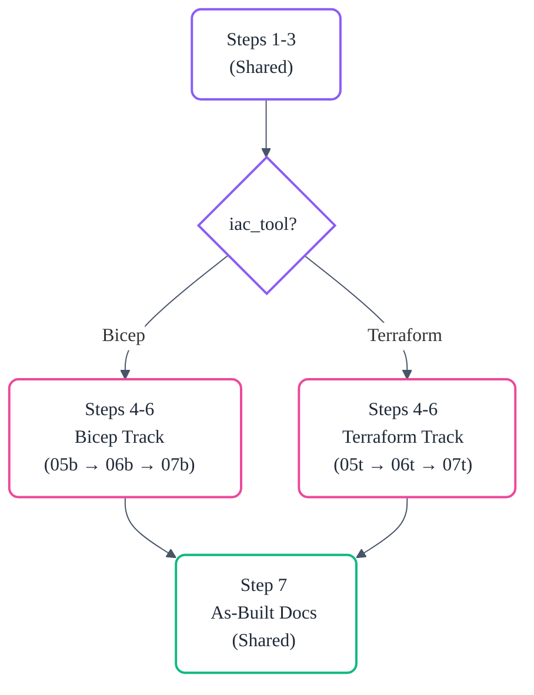

# :material-transit-connection-variant: System Architecture Overview

## :material-format-list-numbered: The 7-Step Workflow

The system follows a strict sequential workflow with mandatory human approval gates
between critical phases:

```mermaid
%%{
  init: {
    'theme': 'base',
    'themeVariables': {
      'primaryColor': '#ffffff',
      'primaryTextColor': '#333333',
      'primaryBorderColor': '#e91e63',
      'lineColor': '#475569',
      'fontFamily': 'ui-sans-serif, system-ui, -apple-system, sans-serif'
    },
    'flowchart': {
      'curve': 'basis',
      'nodeSpacing': 50,
      'rankSpacing': 50
    }
  }
}%%
flowchart LR
    classDef default fill:#ffffff,stroke:#e91e63,stroke-width:2px,color:#1f2937,rx:8px,ry:8px;
    classDef gate fill:#ffffff,stroke:#3b82f6,stroke-width:2px,color:#1f2937,rx:8px,ry:8px;
    classDef endNode fill:#ffffff,stroke:#10b981,stroke-width:2px,color:#1f2937,rx:8px,ry:8px;

    S1["Step 1\nRequirements"]
    G1{{"Gate 1\n🔒 Approval"}}:::gate
    S2["Step 2\nArchitecture"]
    G2{{"Gate 2\n🔒 Approval"}}:::gate
    S3["Step 3\nDesign\n(optional)"]
    S4["Step 4\nIaC Plan"]
    G3{{"Gate 3\n🔒 Approval"}}:::gate
    S5["Step 5\nIaC Code"]
    G4{{"Gate 4\n✔ Validation"}}:::gate
    S6["Step 6\nDeploy"]
    G5{{"Gate 5\n🔒 Approval"}}:::gate
    S7["Step 7\nAs-Built Docs"]:::endNode

    S1 --> G1 --> S2 --> G2 --> S3 --> S4 --> G3 --> S5 --> G4 --> S6 --> G5 --> S7
```

| Step | Phase        | Agent                              | Output                                   | Review            |
| ---- | ------------ | ---------------------------------- | ---------------------------------------- | ----------------- |
| 1    | Requirements | 02-Requirements                    | `01-requirements.md`                     | 1 challenger pass |
| 2    | Architecture | 03-Architect                       | `02-architecture-assessment.md` + cost   | 3+1 passes        |
| 3    | Design (opt) | 04-Design                          | `03-des-*.{py,png,md}`                   | —                 |
| 4    | IaC Plan     | 05b-Bicep Planner / 05t-TF Planner | `04-implementation-plan.md` + governance | 1+3 passes        |
| 5    | IaC Code     | 06b-Bicep CodeGen / 06t-TF CodeGen | `infra/bicep/` or `infra/terraform/`     | 3 passes          |
| 6    | Deploy       | 07b-Bicep Deploy / 07t-TF Deploy   | `06-deployment-summary.md`               | 1 pass            |
| 7    | As-Built     | 08-As-Built                        | `07-*.md` documentation suite            | —                 |

## :material-music: The Conductor Pattern

 

The InfraOps Conductor (agent `01-Conductor`) is the master orchestrator. It does not
generate infrastructure code or documentation itself. Instead, it:

1. Reads the workflow DAG from `workflow-graph.json`
2. Resolves agent paths and models from `agent-registry.json`
3. Delegates each step to the appropriate specialised agent via `#runSubagent`
4. Enforces approval gates between steps
5. Maintains session state in `00-session-state.json`
6. Writes human-readable handoff documents at every gate

The Conductor never touches infrastructure templates. It is a pure orchestrator and
state machine.

## :material-source-fork: Dual IaC Tracks

 

Steps 1–3 (Requirements, Architecture, Design) are shared across both infrastructure
tracks. At Step 4, the workflow diverges based on the `iac_tool` field in the requirements
document:

