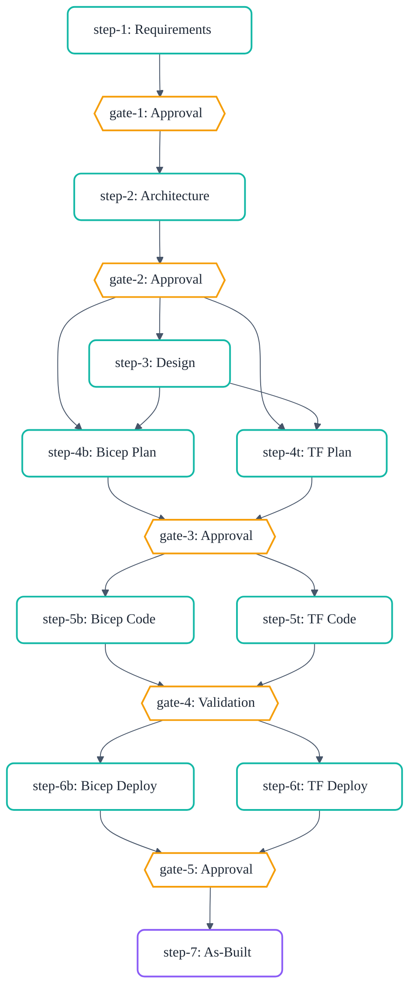

# Workflow Engine and Quality Systems

## Workflow Engine

<div align="center"></div><br/>

### The DAG Model

The workflow is encoded as a machine-readable directed acyclic graph in
`workflow-graph.json`:



Each node has a type (`agent-step`, `gate`, `subagent-fan-out`, `validation`), and each
edge has a condition (`on_complete`, `on_skip`, `on_fail`). Conditional routing at IaC
nodes is governed by the `decisions.iac_tool` field.

### Gates and Approval Points

Five mandatory gates require explicit human confirmation before the workflow advances:

| Gate | After  | Blocks Until                                      |
| ---- | ------ | ------------------------------------------------- |
| 1    | Step 1 | User approves requirements                        |
| 2    | Step 2 | User approves architecture and cost estimate      |
| 3    | Step 4 | User approves implementation plan                 |
| 4    | Step 5 | Automated validation passes (lint, build, review) |
| 5    | Step 6 | User approves deployment and verifies resources   |

### IaC Routing

The `iac_tool` field in `01-requirements.md` determines which track is activated.
Steps 4b, 5b, 6b form the Bicep track; steps 4t, 5t, 6t form the Terraform track.
Only one track is active for a given project.

### Session State and Resume

The `00-session-state.json` file (schema v2.0) provides atomic state tracking:

```json
{
  "schema_version": "2.0",
  "project": "my-project",
  "current_step": 2,
  "lock": {
    "owner_id": "copilot-session-abc123",
    "heartbeat": "2026-03-04T10:15:00Z",
    "attempt_token": "550e8400-e29b-41d4-a716-446655440000"
  },
  "steps": {
    "2": {
      "status": "in_progress",
      "sub_step": "phase_2_waf",
      "claim": {
        "owner_id": "copilot-session-abc123",
        "heartbeat": "2026-03-04T10:15:00Z",
        "attempt_token": "550e8400-e29b-41d4-a716-446655440000",
        "retry_count": 0,
        "event_log": []
      }
    }
  }
}
```

The claim model prevents concurrent sessions from corrupting state. Stale heartbeats
(older than `stale_threshold_ms`, default 5 minutes) are automatically recovered.

## Quality and Safety Systems

### 27 Validation Scripts

Every convention is backed by a machine-enforceable check:

| Category            | Validators                                                                                |
| ------------------- | ----------------------------------------------------------------------------------------- |
| Markdown            | `lint:md`, `lint:links:docs`                                                              |
| Artefact format     | `lint:artifact-templates`, `lint:h2-sync`, `fix:artifact-h2`                              |
| Agent quality       | `lint:agent-frontmatter`, `lint:agent-body-size`                                          |
| Skill quality       | `lint:skills-format`, `lint:skill-size`, `lint:skill-references`, `lint:orphaned-content` |
| Instruction quality | `lint:instruction-frontmatter`, `validate:instruction-refs`                               |
| Governance          | `lint:governance-refs`, `lint:mcp-config`                                                 |
| Infrastructure      | `lint:terraform-fmt`, `validate:terraform`                                                |
| Session state       | `validate:session-state`, `validate:session-lock`                                         |
| Registry/config     | `validate:workflow-graph`, `validate:agent-registry`, `validate:skill-affinity`           |
| Code quality        | `lint:json`, `lint:python`                                                                |
| Meta                | `lint:version-sync`, `lint:deprecated-refs`, `lint:docs-freshness`, `lint:glob-audit`     |

All validators run via `npm run validate:all`.

### Git Hooks (Pre-Commit and Pre-Push)

**Pre-commit** (sequential, via lefthook): Validates staged files only — markdown lint,
link checks, H2 sync, artefact templates, agent frontmatter, instruction frontmatter,
Python lint, Terraform format and validate.

**Pre-push** (parallel, via lefthook): Diff-based domain routing. The `diff-based-push-check.sh`
script categorises changed files and runs only matching validators:

- `*.bicep` → Bicep build + lint
- `*.tf` → Terraform fmt + validate
- `*.agent.md` → Agent frontmatter + body size
- `*.instructions.md` → Instruction frontmatter
- `SKILL.md` → Skills format + skill size
- `*.json` → JSON syntax
- `*.py` → Ruff lint

### Circuit Breaker

The circuit breaker pattern protects against runaway agent loops during deployment:

| Anomaly Pattern     | Detection Threshold | Action                         |
| ------------------- | ------------------- | ------------------------------ |
| Error repetition    | 3 consecutive       | Halt, write `blocked` finding  |
| Empty response loop | 3 consecutive       | Halt, escalate to human        |
| Timeout cascade     | 3 consecutive       | Halt, check auth               |
| What-if oscillation | 2 cycles            | Halt, flag resource conflict   |
| Auth failure loop   | 2 consecutive       | Halt, prompt re-authentication |

### Context Compression

When agents approach model context limits, the context-shredding system activates:

| Tier         | Trigger    | Strategy                                   |
| ------------ | ---------- | ------------------------------------------ |
| `full`       | < 60% used | Load entire artefact                       |
| `summarized` | 60–80%     | Key H2 sections only (tables preserved)    |
| `minimal`    | > 80%      | Decision summaries only (< 500 characters) |
